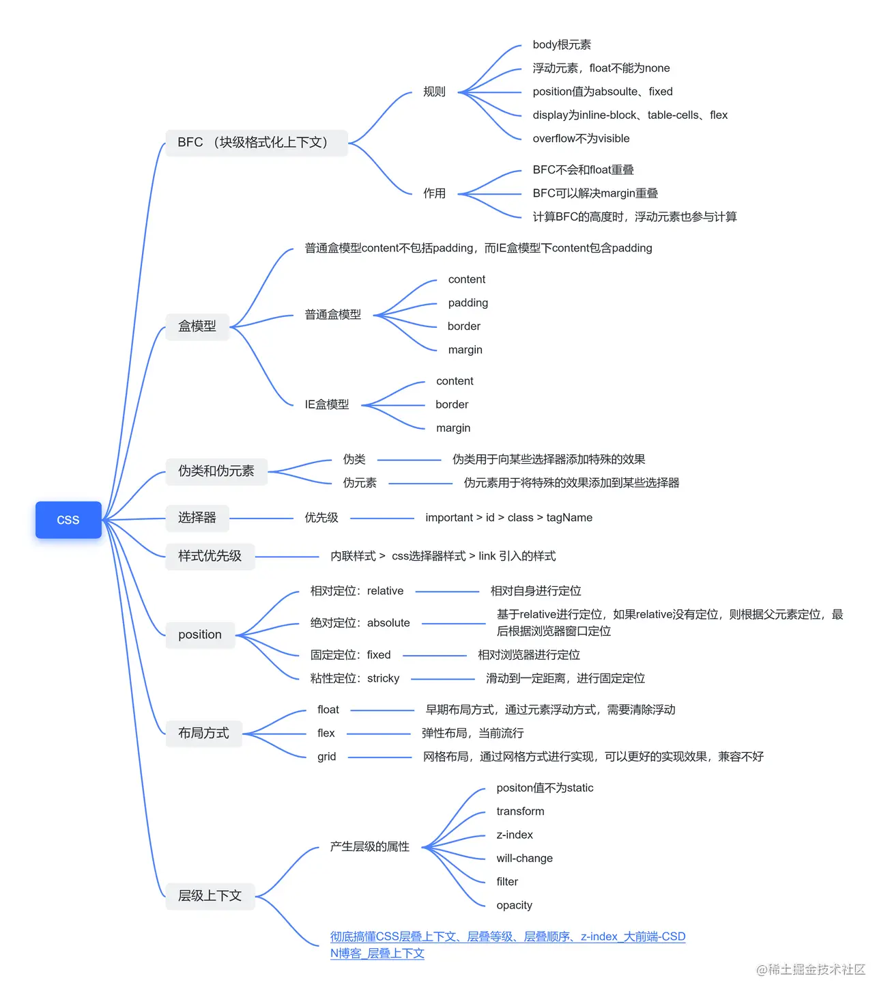
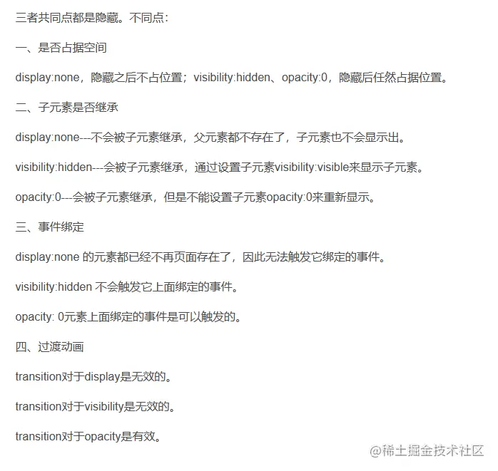
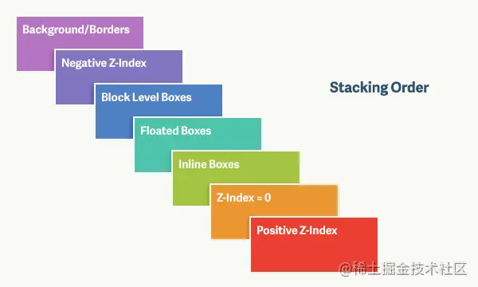
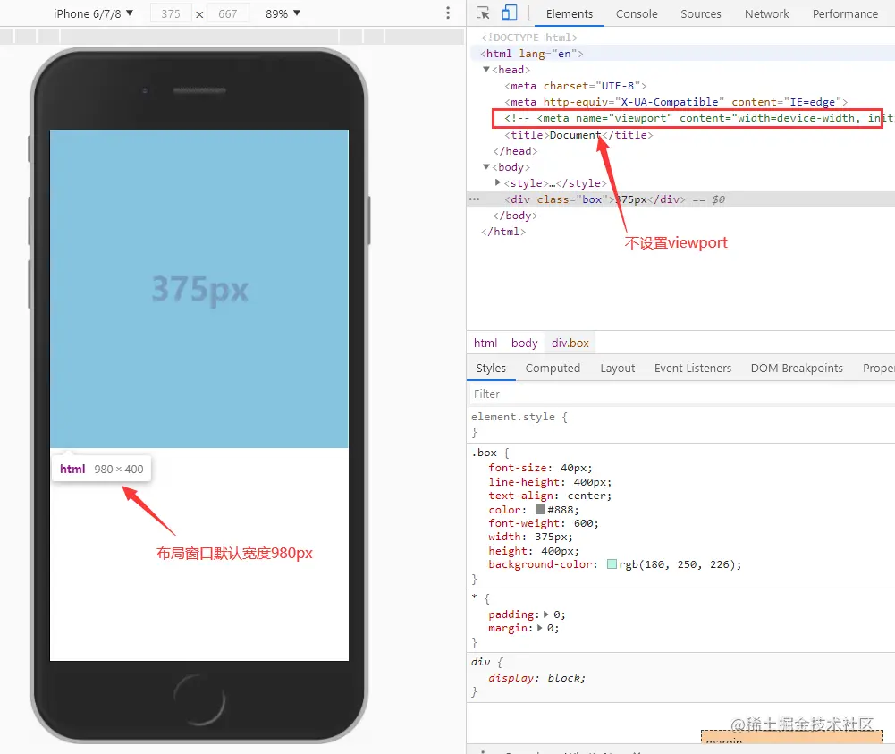
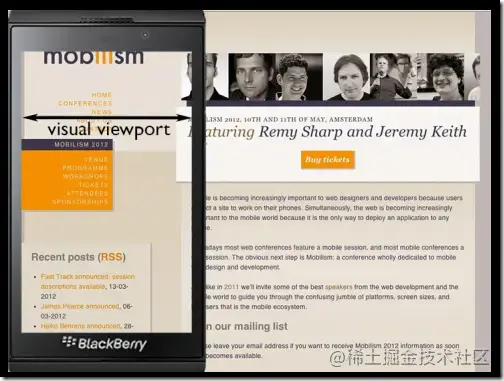
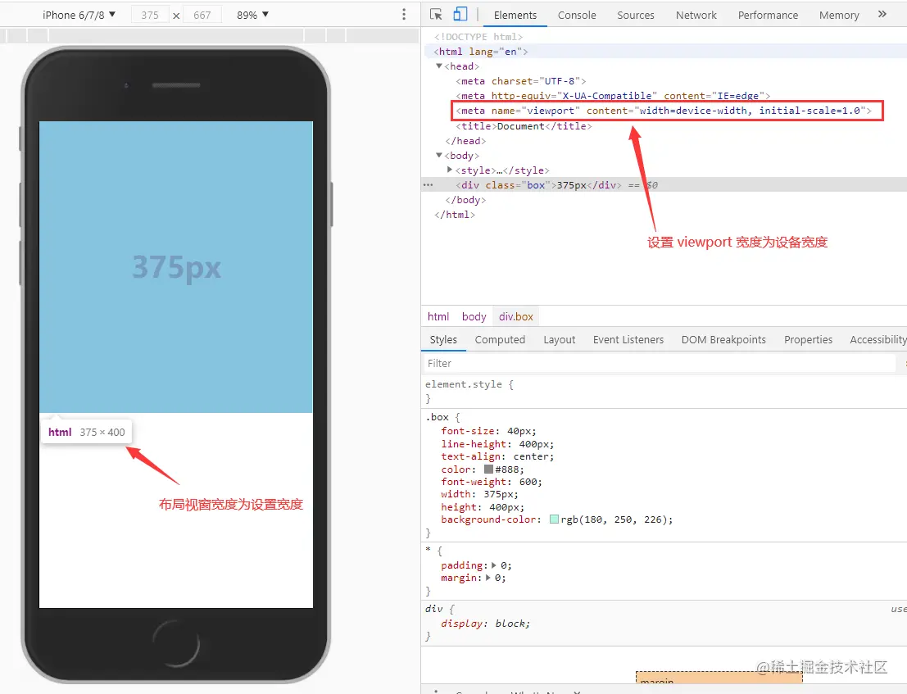

# 思维导图



# CSS

## 1 link 与 @import 区别 !!!

- link 是 XHTML 标签，除了能够加载 CSS，还可以定义 RSS 等其他事务；而 @import 只可以加载 CSS。
- 当解析到 link 标签时，页面会并行加载引用的 css；@import 需要页面完全载入以后再加载。
- @import 需要 IE5 以上才能使用。
- link 支持使用 Javascript 动态引入；而 @import 不支持。

如果想要预加载某些资源，可以通过 link 标签的 rel 属性值为 preload ，并且需要设置预加载的资源 href 属性，如果需要指定预加载的资源类型可以通过 as 属性指定。

## 2 盒子模型 !!!!

CSS3 中的两种盒子模型：标准盒子模型、IE 盒子模型。
两种盒子模型都是由 content + padding + border + margin 构成，其**大小**都是由 content + padding + border 决定，但是盒子内容宽/高度（width/height）的计算范围根据盒模型的不同会有所不同

- 标准盒子模型的 width/height 只包括 content
- IE 盒子模型的 width/height 为 border + padding + content
- 可以通过 box-sizing 改变元素的盒子模型
  - content-box：标准盒子模型
  - border-box：IE 盒子模型

## 3 BFC(重点理解) !!!!

块级格式化上下文

### 特性

- BFC 内部块级盒会在垂直方向上一个接一个排列
- 同一个 BFC 下的相邻块级元素可能发生外边距重叠，创建新的 BFC 可以避免外边距重叠
- 每个元素的左外边距与包含块(也就是包含该元素的块级元素)的左边框相接触，浮动也是如此
- BFC 区域不会与浮动元素区域重叠
- 计算 BFC 高度时，浮动元素也会参与计算
- 文字不会被浮动元素覆盖，环绕于周围

### BFC 创建

- 根元素
- float:left/right
- 绝对/固定 定位
- display 为 table、inline-block、table-caption(注意这是行内块需要内容撑开或设定宽度)
- overflow 值不为 visible、none

### 应用

1. 自适应多栏布局

```html
<style>
  .wrapper div {
    height: 200px;
  }
  .left {
    float: left;
    width: 200px;
    background: gray;
  }
  .right {
    float: right;
    width: 200px;
    background: gray;
  }
  .main {
    background: cyan;
  }
</style>

<div class="wrapper">
  <div class="left"></div>
  <div class="right"></div>
  <div class="main"></div>
</div>
```

2. 防止外边距重叠(margin 塌陷)

```html
<style>
  .main {
    /*overflow:hidden; /* 或auto  */
    margin-top: 50px;
    height: 200px;
    background-color: red;
  }
  .content {
    margin-top: 50px;
    height: 50px;
    background-color: green;
  }
</style>
<div class="main">
  <div class="content"></div>
</div>
```

3. 清除浮动

```html
<style>
  .box {
    float: left;
    width: 100px;
    height: 180px;
    margin: 10px;
    background: cyan;
  }

  .bfc {
    /* 计算 BFC 高度时，浮动元素也会参与计算，可以利用这一点清除 BFC 内部的浮动 */
    overflow: auto;
    min-height: 50px;
    background: gray;
  }
</style>
<div class="bfc">
  <div class="box"></div>
  <div class="box"></div>
  <div class="box"></div>
</div>
```

## 4 布局方式 !!

1.  静态布局  
    最为传统的一种布局方式，网页上的所有元素都是用 px 为单位进行设定的。

2.  浮动布局  
    进行调用浮动属性改变页面中元素的位置，浮动布局应该是目前各大网站用的最多的一种布局方式了，但是也特别复杂。浮动元素是脱离文档流的，但不脱离文本流。

3.  定位布局  
    利用 position 属性控制页面元素设置一些不规则布局。

4.  流式布局  
    当屏幕分辨率大小发生变化时，页面里的元素大小会变化但布局不会发生变化。

5.  自适应布局  
    为不同的屏幕定义不同的布局，就是创建多个静态布局，每个静态布局对应一个屏幕分辨率范围。

6.  响应式布局  
    通过媒体查询(@media)分别为不同的屏幕分辨率定义布局，创建多个流式布局，分别对应一个屏幕分辨率范围。

    `<meta name="viewport" content="width=device-width, initial-scale=1, maximum-scale=1, user-scalable=no" />`

7.  弹性布局
    使用 em 或 rem 单位进行布局，相对%更加灵活，同时可以支持浏览器的字体大小调整和缩放等的正常显示，因为 em 是相对父级元素的原因没有得到推广。

8.  flex 布局

## 5 常见 CSS 布局 !!!!

### 5.1 单列布局

1.  等宽

    ```html
    <style>
      .header,
      .body,
      .footer {
        /*最大不超过500px*/
        /*小于500自适应*/
        max-width: 500px;
        margin: 0 auto;
      }

      .header {
        height: 50px;
        background-color: red;
      }

      .body {
        height: 500px;
        background-color: green;
      }

      .footer {
        height: 50px;
        background-color: blue;
      }
    </style>
    <div class="header"></div>
    <div class="body"></div>
    <div class="footer"></div>
    ```

2.  header、footer w:100%

    ```html
    <style>
      .header {
        height: 50px;
        background-color: red;
      }

      .footer {
        height: 50px;
        background-color: blue;
      }

      .body {
        max-width: 500px;
        height: 500px;
        margin: 0 auto;
        background-color: green;
      }
    </style>
    <div class="header"></div>
    <div class="body"></div>
    <div class="footer"></div>
    ```

### 5.2 实现两栏布局（定宽 + 自适应布局）

1.  利用浮动，左边元素宽度固定 ，设置向左浮动

    ```html
    <!-- 左侧固定右侧自适应 -->
    <style>
      .main {
        overflow: hidden;
        background: cyan;
      }
      .main > div {
        height: 100%;
      }
      .left {
        float: left;
        width: 200px;
        background: red;
      }
      .right {
        background: gray;
      }
    </style>
    <div class="main">
      <div class="left"></div>
      <div class="right"></div>
    </div>
    ```

2.  利用 flex 布局，左边元素固定宽度，右边元素 flex:1

    ```html
    <style>
      .main {
        display: flex;
        background: cyan;
      }
      .main > div {
        height: 100%;
      }
      .left {
        width: 200px;
        background: red;
      }
      .right {
        flex: 1;
        background: gray;
      }
    </style>
    ```

3.  利用绝对定位，父级元素 relative,左边元素 absolute,右边元素 margin-left

    ```html
    <style>
      .main {
        position: relative;
        height: 200px;
        background: cyan;
      }
      .main div {
        height: 100%;
      }
      .left {
        position: absolute;
        width: 200px;
        background: red;
      }
      .right {
        background: gray;
      }
    </style>
    ```

4.  利用绝对定位，父级元素 relative,左边元素设置宽度,右边元素 absolute,设置 left,right:0
    ```html
    <style>
      .main {
        position: relative;
        height: 200px;
        background-color: red;
      }
      .left {
        width: 200px;
        background-color: green;
      }
      .right {
        position: absolute;
        background-color: yellow;
      }
    </style>
    ```

### 5.3 实现圣杯布局和双飞翼布局（经典三分栏布局）

#### 目的

- 三栏布局，中间一栏必须先写，这样解析 html 时生成 dom 时,主栏最先加载和渲染
- 两侧内容固定，中间内容随着宽度自适应
- 双飞翼布局是圣杯布局的优化，解决了圣杯布局错乱的问题

#### 圣杯布局

**步骤**：

1.  三个部分都设置左浮动，中间宽度 100%
2.  左盒子设置 margin-left 为负值让 left 回到 center 同行，右盒子设置 margin-right 为负值回到 center 同行
3.  设置父容器 padding 将中间内容容挤压,留出两边间隙
4.  设置相对定位让 left 让 左边盒子回归正确位置

```html
<style>
  html,
  body {
    margin: 0;
    padding: 0;
  }

  #container {
    margin-top: 20px;
    /* overflow: hidden; */
    padding-left: 200px;
    padding-right: 200px;
    height: 200px;
    background-color: gray;
  }

  #container > div {
    float: left;
    height: 100%;
  }

  .center {
    width: 100%;
    background: red;
  }

  .left {
    position: relative;
    /* 2. */
    left: -200px;
    /* 1. */
    margin-left: -100%;
    width: 200px;
    background: green;
  }

  .right {
    /* 可以和左盒子一样通过 relative 定位来更改位置 */
    /* position: relative; */
    /* right: -200px; */
    /* margin-left: -200px; */
    width: 200px;
    /* 也可以通过 margin-right 更改位置 */
    margin-right: -200px;
    background: blue;
  }
</style>
<!-- 圣杯 -->
<div id="container" class="clearfix">
  <p class="center">我是中间我是中间我是中间我是中间我是中间我是中间我是中间</p>
  <p class="left">我是左边</p>
  <p class="right">我是右边</p>
</div>
```

#### 双飞翼布局

**步骤：**

1.  三个部分都设置左浮动，中间宽度 100%
2.  设置 margin-left 为负值让 left 和 right 回到 center 同行
3.  中间部分内容放在内层 div , 并它的设置 margin 让其全部显示

```html
<style>
  .float {
    float: left;
  }

  #main {
    width: 100%;
    height: 200px;
    background-color: gray;
  }

  #main-wrap {
    margin: 0 200px 0 200px;
    background-color: pink;
    height: 100%;
  }

  #left {
    position: relative;
    width: 200px;
    height: 200px;
    background-color: lightsalmon;
    /* left: -200px; */
    margin-left: -100%;
  }

  #right {
    width: 200px;
    height: 200px;
    background-color: lightskyblue;
    margin-left: -200px;
  }
</style>
<!-- 双飞翼 -->
<div id="main" class="float">
  <div id="main-wrap">main</div>
</div>
<div id="left" class="float">left</div>
<div id="right" class="float">right</div>
```

### 5.4 不定宽+ 自适应

1.  float + overflow
    ```html
    <style>
      .left {
        float: left;
        margin-right: 20px;
      }
      .right {
        /*开启bfc*/
        overflow: hidden;
      }
    </style>
    ```
2.  table
    ```html
    <style>
      .parent {
        display: table;
      }
      .left {
        /*宽度默认auto长度可能相同*/
        /*通过给左边一个很小的宽度将左边挤到内容区*/
        width: 0.1%;
        /*通过padding-right添加间距*/
        padding-right: 20px;
      }
      .left,
      .right {
        display: table-cell;
      }
    </style>
    <div class="parent">
      <div class="left">
        <p>left</p>
      </div>
      <div class="right">
        <p>right</p>
      </div>
    </div>
    ```
3.  flex  
    把定宽的代码宽度去掉

### 5.5 等宽布局

1. float
   ```html
   <style>
     .parent {
       /*给父级拓宽20px*/
       margin-right: -20px;
     }
     .child {
       float: left;
       width: 25%;
       /*每个子项给出20px空间作间隙*/
       padding-left: 20px;
       box-sizing: border-box;
     }
   </style>
   ```
2. table
   ```html
   <!-- 包装拓宽 -->
   <style>
     .parent-wrap {
       margin-left: -20px;
     }
     .parent {
       display: table;
       /*table默认随内容撑开,需要手动占据父级宽度*/
       width: 100%;
       table-layout: fixed;
     }
     .child {
       display: table-cell;
       padding-left: 20px;
     }
   </style>
   <!-- calc计算拓宽(不推荐) -->
   <style>
     .parent8 {
       display: table;
       width: calc(100% + 20px);
       table-layout: fixed;
       position: relative;
       left: -20px;
     }
     .column3 {
       display: table-cell;
       padding-left: 20px;
     }
   </style>
   ```
3. flex
   ```html
   <style>
     .parent {
       display: flex;
       justify-content: center;
     }
     .child {
       flex: 1;
       /*间隙直接加*/
       margin-left: 20px;
     }
   </style>
   ```

### 5.6 等高布局

1. padding-bottom + margin-bottom
   ```html
   <style>
     .container {
       overflow: hidden;
     }
     .center,
     .right {
       padding-bottom: 10000000px;
       margin-bottom: -10000000px;
     }
     .center {
       /* 也可以固定宽 */
       float: left;
       /* 需要间距时加 */
       margin-right: 10px;
       background-color: red;
     }
     .right {
       /*开启bfc防止与浮动元素重叠*/
       overflow: hidden;
       background-color: skyblue;
     }
   </style>
   <div class="container">
     <div class="center"></div>
     <div class="right"></div>
   </div>
   ```
2. flex
   ```html
   <style>
     .container {
       display: flex;
     }
     .center {
       /* 也可以固定宽 */
       /* 需要间距时加 */
       margin-right: 10px;
       background-color: blue;
     }
     /*因为flex的子项默认是stretch拉伸*/
     .right {
       flex: 1; /*哪边需要自适应哪边加*/
       background-color: red;
     }
   </style>
   ```
3. table

   ```html
   <style>
     .parent {
       /*开启table*/
       display: table;
       /*table默认随内容撑开,需要手动占据父级宽度*/
       width: 100%;
       /*如果需要设定宽需要开启*/
       table-layout: fixed;
     }
     .left,
     .right {
       /*相当于td,td默认高度撑开*/
       /*并且宽度默认等分*/
       display: table-cell;
       background-color: blue;
     }
     .left {
       /*设置固定宽度*/
       width: 100px;
       background-color: red;
       /*如果需要间距可以用border*/
       border-right: 50px solid transparent;
       /*将背景颜色显示到padding,不然border也有颜色*/
       background-clip: padding-box;
     }
   </style>
   <div class="parent">
     <div class="left">
       <p>left</p>
     </div>
     <div class="right">
       <p>right</p>
       <p>right</p>
     </div>
   </div>
   ```

### 5.7 粘连布局

1. 内容 padding-bottom 让空间+margin-top 负值
   ```html
   <style>
     html,
     body {
       height: 100%;
     }
     .wrap {
       min-height: 100%;
     }
     .main {
       /* 内容区域需要让出一小部分空间给footer*/
       padding-bottom: 30px;
     }
     /* 通过 margin-top 负值的方式将它拉到上一个元素的上一层 */
     .footer {
       position: relative;
       height: 30px;
       margin-top: -30px;
       background-color: red;
     }
   </style>
   <div class="wrap">
     <div class="main"></div>
   </div>
   <div class="footer"></div>
   ```
2. 包装层 padding-bottom 让空间 + ie 盒模型
   ```html
   <style>
     html,
     body {
       margin: 0;
       height: 100%;
     }
     .wrap {
       min-height: 100%;
       padding-bottom: 50px;
       box-sizing: border-box;
     }
     .footer {
       height: 50px;
       margin-top: -50px;
       background-color: red;
     }
   </style>
   ```
3. margin-bottom 负值+与 footer 等高元素
   ```html
   <style>
     html,
     body {
       margin: 0;
       height: 100%;
     }
     .wrap {
       min-height: 100%;
       margin-bottom: -50px;
     }
     .push,
     footer {
       height: 50px;
     }
     .footer {
       background-color: red;
     }
   </style>
   ```
4. flex
   ```html
   <style>
     html {
       height: 100%;
     }
     body {
       /* height: 100%; // 固定高度 */
       /* 可变高度,限定最小为视口高 */
       min-height: 100vh;
       /* 可变高度,限定最小为视口高 */
       /* min-height: 100%; */
       display: flex;
       flex-direction: column;
     }
     .content {
       flex: 1;
     }
     .footer {
       height: 50px;
       background-color: red;
     }
   </style>
   <div class="content"></div>
   <div class="footer"></div>
   ```

总结：前三种内容区都需要添加一个外部包装层，用于设置 min-height:100% 占据整个屏幕，并且在自己的空间内分一部分给 footer 让空间

## 6 水平垂直居中的方式 !!!!

[面试官：你能实现多少种水平垂直居中的布局（定宽高和不定宽高）](https://juejin.cn/post/6844903982960214029)
**所有不定宽高的方式都能用在定宽高**

### 定宽高

1.  绝对定位,top:50%,left:50%,盒子必须有宽高,并配合 margin:-宽/2,-高/2;

    ```html
    <style>
      .father {
        position: relative;
      }
      .son {
        position: absolute;
        top: 50%;
        bottom: 50%;
        width: 200px;
        height: 300px;
        margin: -150px, -100px;
      }
    </style>
    ```

2.  绝对定位,四方向为 0,并配合 margin:auto；盒子必须有宽高

    ```html
    <style>
      .father {
        position: relative;
      }
      .son {
        position: absolute;
        top: 0;
        left: 0;
        right: 0;
        bottom: 0px;
        margin: auto;
        height: 100px;
        width: 100px;
      }
    </style>
    ```

### 不定宽高

1.  绝对定位,配合 transform:translate(-50%,-50%);

    ```html
    <style>
      .father {
        position: relative;
      }
      .son {
        position: absolute;
        top: 50%;
        left: 50%;
        transform: translate(-50%, -50%);
      }
    </style>
    ```

2.  flex

    ```html
    <style>
      .father {
        display: flex;
        justify-content: center;
        align-items: center;
      }
      .son {
      }
    </style>
    ```

3.  父级 flex + margin:auto

    ```html
    <style type="text/css">
      .box {
        width: 200px;
        height: 200px;
        border: 1px solid red;
        display: flex;
      }
      .children-box {
        background: yellow;
        margin: auto;
      }
    </style>
    ```

### 内联元素居中

1. 水平居中

- text-align: center;

- 父元素 display: flex; justify-content: center;

2. 垂直居中

- 单行文本：height = light-height;

- 多行文本：vertical-align: middle;

## 7 flex 布局 !!!

### 简介:

flex 是 flexible Box 的缩写，意为"弹性布局"，用来为盒装模型提供最大的灵活性，任何一个容器都可以指定 flex 布局。

**重要：** 为父盒子设为 flex 布局以后，子元素的 float、clear 和 vertical-align 属性将失效

**原理：** 通过给父盒子添加 flex 属性，控制子盒子的位置和排列方式

采用 flex 布局的元素，称为 flex 容器，简称容器。他的所有的子元素自动成为容器成员，成为 flex 项目

### **父项常用属性：**

1. flex-direction：设置主轴（默认 x 轴）的方向

   - row: 默认值,从左到右，row-reverse: 从右到左
   - column: 从上到下，column-reverse: 从下到上

2. justify-content：设置**主轴**上的子元素排列方式

   - flex-start: 默认值，从头部开始
   - flex-end: 从尾部开始排列
   - **center:** 在主轴居中对齐
   - **space-around:** 平分剩余空间
   - **space-between:** 先贴两边，再平分剩余空间

3. flex-wrap：设置子元素是否换行

   - nowrap: 默认值,不换行,一行内显示（通过缩小子元素宽度）
   - wrap: 换行
   - wrap-reverse: 换行，第一行在下方

4. align-content：设置**侧轴**（默认 y 轴）上的子元素 的排列方式 **（多行）**

   - flex-start: 默认值, 在侧轴从头部开始排列
   - flex-end: 在侧轴尾部开始排列
   - center: 在侧轴居中显示
   - **space-around:** 子项在侧轴平分剩余空间
   - **space-between:** 子项在侧轴先分布在两头, 再平分剩余空间
   - stretch: 设置子项元素高度平分父元素高度

5. align-items：设置**侧轴**上的子元素排列方式 **（单行）**

   - flex-start: 从上到下
   - flex-end: 从下到上
   - **center:** 挤在一起居中
   - stretch: 默认值, 拉伸,子盒子不要给高度

6. flex-flow：复合属性，相当于同时设置了 flex-direction 和 flex-wrap， column wrap: 主轴为侧轴, 换行

### **子项常用属性：**

- flex: 定义子项分配剩余空间所占份数(复合属性)

  flex: none | [<'flex-grow'> <'flex-shrink'>? || <'flex-basis'>]
  flex: none， 0 0 auto;
  flex：auto，1 1 auto;
  flex：1， 0 1 auto;

  [flex-glow & flex-shrink 计算](https://blog.csdn.net/zxcbnm7089/article/details/119598192)

  - flex-grow：项目放大比例，默认 0 (如果存在剩余空间也不放大)。一个项目的 flex-grow 为 2，其他项目都为 1，前者占据的剩余空间将比其他项多一倍。

    

  - flex-shrink：项目缩小比例，默认 1 (空间不足项目将缩小)。一个项目的 flex-shrink 为 0，其他项目都为 1，则空间不足时，前者不缩小。

    

  - flex-basis：分配多余空间之前，项目占据的主轴空间，默认 auto 项目本来大小。若设置固定的值如 350px，项目占据固定空间

- align-self: 控制子项自己在侧轴上的布局方式, 允许单个子项与其他项不一样的对齐方式

  - auto: 默认值, 表示继承 align-items, 如果没有父元素, 等同于 stretch
  - flex-start: 从上到下
  - flex-end: 从下到上
  - **center:** 居中

- order: 定义项目的排列顺序,数值越小越前,默认为 0

## 8 css 选择器和优先级 !!!!

优先级：!important>(行内|内联)样式>id>class=伪类=属性>标签=伪元素>通配符=子类=兄弟>继承
1000(行内) -> 0100(id) -> 0010(类) -> 0001(标签) -> 0000(通配符)
选择器从右向左解析

## 9 css 伪类选择器 !!!!

- E:link(1)，未点击的超链接，针对于所有写了 href 属性的超链接(不包括锚点)

- E:visited(2)，访问过的超链接

- E:hover(3)，悬停

- E:focus(4)，获取焦点

- E:active(5)，激活，鼠标点击不松手

- E:last-child，必须是父级容器的最后一个子元素，再校验 E。

- E:last-of-type，必须父级容器的最后一个子元素和所有子元素的最后一个子元素。再校验 E。

- E:nth‐child(n)：先找到父级容器的第 n 个子元素，再比较与 E 是否相同。

- E:nth‐of‐type(n)：先找到父级容器的第 n 个子元素及子元素的第 n 个子元素)，再比较 E 是否相同。
  - n 都是从 0 开始，标签元素从 1 开始；例如
  - 如果第 n 个孩子不是 E 就失效
  - 都会去匹配自己的所有孩子，并且所有孩子都算在 n 中。

## 10 css 继承 !!!

- 继承了不能被取消，只能重新定义样式。
- 每一个属性可以指定值为**inherit**，对于给定的元素，该属性和它父元素相对属性的计算值取一样的值。
- 所有元素可继承：visibility 和 cursor。
- text­，font­，line­ 这些开头的属性可以继承，以及 color、opacity 属性
- line-height 继承
  - 父元素的 line-height 写了具体数值，比如 30px，则子元素 line-height 继承该值
  - 父元素的 line-height 写了比例，比如 1.5/2，则子元素 line-height 也是继承该比例
  - 父元素的 line-height 写了百分比，比如 200%，则子元素 line-height 继承的是父元素 font-size \* 200% 计算出来的值
- opacity 会被子元素继承并且子元素不能通过 opacity:1 取消隐藏

## 11 复合 css 写法 !!!

- font: font-style(斜体/倾斜体) 加粗 大小/行高 字体

- background: 背景颜色(background-color) 背景图片地址(background-image) 背景平铺(background-repeat) 背景图像滚动(background-attachment) 背景图片位置(background-position);

- box-shadow: 水平阴影 垂直阴影 模糊距离 阴影尺寸 颜色 外部/内部阴影

- text-shadow: 水平阴影 垂直阴影 模糊距离 颜色

- trasition: 要过渡的 css 属性(transition-property) 花费时间(transition-duration) 运动曲线(transition-timing-function) 何时开始(transition-delay);

- animation: 花费时间 运动曲线 何时开始 动画名(animation-name)  
  需要配合 KeyFrames ，使用 KeyFrames 定义动画序列

## 12 清除浮动 !!!!

- 单伪元素

  ```css
  .clearfix:after {
    /* 伪元素必写属性 */
    content: "";
    /* 插入的元素必须是块级 */
    display: block;
    /* 不要看见这个元素 */
    height: 0;
    /*核心代码清除浮动*/
    clear: both;
    /* 不要看见这个元素 */
    visibility: hidden;
  }
  .clearfix {
    /* ie6、7专有 */
    *zoom: 1;
  }
  ```

- 双伪元素
  ```css
  .clearfix:before,
  .clearfix:after {
    content: "";
    display: table;
  }
  .clearfix:after {
    clear: both;
  }
  .clearfix {
    *zoom: 1;
  }
  ```

## 13 文字溢出 !!!

- 单行
  ```css
  /*强制一行显示*/
  white-space: nowrap;
  /*超出部分隐藏*/
  overflow: hidden;
  /*溢出部分省略号代替*/
  text-overflow: ellipsis;
  ```
- 多行
  ```css
  overflow: hidden;
  text‐overflow: ellipsis;
  /* 弹性伸缩盒子模型显示 */
  display: ‐webkit‐box;
  /* 限制在一个块元素显示的文本的行数 */
  ‐webkit‐line‐clamp: 2;
  /* 设置或检索伸缩盒对象的子元素的排列方式 */
  ‐webkit‐box‐orient: vertical;
  ```

## 14 position 的值及其作用 !!!!

- static，默认，正常文档流，没有定位。

- relative，相对定位，给元素本身设置其相对原本位置的定位，本身位置保留不脱离文档流，其它元素位置不受到影响。

- absolute，绝对定位，设置子元素相对于最近一个设置了定位的父级的位置；没有则相对于 body。

- fixed，固定定位，相对于 body 的定位。

- sticky，粘连定位，元素在可视区时位置不受影响，当元素要移除可视区时会变为固定定位。

## 15 隐藏滚动条 !!

1. 使用伪类
   ```css
   选择器::webkit-scrollbar {
     display: none;
   }
   ```
2. 外层嵌套盒子
   ```css
   /*在外层套一个容器使用overflow:hidden;
   在里层的容器设置overflow：auto;
   同时设置宽度比外层多17px (17px为滚动条的宽度)*/
   #container {
     width: 100%;
     height: 100%;
     overflow: hidden;
   }
   #content {
     width: calc(100% + 17px);
     height: calc(100% + 17px);
     overflow: auto;
   }
   ```
   原理：滚动条出现的原因是由于里层的容器宽高超出了外层的容器， 在 html 中，外层的滚动条是只能通过外层来隐藏或者更上层来隐藏， 如 body 层出现的滚动条，不能设置里面的 box overflow：hidden；来隐藏，只能设置 body overflow：hidden 或者 html overflow:hidden；来隐藏

## 16 display:none、visibility: hidden、opacity:0 区别 !!!!

- display 会让元素从 dom 树中移除；造成重排；非继承属性

- visibility 只是元素不可见并且会`占用空间`；造成重绘；继承属性；`不会触发监听器`

- opacity 元素变透明`占用空间`；继承属性；`会触发监听器`



## 17 隐藏元素的方法 !!!

- display: none
- visibility: hidden
- opacity:0
- position: absolute 移除可视区
- z-index: 负值，用其他元素遮住该元素
- transform: scale(0,0) 将元素缩放为 0

## 18 监听 transition 结束 !!

- transitionend
- transitionstart

## 19 translate !!!!

1. translate 是 transform 属性的⼀个值。改变 transform 或 opacity 不会触发浏览器重新布局导致回流或重绘，只会触发复合。

2. 改变绝对定位会触发重新布局，进⽽触发重绘和复合。

3. transform 使浏览器为元素创建⼀个 GPU 图层，但改变绝对定位会使⽤到 CPU，所以 translate() 更⾼效，可以缩短平滑动画的绘制时间

4. translate 改变位置时，元素依然会占据其原始空间，绝对定位就不会发⽣这种情况

## 20 li 与 li 之间有看不见的空白间隔原因!!

浏览器会把内联元素间的空白字符渲染成一个空格。而为了代码书写美观，常把 li 换行，导致换行符字符变成一个空格，占据一个字符宽度。

- 设置 li 浮动
- 写在同一行
- 将 ul 的 font-size 设为 0
- 设置 ul 的字符间隔 letter-spacing: -8px

## 21 CSS3 新特性 !!!!

- 新增各种 CSS 选择器 （: not(.input)：所有 class 不是“input”的节点）
- 圆角 （border-radius:8px）
- 盒子阴影 （box-shadow）
- 文字特效 （text-shadow）
- 文字渲染 （text-decoration）
- 线性渐变 （gradient）
- 旋转 （transform）
- 增加了旋转(rolate),缩放(scale),定位(translate),倾斜(skew),动画,透视(perspective)

## 22 CSS 预处理器 !!!

Sass、Less 都是 CSS 预处理器，增加了 css 代码的复用性。  
变量、混合、嵌套、运算、转义、函数、命名空间和访问符、映射、作用域、注释、导入。

- 结构清晰， 便于扩展
- 可以很方便的屏蔽浏览器私有语法的差异
- 可以轻松实现多重继承
- 兼容 CSS 代码，可以应用到老项目中

## 23 z-index 属性在什么情况下会失效 !!

- 父元素 position 为 relative 时，子元素的 z-index 失效。解决：父元素 position 改为 absolute 或 static

- 元素 position 属性为默认属性 static

- 元素在设置 z-index 的同时还设置了 float 浮动。解决：float 去除，改为 display：inline-block

## 24 css 动画 !!!!

- animation-duration
- animation-timing-function
- animation-delay
- animation-iteration-count 动画重复次数(infinite 循环动画)
- animation-direction 动画方向
- animation-name

```css
/* 由浏览器窗口右边滑至左边 */
p {
  animation: 3s ex1;
}

@keyframes ex1 {
  from {
    margin-left: 100%;
    width: 300%;
  }

  to {
    margin-left: 0%;
    width: 100%;
  }
}

@keyframes ex2 {
  0% {
    margin-left: 100%;
    width: 300%;
  }

  100% {
    margin-left: 0%;
    width: 100%;
  }
}
```

动画事件

- animationstart
- animationend
- animationiteration， 当 CSS Animation 运动到最后一帧时触发

## 25 px、em、rem !!!!

- px 固定像素
- em 相对于父元素字体大小
- rem 相对于根元素字体大小

## 26 1px 问题 !!

- transform: scale(0.5) + ::before/::after

  ```css
  .calss1 {
    position: relative;
    &::after {
      content: "";
      position: absolute;
      bottom: 0px;
      left: 0px;
      right: 0px;
      border-top: 1px solid #666;
      transform: scaleY(0.5);
    }
  }
  ```

- 直接写 0.5px

- 伪元素先放大后缩小

  在目标元素的后面追加一个 ::after 伪元素，让这个元素布局为 absolute 之后、整个伸展开铺在目标元素上，然后把它的宽和高都设置为目标元素的两倍，border 值设为 1px。接着借助 CSS 动画特效中的放缩能力，把整个伪元素缩小为原来的 50%。此时，伪元素的宽高刚好可以和原有的目标元素对齐，而 border 也缩小为了 1px 的二分之一，间接地实现了 0.5px 的效果。

  ```css
  #container[data-device="2"] {
    position: relative;
  }
  #container[data-device="2"]::after {
    position: absolute;
    top: 0;
    left: 0;
    width: 200%;
    height: 200%;
    content: "";
    transform: scale(0.5);
    transform-origin: left top;
    box-sizing: border-box;
    border: 1px solid #333;
  }
  ```

- meta 的 viewport 缩放来解决

## 27 0.5px 的线 !!

- transform: scale(0.5, 0.5)

- meta 配合 viewport

  ```html
  <meta name="viewport" content="width=device-width, initial-scale=0.5, minimum-scale=0.5, maximum-scale=0.5" />
  ```

## 28 宽高自适应正方形 !!

- vw

  ```css
  .square {
    width: 10%;
    height: 10vw;
    background: tomato;
  }
  ```

- margin/padding 百分比相对父元素宽度性质

  ```css
  .square {
    width: 20%;
    height: 0;
    padding-top: 20%;
    background: orange;
  }
  ```

- 子元素 margin-top

  ```css
  .square {
    width: 30%;
    overflow: hidden;
    background: yellow;
  }
  .square::after {
    content: "";
    display: block;
    margin-top: 100%;
  }
  ```

## 29 三角形、扇形 !!

- 三角

```css
div {
  width: 0;
  height: 0;
  /*一边有颜色，靠近他的两倍 transparent*/
  border-bottom: 50px solid red;
  border-right: 50px solid transparent;
  border-left: 50px solid transparent;
}
```

- 扇形，三角形加 border-radius

## 30 元素层叠顺序 !!!!



1. 背景和边框：建立当前层叠上下文元素的背景和边框。
2. 负的 z-index：当前层叠上下文中，z-index 属性值为负的元素。
3. 块级元素：文档流内非行内级非定位后代元素。
4. 浮动元素：非定位浮动元素。
5. 行内元素：非定位行内元素。
6. z-index:0：层叠级数为 0 的定位元素。
7. 正 z-index：z-index 属性值为正的定位元素。

注意: 当定位元素 z-index:auto，生成盒在当前层叠上下文中的层级为 0，不会建立新的层叠上下文，除非是根元素。

## 31 常见的触发硬件加速的 css 属性 !!

- transform，应用于元素的 2D 或 3D 转换。
- opacity，设置元素的 `不透明` 级别。
- perspective，设置元素视图，只影响 3D 转换元素。
- perspective-origin，改变 3D 元素的 `底部位置` 。

## 32 CSS3 动画和 JS 动画的区别与优劣 !!!

### CSS3 动画

CSS3 动画又被称为补间动画，原因是只需要添加关键帧的位置，其他的未定义的帧会被自动生成。因为只设置了几个关键帧的位置，所以在进行动画控制的时候比较困难，不能停止动画或者在动画过程中添加一些其他的动作。

1. 浏览器会对 CSS3 动画进行优化；帧速不好的浏览器，CSS3 会自动降级来兼容。

2. 可以通过设置 will-change 属性，提取告知浏览器哪些元素的属性将会改变，提前做好准备，等到需要改变的元素的时间点到达就可以立刻实现它们，从而减少卡顿等问题。

3. 不要将 will-change 应用到太多的元素上，如果过度使用的话，可能导致页面响应缓慢或者消耗非常多的资源。

4. 运用 will-change 告诉浏览器 box 元素将要做几何变换和透明度变换，这时候 **渲染引擎 GUI 线程将会将该元素单独实现一帧**，等到变化的时间点到达时，渲染引擎会通过 `合成线程` 直接处理变换，这些变换并不涉及到主线程，大大提升渲染的效率。

```css
.box {
  will-change: transform, opacity;
}
```

### JS 动画

JS 动画是逐帧动画，在时间帧上一帧一帧的绘制内容，几乎可以完成所有很复杂的动画，但是由于每一帧的内容都不同，所有会增加制作上的负担，占用较大的资源空间。

JS 动画可以实现非常细腻又或是非常复杂动画；并且可控性更高，我们可以在动画过程中添加一些其他的动作；

### 对比

1. JS 动画运行在 CPU，而 CSS3 动画运行在 GPU

2. JS 动画必然不能避免回流，只能减少回流事件的发生，而回流必定会引起重绘，大量的回流发生会导致浏览器一直在不断的计算每个 DOM 元素的信息，导致浏览器内存堆积。另外由于 Javascript 是运行时会挂起 GUI 渲染线程，就会导致线程阻塞，从而发生丢帧。

3. CSS3 动画时运行在合成线程中的，不会阻塞主线程，并且在合成线程中完成的动作不会触发回流和重绘。

### 总结

CSS3 动画相对于 JS 动画耗费的性能往往更小，并且执行效率高于 JS 动画。因此如果能用 CSS 动画实现，就不要采用 JS 动画。如果一些非常复杂的动画 CSS 实现不了，那么可以采用 JS + Canvas 的方式实现。

另外 CSS3 动画硬件加速的优势只有在使用了一些特定属性的时候才会用到。
因此大部分场景下性能问题需要关注的还是，重排、重绘、是否有高消耗的属性(css shadow)、是否启用硬件加速。

## 33 移动端适配 !!!!

[移动端适配的 5 种方案](https://juejin.cn/post/6953091677838344199)

### 视口 viewport

- 布局视窗

  在浏览器窗口的 css 布局区域，`布局视口的宽度`限制了 `css 布局的宽`。为了能在移动设备上正常显示那些为 pc 端浏览器设计的网站，**移动设备上的浏览器都会把自己默认的 viewport 设为 980px 或其他值**，一般都比移动端浏览器可视区大很多，所以就会**出现浏览器横向滚动条**的情况。

  
  

  由上图可以得知，移动端在不设置 meta 的 viewport 时，页面宽度默认为 980px，会出现横向滚动条。

- 视觉视窗

  终端设备(pc、手机)显示网页的区域。

  

- 理想视窗

  针对当前设备最理想的展示页面的视窗，不会出现横向滚动条，页面刚好全部展现在视窗内，**理想视窗也就是终端屏幕的宽度**。

  

### 适配方案

**需要适配的目的：**在屏幕大小不同的终端设备拥有统一的界面，让拥有更大屏幕的终端展示更多的内容。

1. rem

   早期用于解决移动端适配的主流方案，也称为 flexble 方案。

   计算公式：
   设根元素 `font-size` 为 16px，设计稿为 750px/1136px。
   需要一个宽为 375px/400px 的盒子，转换为 23.4375rem/25rem。

   设计稿宽 / 根元素字体大小 = (设计稿宽 / 元素宽) \* 该元素的 rem 比例。
   即：该元素的 rem 比例 = 元素宽 / 根元素字体大小。

   一般来说，根元素的字体大小由`设计稿宽度的划分份数`决定，例如 750px 的设计稿划分为 25 份，则可以让根元素的字体大小为 30px，表示为一份的宽度。所以之后每个元素的 rem 比例就是，它在根元素字体大小为 30px 的前提下，所需要的份数。
   例：`元素宽 375px 为设计稿宽度的一半，该元素所需份数为 375px/ 30px = 12.5 份，正好为总份数的一半`。

   - 优点：能够很好的实现在不同尺寸的屏幕横向填满屏幕，且不同屏幕元素大小比例一致。解决 `viewport` 不兼容的问题。

   - 缺点：在大屏设备（IPad）上，元素此处会很大，导致页面显示更少的内容。目前大多数浏览器的 `viewport` 已经基本兼容，`flexble` 适配方案可以通过 `viewport` 替代。

   - 大屏改进方案：
     1. 限制 rem 的最大值；
     2. 通过媒体查询，限制内容最大宽度

2. vw/vh

   类似于 rem ，但是 `100 vw = 布局视口宽度`，可以通过 meta 设置 `width=device-width` 让我们布局界面的视口宽度变为理想视口宽度(设备屏幕宽度)，这样就可以通过以 vw 为划分单位进行划分，划分的份数固定为 100 份。

   计算公式：
   假设设计稿宽度为 750px ，因为被划分为 100 份，所以每份占 7.5px。  
   某个元素宽度为 375px，375px / 7.5px = 50 份，正好为总份数一半。  
   因此这个 375px 的盒子宽度应该定为 50 vw，`350px / (750px / 100份) = (350px * 100) / 750px`。

3. 百分比布局

需要特定宽度时对开发者不友好，元素百分比参考的对象为`父元素`，元素嵌套深时会有问题。

4. @media 响应式布局

针对不同的屏幕单独设置，可以用于处理极端情况（IPad 大屏设备）或简单的适配（隐藏元素或改变元素位置）。

5. px 为主，搭配 vw/vh、媒体查询与 flex 布局

6. 现代移动端适配方案

   1. 设置 meta 标签 `name=viewport`， `content="width=device-width"`。
   2. css 中使用 px。
   3. 适当场景使用 flex，配合 vw 自适应。
   4. 跨设备类型通过 @media 媒体查询。

## 34 requestAnimationFrame(callback) !!!

window.requestAnimationFrame(callback\[,options\]) 告诉浏览器希望执行一个动画，要求浏览器在下次重绘之前调用指定的回调函数更新动画。该方法需要传入一个回调函数作为参数，该回调函数会在浏览器 `下一次重绘之前` 执行。也可以通过第二个参数指定最晚执行时间，如果超过这个时间任务还没执行则强制执行。

requestAnimationFrame 目的是为了让各种网页动画效果（DOM 动画、Canvas 动画、SVG 动画、WebGL 动画）能够有一个统一的刷新机制，从而节省系统资源，提高系统性能，改善视觉效果。代码中使用这个 API，就是告诉浏览器希望执行一个动画，让浏览器在下一个动画帧安排一次网页重绘。

requestAnimationFrame 不同于 setTimeout 或 setInterval，由系统来决定回调函数的执行时机，会请求浏览器在 `下一次重新渲染之前` 执行回调函数，也就是 requestAnimationFrame 可以 `保证在每一帧开始时` 执行回调。requestAnimationFrame 回调执行的时间间隔都会紧跟屏幕刷新一次所需要的时间，requestAnimationFrame 能够保证回调函数在每一帧内只渲染一次，但是如果这一帧有太多任务执行，还是会造成卡顿，因此只能 `保证重新渲染的时间间隔最短是屏幕的刷新时间`。

requestAnimationFrame 的回调执行次数依据显示器的刷新率，显示器有固定的刷新频率（60Hz 或 75Hz），也就是一般为每秒刷新 60 次，每次刷新花费 16.6 ms，也就是说每秒最大只能重绘 60/75 次，requestAnimationFrame 的基本思想就是与这个刷新频率保持同步，使用这个 API，一旦页面不处于浏览器的当前标签，就会自动停止刷新。

requestAnimationFrame 属于`宏任务` 在主线程上完成，如果主线程非常繁忙 requestAnimationFrame 的动画效果会打折扣。

cancelAnimationFrame 用于取消执行动画，接收一个参数 requestAnimationFrame 默认返回的 id。

### 屏幕刷新率知识

**60fps 与设备刷新率**

大多数设备的屏幕刷新率为 60 次/s 。因此，如果 在页面中有一个动画或渐变效果，或者用户正在滚动页面，那么浏览器渲染动画或者页面的每一帧的速率也需要跟设备屏幕的刷新率保持一致。

每个帧的预算时间仅比 16ms 多一点 (1s / 60 = 16.66 ms)。但实际上浏览器有其他整理工作，因此需要花费一帧中的部分时间，所以其他工作需要在 10 ms 内完成。如果在这个帧内无法完成任务，就会帧率将下降，也就是发生 `屏幕卡顿`。例如，使用 Javascript 修改了 DOM，并触发样式修改，经过了重排和重绘最后渲染到屏幕上，如果在这期间某一任务花费时间过长，都会导致渲染这一帧的时间延长致使屏幕帧率下降，如果这一帧渲染时长花费了 50 ms ，那么 `帧率 = 1s / 50ms = 20 fps`。

## 35 requestIdleCallback !!!

[requestIdleCallback 和 requestAnimationFrame 详解](https://juejin.cn/post/6844903848981577735)
