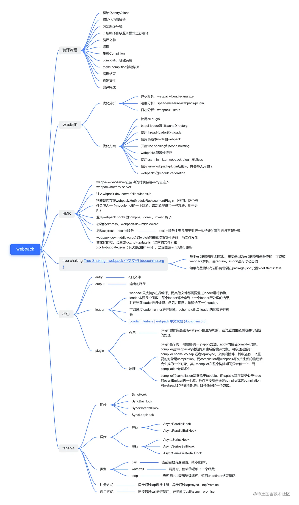
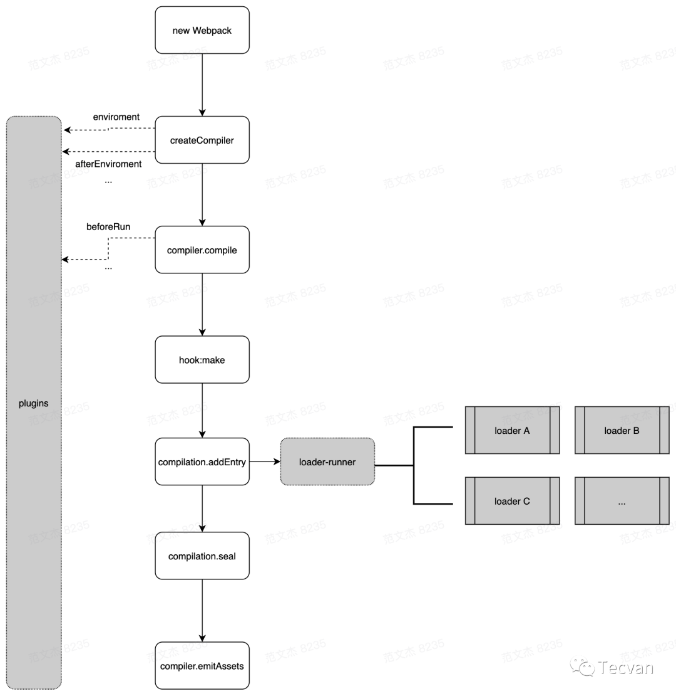
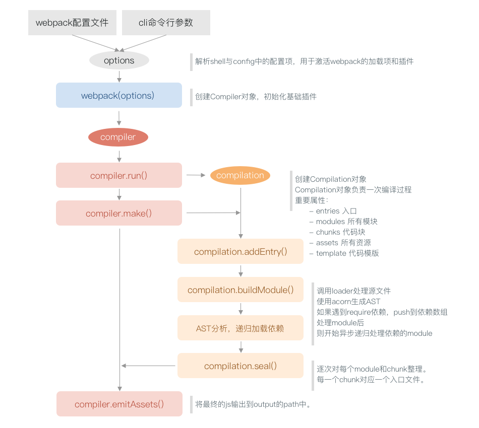
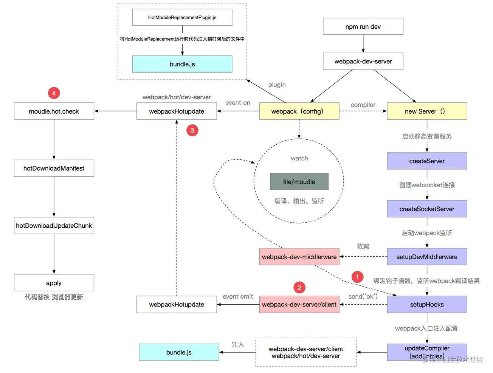

# 思维导图



# webpack 开发环境

```javascript
// webpack 默认能处理 js、json 文件
const HtmlWebpackPlugin = require("html-webpack-plugin");
const { resolve } = require("path");
module.export = {
  entry: "...index.js", // 入口文件
  output: {
    filename: "js/main.js",
    path: resolve(__dirname, "dist")
  },
  module: {
    rules: [
      {
        test: /^\.less$/,
        use: ["style-loader", "css-loader", "less-loader"]
      },
      {
        test: /^\.css$/,
        use: ["style-loader", "css-loader"]
      },
      {
        // 处理样式中图片资源
        test: /^\.(jpg|png|gif)$/,
        loader: "url-loader",
        options: {
          limit: 8 * 1024,
          name: "imgs/[hash:10].[ext]", // 若要实现不同的输出路径(只需在文件名前加上目录名即可)
          esModule: false // 关闭 es6 模块化
        },
        type: "javascript/auto" // webpack5 版本开始弃用旧的assets loader，需要加点设置才能适用
      },
      {
        // 处理html中图片资源(这里的图片文件的输出路径无需配置，只需在处理图片资源中配置)
        test: /^\.html$/,
        loader: "html-loader"
      },
      {
        exclude: /^\.(less|css|html|jpg|png|gif|js)$/,
        loader: "file-loader",
        options: {
          name: "media/[hash:10].[ext]"
        }
      }
    ]
  },
  plugins: [
    new HtmlWebpackPlugin({
      template: resolve(_dirname, "...index.html")
    })
  ],
  mode: "development",
  devServer: {
    // 开发服务器 devServer: 用来自动化(自动编译、打开浏览器、刷新浏览器)
    // 特点：之后在内存中打包编译，不会有任何输出
    // 启动 devServer 的指令：npx webpack-dev-server
    static: {
      directory: resolve(__dirname, "build")
    },
    compress: true, // 开启 gzip 压缩
    host: "", // 主机名
    port: "", // 端口
    open: true, // 自动打开
    watchFiles: ["./src/index.html"] // webpack5+,监听html文件`热更新`需要添加这句
  }
};
```

# webpack 生产环境

```json
// package.json
{
  "browserslist": {
    "development": ["last 1 chrome version", "last 1 firefox version", "last 1 safari version"],
    "production": [">0.2%", "not dead", "not op_mini all"]
  },
  "dependencies": {
    "D": "^1.0.1",
    "optimize-css-assets-webpack-plugin": "^6.0.1"
  }
}
```

```javascript
const HtmlWebpackPlugin = require("html-webpack-plugin");
const MiniCssExtractPlugin = require("mini-css-extract-plugin");
const OptimizeCssAssetsWebpackPlugin = require("optimize-css-assets-webpack-plugin");

const commonCssLoader = [
  // 'style-loader', // 创建 style 标签,将样式放入
  // 用这个 loader 取代 style-loader 。作用：提取 js 文件中的 css
  MiniCssExtractPlugin.loader,
  "css-loader",
  {
    loader: "postcss-loader", // css 兼容性
    options: {
      postcssOptions: {
        // 外围需要包裹一层这个需要注意
        ident: "postcss",
        plugins: () => [
          require("postcss-preset-env")() // 记得需要运行
        ]
        // 还需要在 package.json 中定义 browerslist
      }
    }
  }
];
// 定义 nodejs 环境变量；决定使用 'broserslist' 的哪个环境
process.env.NODE_ENV = "production";
module.export = {
  entry: "...index.js", // 入口文件
  output: {
    filename: "js/main.js",
    path: resolve(__dirname, "dist")
  },
  module: {
    rules: [
      {
        test: /\.css$/,
        use: [...commonCssLoader]
      },
      {
        test: /\.less$/,
        use: [...commonCssLoader, "less-loader"]
      },
      /**
       * 正常来说，一个文件只能被一个 loader 处理
       * 当一个文件需要被多个 loader 处理
       * 那么一定要指定 loader 执行的先后顺序
       *  先执行 eslint 在执行 babel
       */
      /* { // js 代码规范校验
        // 在 packege.json 中配置 eslintConfig ??
        test: /\.js$/,
        exclude: /node_modules/,
        enforce: 'pre', // 优先执行  
        loader: 'eslint-loader',
        options: {
          fix: true // 自动修复
        }
      }, */
      {
        // js 兼容性
        test: /\.js$/,
        exclude: /node_modules/,
        loader: "babel-loader",
        options: {
          presets: [
            [
              "@babel/preset-env",
              {
                useBuiltIns: "usage",
                corejs: { version: 3 },
                targets: {
                  chrome: "60",
                  firefox: "60"
                }
              }
            ]
          ]
        }
      },
      {
        // 处理图片
        test: /\.(jpg|png|gif)$/,
        loader: "url-loader",
        options: {
          limit: 8 * 1024,
          name: "imgs/[hash:8].[ext]",
          esModule: false
        },
        type: "javascript/auto"
      },
      {
        // 处理 html 中的图片
        test: /\.html$/,
        loader: "html-loader"
      },
      {
        // 处理其他文件
        exclude: /\.(js|css|png|jpg|gif|html|less)$/,
        loader: "file-loader",
        options: {
          name: "media/[hash:8].[ext]"
        }
      }
    ]
  },
  plugins: [
    new MiniCssExtractPlugin({
      // 提取 css
      filename: "css/index.css"
    }),
    new OptimizeCssAssetsWebpackPlugin(), // 压缩 css
    new HtmlWebpackPlugin({
      template: "./src/index.html",
      minify: {
        // 压缩 html
        collapseWhitespace: true,
        removeComments: true
      }
    })
  ],
  mode: "production"
};
```

# webpack 打包流程

[[万字总结] 一文吃透 Webpack 核心原理](https://mp.weixin.qq.com/s/SbJNbSVzSPSKBe2YStn2Zw)

Webpack 的核心功能就是将各种类型的资源，包括图片、css、js 等，转译、组合、拼接生成 js 格式的 bundle(打包) 文件。



Webpack 的打包过程完成了 `内容转换 + 资源合并` 两种功能，包含三个阶段：

1. 初始化阶段：

   1. `初始化参数：`读取配置文件和命令行参数并与默认配置结合得到用户配置参数

   2. `创建 Compiler 编译器对象：`将参数传入 `Webpack` 构造函数创建 Compiler 对象

   3. `初始化编译环境：`根据 `entry` 入口配置注入内置的插件、注册各种模块工厂、初始化 RuleSet 规则集、加载配置的插件

   4. `开始编译：`执行 `Compiler` 对象的 `run` 方法，得到 `Compilation` 单次编译的管理器对象。每次文件变更触发重新编译时，都会创建一个新的 `Complation` 对象。

   5. `确定入口：`根据配置中的 `entry` 找出所有的入口文件，调用 `Compilation.addEntry` 将入口文件转换为 `Dependence` 对象

2. 编译阶段：

   1. `make 编译模块：`根据 `entry` 对应的 `Dependence` 创建 `Module` 模块对象，调用 `loader` 将模块转译为标准 js 内容，调用 js 解释器将内容转换为 `AST` 对象，从中找出该模块依赖的模块，再递归 `make` 步骤直到所有入口依赖的文件都经过 `make` 处理

   2. `完成模块编译：`上一步递归处理所有可达的模块后，得到每个模块被翻译后的内容以及它们之间的 `ModuleDependencyGraph` 依赖关系图

3. 输出阶段：

   1. `seal 输出资源：`根据 `entry` 配置和模块之间的依赖关系，组装成一个个包含多个 `Module` 的 `Chunk 代码块` ，再把每个 `Chunk` 转化成一个单独的文件加入到输出列表，这是最后一次能修改输出内容的步骤

   2. ` emitAssets 写入文件系统：`在确定好输出内容后，根据配置确定输出的路径和文件名，把文件内容写入到文件系统。

在以上过程中， Webpack 会在特定的时间点广播出特定的事件，插件在监听到感兴趣的事件后会执行特定的逻辑，并且插件可以调用 Webpack 提供的 API 改变 Webpack 的运行结果。

.png>)

# 常用 loader

- file-loader：加载文件资源，如 图片，有移动复制命名等功能，在代码中通过相对 URL 引用输出的文件

- url-loader：通常用于加载图片，可以设置一个阈值，大于阈值交给 file-loader 处理，小于阈值时直接转为 base64 编码的二进制流，减少请求

- style-loader：将 css 代码注入到 Javascript 中，通过 DOM 操作加载 css，将 css 通过 `<style>` 标签引入到 html 中

- css-loader：分析 `@import` 和 `url()`，引用 css 与对应的资源。支持模块化、压缩、文件导入。

- less-loader/sass-loader：将 less/sass 代码转为 css 代码

- postcss-loader：处理 css 兼容性，如进制转换

- less-loader：less 文件的预处理器，将 .less 后缀的文件转换成 css 文件

- babel-loader：将 ES6 代码转换成 ES5，解决兼容性问题

  - balylon 将 ES6/ES7 代码解析成 AST
  - babel-traverse 对 AST 进行遍历转译，得到新的 AST
  - 新的 AST 通过 babel-generator 转换成 ES5



# 常用的 plugin

- html-webpack-plugin：简化 html 文件创建(依赖于 html-loader)，html 压缩、自动引入打包后的 js

- split-chunks-plugin：代码分割

- mini-css-extract-plugin：抽离样式，css 提取为独立文件，支持按需加载

- optimize-css-assets-webpack-plugin：css 压缩

- compression-webpack-plugin：使用 Gzip 压缩 js 和 css。

# loader 和 plugin 的区别

- `loader` 就是加载器，本质是一个函数，在该函数中对接收到的内容进行转换，返回转换后的结果。因为 Webpack 只能处理 CommonJS 规范的 JavaScript 模块，所以就需要通过 loader 对其他类型的资源进行转译，转换成 Webpack 能处理的模块。

- `plugin` 就是插件，它直接作用于 Webpack，可以扩展 Webpack 的功能，让 Webpack 具有更多的灵活性。在 Webpack 运行的生命周期中会广播出许多事件，Plugin 可以监听这些事件，在合适的时机通过 Webpack 提供的 API 改变输出结果。Plugin 可以解决 loader 无法实现的其他事，例如 html-webpack-plugin 可以在 html 中引入打包后的 js 资源。

- `loader` 在 module.rules 中配置，作为模块的解析规则，类型为数组。每一项都是一个对象，在对象中通过 loader 或 use 指定 loader、test 指定需要编译的文件、options 配置 loader 编译的配置。

- `plugin` 在 plugins 中单独配置，类型为数组，数组的每一项是插件的实例，参数都通过构造函数传入。

# 文件监听原理

轮询判断文件的最后编辑时间是否变化，如果某个文件发生了变化，并不会立刻告诉监听者，而是先缓存起来，等 `aggregateTimeout` 后再执行。

开启监听模式的方式：

- 启动 webpack 命令时，带上 --watch 参数
- 在 webpack.config.js 中设置 watch: true

```js
module.exports = {
  // 默认 false，也就是不开启
  watch: true,
  // 只有开启监听模式时，watchOptions 才有意义
  watchOptions: {
    // 默认为空，不监听的文件或者文件夹，支持正则匹配
    ignored: /node_modules/,
    // 监听到文件变化发生后会等 300ms 再去执行，默认 300ms
    aggregateTimeout: 300,
    // 判断文件是否发生变化，通过不断轮询系统指定文件有没有变化，默认每秒间 1000 次
    poll: 1000
  }
};
```

# devServer HMR 热模块替换原理

[热模块替换原理](https://juejin.cn/post/6844904008432222215#heading-14)
[热模块替换详细原理](https://zhuanlan.zhihu.com/p/30669007)

HMR，Hot Module Replacement。

**热模块替换与热更新不相同，热更新会打包编译所有资源，并刷新浏览器。而热模块替换只会发生局部修改。**

- 使用 webpack-dev-server 托管静态资源，同时以 Runtime 运行时的方式注入 HMR 客户端代码

- 浏览器加载页面后，与 WDS 建立 Websocket 链接

- Webpack 监听到文件变化后，`增量构建`发生变更的模块，并在增量构建完毕后触发 `compilation.hooks.done` 钩子，并向 WDS 传递本次构建的统计信息对象 `stats` 。WDS 监听 done 钩子，在回调中通过 Websocket 发送 hash 事件

- 浏览器接收到 hash 事件后，请求 `manifest` 资源文件，确认本轮热更新涉及的 chunk

  `manifest`文件：JSON 格式的文件，包含所有发生变更的模块列表，命名为 [hash].hot-update.json

  模块变更文化：js 文件，包含编译后的模块代码，命名为 [hash].hot-update.js

  注意： Webpack 4 之前，热更新文件以模块为单位，即所有发生变化的模块都会生成对应的热更新文件； Webpack 5 之后热更新文件以 chunk 为单位，chunk 下任意文件的变化都只会生成 main.[hash].hot-update.js

- 浏览器请求并加载发生变更的资源

- Webpack 运行时触发变更模块的 module.hot.accept 回调，这需要客户端通过 module.hot.accept 接口明确告知 webpack 如何执行代码替换，执行代码变更逻辑

- done



在构建打包文件时，加入一段 HMR runtime 的 js 和一段与服务器建立 websocket 连接的 js，文件修改会触发 webpack 重新构建，服务器通过向浏览器发送 hash 事件更新消息，浏览器通过 jsonp 拉取更新模块文件，jsonp 的回调触发热模块更新。

# babel 原理

[Babel 原理](https://juejin.cn/post/6844903760603398151)

babel 常用于将 ES6 语法转译为 ES5 的语法。主要步骤如下：

1. parse 解析

   将代码字符串解析为 AST 抽象语法树。每个 JS 引擎都有自己的解析器，Babel 通过 Babylon 实现。解析过程有两个阶段：

   1. 词法分析（Lexical Analysis）

      将字符串形式的代码转换为 tokens 令牌流， token 类似于 AST 中的节点

   2. 语法分析（Syntactic Analysis）

      把一个令牌流转换成 AST 形式，这个阶段会把令牌中的信息转换成 AST 的表述结构

   code(字符串形式代码) -> tokens(令牌流) -> AST(抽象语法树)

2. transform 转换

   Babel 拿到解析得到的 AST 通过 babel-traverse 对其深度优先遍历，在此过程中对节点进行添加、更新及移除。是 Babel 或是其他编译器中最复杂的过程。

3. generate 生成

   将转换后的 AST 通过 babel-generator 转换成字符串形式的 js 代码，同时还会创建源码映射（source-map）。
   通过深度优先遍历整个 AST ，然后构建可以表示转换后代码的字符串。

# AST

[AST 抽象语法树——最基础的 javascript 重点知识，99%的人根本不了解](https://segmentfault.com/a/1190000016231512)
