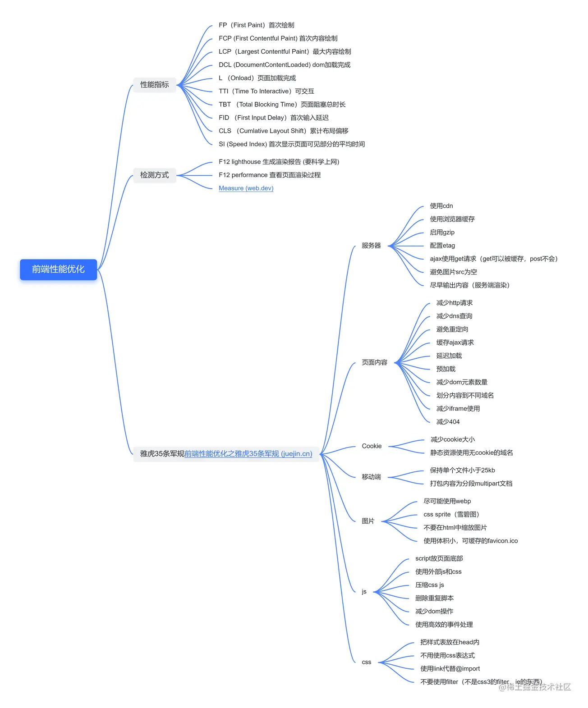
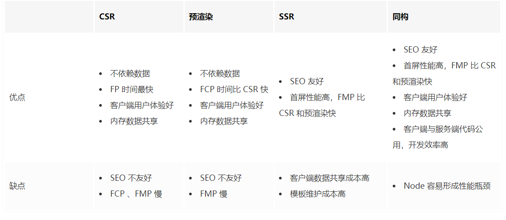

# 思维导图



# [前端性能优化之雅虎 35 条军规](https://juejin.cn/post/6844903657318645767?from=from_parent_mindnote)

# 首屏加载性能指标

**FP：First Paint** ，首次绘制，是时间线上的第一个“时间点”，它代表浏览器第一次向屏幕传输像素的时间，也就是页面在屏幕上`首次发生视觉变化`的时间。

注意：FP 不包含默认背景规则，包含非默认的背景绘制。

**FCP：First Contentful Paint**，首次内容绘制，代表浏览器第一次向屏幕绘制“内容”。

注意：只有`首次绘制来自 DOM 的内容`，如文本、图片、非白色的 Canvas 或 SVG 才被算作 FCP。

**FMP：First Meaningful Paint**，首次有效绘制，表示页面的“主要内容”开始出现在屏幕上的时间点，测量用户加载体验的主要指标。

**TTFB 是 Time to First Byte** ，指的是浏览器开始收到服务器响应数据的时间（后台处理时间+重定向时间），是反映服务端响应速度的重要指标。就像你问朋友了一个问题，你的朋友思考了一会儿才给你答案，你朋友思考的时间就相当于 TTFB。你朋友思考的时间越短，就说明你朋友越聪明或者对你的问题越熟悉。对服务器来说，TTFB 时间越短，就说明服务器响应越快。

**TTI**，

# 首屏渲染优化方式即比较



# 预渲染

webpack 打包时候渲染，通过无头浏览器。

`无头浏览器` 就是在打包的时候，把 index.html 的内容放入浏览器，但是浏览器是空白的，当进入页面时直接加载这个 index.html ，但是没有 Ajax 请求的数据。

获取到预渲染的页面 html 内容，然后在放入 index.html 再到 CDN 直接请求 html ，相当于把 FMP 提前到了 FP，更像是另外一种骨架屏，少了 Ajax 请求。

# SSR 服务端渲染

在 node 服务端预先请求客户端需要加载的资源，并在服务端完成了数据的渲染，再将全部渲染完成后的 html 资源返回给客户端。

# 使用 Gzip 压缩

需要服务端开启 Gzip 支持，并且在前端部分添加一些插件用于支持 Gzip 压缩。

# 延迟 css/js 加载

使用外链式的 css 和 js 引入，js 标签上添加 async/defer 属性。可以在 main.js 中通过 import 引入一些 UI 组件库或 css 文件，然后通过外链式的 script 引入，这样就不会通过 webpack 打包。

# 骨架屏

在进入 FP 阶段时，在页面先显示一个基本的界面轮廓，当页面加载完成之后就消失。

# 路由懒加载

步骤：

1. 将需要进行懒加载的子模块打包成独立的文件

可以通过在 import 中通过 webpackChunkName 字段指定按需加载的文件打包后生成的文件名
`import(/* webpackChunkName: "con" */ './con.js')`

并且在 webpack 配置中的 output 属性添加上 chukFilename 以 '[name].bundle.js' 的格式，这样在 import 中通过 `/* webpackChunkName:名字 */` 就可以将懒加载的子模块打包成独立的文件了。

    ```js
    const path = require("path");
    module.exports = {
      entry: "./src/main.js", //入口文件
      output: {
        path: path.resolve(__dirname, "dist"),
        chunkFilename: "[name].bundle.js",
        filename: "bundle.js"
      }
    };
    ```

2. 借助函数实现延迟执行子模块的加载代码

ES6 提供了 import() 函数，可以实现运行时的异步加载，与 cjs 的 require 运行时同步加载不同。import 函数帮助我们将懒加载的子模块打包成独立的文件，并且可以将模块的引入，用函数的形式实现函数调用时加载子模块代码。我们知道 js 的运行过程分为解释和执行，在解释阶段便确定了作用域，并且在执行阶段创建执行上下文，而函数上下文的创建仅在函数调用时，因此函数只要不调用就不会创建相应的执行上下文也就不会执行函数体里的代码。

语法：
`() => import(路径)` 、 `resolve => require([路径], resolve)`

# 图片懒加载

图片懒加载主要是利用图片标签有 src 属性会就发送请求，如果没有 src 属性就不会发送请求的特性。

在图片标签中添加一个 data-src 属性，将图片的 url 放在 data-src 中，然后在图片快要进入可视区前或者已经在可视区时将 url 取出放入到 src 属性中。

1. 通过 img 的 loading 属性设为 `lazy`

    loading：HTML 元素延迟加载属性，loading 属性值为 lazy 时允许浏览器选择性加载 img 元素，根据用户滚动操作至其元素附近执行加载，一定程度起到节流的作用。

    - eager，默认值。图像会立即加载
    - lazy，图像延迟加载。推迟图片加载知道浏览器认为其需要立即加载时才去加载

2. 判断元素是否在可视区可以通过 元素到文档顶部的距离(固定)-浏览器窗口与文档顶部之间的距离，滚动条滚动距离(可变)是否小于屏幕的可视区高度(不变)来判断，小于就是在可视区内，大于就是不在可视区内，

    ```js
    Element.offsetTop - document.documentElement.scrollTop < document.documentElement.clientHeight;
    Element.offsetTop - document.documentElement.scrollTop < window.innerHeight;
    ```

3. 也可以通过 getBoundingClientRect 获取元素的大小和位置来判断是否在可视区内。当元素到可视窗口顶部的距离小于可视区高度时说明在可视区内。

    在监听滚动条滚动事件来更改图片的 url 的值时采用节流，防止频繁操作 DOM。

    ```js
    function isInSight(el) {
        const bound = Element.getBoundingClientRect();
        const eTop = bound.top,
            eBottom = bound.bottom;
        const clientHegiht = window.innerHeight;
        return eTop <= clientHeight;
    }
    function load(el) {
        if (isInSight(el)) {
            if (!el.src) {
                const src = el.dataset.src; // 通过 dataset 拿到所有 data- 自定义属性
                el.src = src;
                el.removeAttribute("data-src");
            }
        }
    }
    function throttle(fn, delay = 300) {
        let timer = null;
        return function (...args) {
            if (!timer) {
                timer = setTimeout(() => {
                    timer = null; // 清除定时器
                    fn.apply(this, args);
                }, delay);
            }
        };
    }
    function listenerScroll(el) {
        const handler = throttle(load, 300);
        load(el); // 首次渲染时
        window.addEventListener(
            "scroll",
            function () {
                handler(el);
            },
            false
        );
    }
    ```

4. 也可以使用 IntersectionObserver 这个 API ，监测每一个图片元素 intersectionRatio 这个属性变化来加载图片，这个属性的含义是可见比例，处于 0-1 时表示元素可见。并且在每次元素 onload 完后取消对它的监听。

    ```js
    const io = new IntersectionObsever(io => {
        const el = io.target; // 获取目标元素
        const intersectionRatio = io.itersectionRatio;
        if (itersectionRatio > 0 && itersectionRatio <= 1) {
            if (!el.src) {
                const src = el.dataset.src; // 通过 dataset 拿到所有 data- 自定义属性
                el.src = src;
                el.removeAttribute("data-src");
            }
        }
        el.onload = el.onerror = () => io.unobserve(el);
    });
    const eleList = document.querySelectorAll("img");
    eleList.forEach(el => {
        io.observe(el);
    });
    ```

# CDN

CDN (Content Delivery Network，内容分发网络) ，通过给用户选择一个最近的 CDN 服务器向用户响应服务。把缓存在 CDN 服务器中源站点的内容快速提供给用户，并且 CDN 服务器需要与源站点进行内容同步，把更新的内容及本地没有的内容从源站点获取并保存在本地。

## CDN 组成

-   **分发服务器系统：**

    最基本的工作单元就是 Cache 设备，边缘 Cache 负责直接响应用户的资源请求，同步源站点的内容。Cache 设备的数量、规模、总服务器能力 是衡量一个 CDN 系统服务器能力的最基本的指标。

-   **负载权衡系统：**

    负责对所有发起服务请求的用户进行访问调度，确定提供给用户的最终实际访问地址。负载权衡系统分为全局负载权衡和本地负载权衡，`全局负载权衡` 采用就近性原则，通过对每个服务节点“最优”判断，确定向用户提供服务的 Cache 设备的物理位置。`本地负载权衡` 主要负责 节点内部 的设备负载权衡。

-   **运营管理系统：**

    运营管理系统分为 运营管理 和 网络管理 子系统，负责业务层面功能，如与外界系统交换所必须的收集、整理、交付工作，包括客户管理、产品管理、计费管理、统计分析等功能。

## CDN 优点

-   通过选择距离用户最近的 CDN 服务器响应用户请求，延迟更低加载更快
-   一般通过 CDN 加载缓存静态资源，如 图片、脚本、文档
-   部分资源请求分配给 CDN ，减少服务器压力

## CDN 原理

1. 对于客户端访问的 URL，进行 DNS 的解析，发现这个 URL 是一个 CDN 专用的 DNS 服务器， DNS 系统就会将域名解析权交给 CNAME 指向的 CDN 专用的 DNS 服务器

2. CDN 专用的 DNS 服务器将 CDN 的全局负载权衡设备的 IP 地址返回给客户端

3. 客户端向 CDN 的全局负载权衡设备发起资源请求

4. CDN 的全局负载权衡设备根据客户端的 IP 地址，以及客户端请求的 URL ，选择一台客户端所属区域的区域负载权衡设备，告诉客户端向这台设备发起请求

5. 区域负载权衡设备选择一台合适的缓存服务器提供服务，将该缓存服务器的 IP 地址返回给全局负载权衡设备

6. 全局负载权衡设备把缓存服务器的 IP 地址返回给客户端

7. 客户端向该缓存服务器发起请求，缓存服务器响应客户端请求并响应客户端请求的资源

如果缓存服务器没有客户端请求的资源，那么缓存服务器就会向它的上一级缓存服务器请求资源，直至获取到需要的资源，如果最终还是没有就会回到自己的服务器中同步这项资源然后响应该资源。

扩展： CNAME（意为：别名）：在域名解析中，实际上解析出来的指定域名对应的 IP 地址，或者该域名的一个 CNAME，然后再根据这个 CNAME 来查找对应的 IP 地址。

# webpack 打包优化

1. 优化 loader

    - 指定需要打包的文件夹 `include`，以及不需要打包的文件夹 `exclude` 比如 node_mudules 中的代码都是编译过的，无需再处理一遍

    - 将 babel 编译过的文件进行缓存

        `loader: 'babel-loader?cacheDirectory=true'`

2. 组件、类库采用按需加载

3. 代码压缩

webpack 的 production 模式默认会对 js 资源进行压缩，向 html、css 资源需要通过配置 loader 或 plugin 进行压缩，HtmlWebpackPlugin、OptimizeCssWebpackPliugin

# 更快的图片加载

浏览器对资源的加载(下载)是有优先级的，html > css > js > img，而图片的优先级取决于图片引入的方式。

-   以 `background-image:url();` 存在的图片会等到`页面结构全部加载完成后`才开始加载，虽然优先级被提升为 high 但仍然会在 script 之后加载。

-   在 html 中标签 img 是网页结构的一部分，会在`加载过程中并行加载`。这种方式虽然可以提升 img 的加载优先级，但是如果 css 和 js 的外链式资源数大于浏览器同域名能并行的 tcp 链接数(http1.1 6 个)， img 资源的加载仍然会被延迟，直到有空闲的 tcp 链接。之所以页面结构中的 img 优先级被提升为 high 后还在 script 之后加载，是因为 img 在初始化时默认优先级都为 low，只有等到浏览器渲染到图片时，计算图片是否在视图内才把图片提升到优先级为 high。

-   通过 link 标签的 rel="preload" 加载图片，可以让图片在 css/js 前加载。

    `<link rel="preload" as="image" href="http://yun.tuisnake.com/image/1.jpg">`

-   因为我们知道同一个域名下能并行连接的 tcp 连接数只有 6 个，可以将图片单独放在一个域名之下，这样图片资源也可以在第一时间加载。

-   虽然可以通过 script 开启 async/defer 来延迟脚本的加载，但是图片依然会在最后加载。我们可以通过 js 来延迟 css 资源和 script 脚本的加载

-   开启 HTTP 2.0 ，利用 HTTP2 二进制分帧和多路复用的特性，并行加载所有资源。
