# 排序

## 冒泡排序

思路：

- 俩俩交换，大的放在后面，第一次排序后最大值已在数组末尾。
- 因为俩俩交换，需要`n-1`趟排序，比如10个数，需要9趟排序

代码实现要点：

- 两个for循环，外层循环控制排序的趟数，内层循环控制比较的次数。**每趟过后，比较的次数都应该要减1。**。
- 优化：如果一趟排序后也没有交换位置，那么该数组已有序～

```
	//外层循环是排序的趟数
    for (int i = 0; i < arrays.length -1 ; i++) {

        //每比较一趟就重新初始化为0
        isChange = 0;

        //内层循环是当前趟数需要比较的次数
        for (int j = 0; j < arrays.length - i - 1; j++) {

            //前一位与后一位与前一位比较，如果前一位比后一位要大，那么交换
            if (arrays[j] > arrays[j + 1]) {
                temp = arrays[j];
                arrays[j] = arrays[j + 1];
                arrays[j + 1] = temp;


                //如果进到这里面了，说明发生置换了
                isChange = 1;

            }
        }
        //如果比较完一趟没有发生置换，那么说明已经排好序了，不需要再执行下去了
        if (isChange == 0) {
            break;
        }
      
    }

```

### 2.2选择排序

思路：

- 找到数组中最大的元素，与数组最后一位元素交换
- 当只有一个数时，则不需要选择了，因此需要`n-1`趟排序，比如10个数，需要9趟排序

代码实现要点：

- **两个for循环，外层循环控制排序的趟数，内层循环找到当前趟数的最大值，随后与当前趟数组最后的一位元素交换**

```
        //外层循环控制需要排序的趟数
        for (int i = 0; i < arrays.length - 1; i++) {

            //新的趟数、将角标重新赋值为0
            pos = 0;

            //内层循环控制遍历数组的个数并得到最大数的角标
            for (int j = 0; j < arrays.length - i; j++) {

                if (arrays[j] > arrays[pos]) {
                    pos = j;
                }

            }
            //交换
            temp = arrays[pos];
            arrays[pos] = arrays[arrays.length - 1 - i];
            arrays[arrays.length - 1 - i] = temp;


        }

        System.out.println("公众号Java3y" + arrays);
复制代码
```

### 2.3插入排序

思路：

- 将一个元素插入到已有序的数组中，在初始时未知是否存在有序的数据，因此将元素**第一个元素看成是有序的**
- 与有序的数组进行比较，**比它大则直接放入，比它小则移动数组元素的位置，找到个合适的位置插入**
- 当只有一个数时，则不需要插入了，因此需要`n-1`趟排序，比如10个数，需要9趟排序

代码实现：

- 一个for循环内嵌一个while循环实现，外层for循环控制需要排序的趟数，while循环找到合适的插入位置(并且插入的位置不能小于0)

```
        //临时变量
        int temp;


        //外层循环控制需要排序的趟数(从1开始因为将第0位看成了有序数据)
        for (int i = 1; i < arrays.length; i++) {

            temp = arrays[i];

            //如果前一位(已排序的数据)比当前数据要大，那么就进入循环比较[参考第二趟排序]

            int j = i - 1;

            while (j >= 0 && arrays[j] > temp) {

                //往后退一个位置，让当前数据与之前前位进行比较
                arrays[j + 1] = arrays[j];

                //不断往前，直到退出循环
                j--;

            }
            //退出了循环说明找到了合适的位置了，将当前数据插入合适的位置中
            arrays[j + 1] = temp;

        }
        System.out.println("公众号Java3y" + arrays);
复制代码
```

### 2.4快速排序

思路：

- 在数组中找一个元素(节点)，比它小的放在节点的左边，比它大的放在节点右边。一趟下来，比节点小的在左边，比节点大的在右边。
- 不断执行这个操作....

代码实现：

- 快速排序用递归比较好写【如果不太熟悉递归的同学可到：

  递归就这么简单

  】。支点取中间，使用L和R表示数组的最小和最大位置

  - 不断进行比较，直到找到比支点小(大)的数，随后交换，不断减小范围～

- 递归L到支点前一个元素(j)(执行相同的操作,同上)

- 递归支点后一个元素(i)到R元素(执行相同的操作,同上)

```
 public static void quickSort(int[] arr,int low,int high){
        int i,j,temp,t;
        if(low > high){
            return;
        }
        i = low;
        j = high;
        //分解元素
        temp = arr[low];
        while(i < j){
            while(temp <= arr[j] && i < j){
                j--;
            }
            while(temp >= arr[i] && i < j){
                i++;
            }
            if(i < j){
                t = arr[j];
                arr[j] = arr[i];
                arr[i] = t;
            }
        }
        arr[low] = arr[i];
        arr[i] = temp;
        quickSort(arr,low,j - 1);
        quickSort(arr,j + 1, high);
    }
```

### 2.5归并排序

思路：

- 将两个已排好序的数组合并成一个有序的数组。
  - **将元素分隔开来，看成是有序的数组，进行比较合并**
  - 不断拆分和合并，直到只有一个元素

代码实现：

- 在第一趟排序时实质是两个元素(看成是两个已有序的数组)来进行合并，不断执行这样的操作，最终数组有序
- 拆分左边，右边，合并...

```
    public static void main(String[] args) {
        int[] arrays = {9, 2, 5, 1, 3, 2, 9, 5, 2, 1, 8};
        mergeSort(arrays, 0, arrays.length - 1);

        System.out.println("公众号：Java3y" + arrays);


    }

    /**
     * 归并排序
     *
     * @param arrays
     * @param L      指向数组第一个元素
     * @param R      指向数组最后一个元素
     */
    public static void mergeSort(int[] arrays, int L, int R) {

        //如果只有一个元素，那就不用排序了
        if (L == R) {
            return;
        } else {

            //取中间的数，进行拆分
            int M = (L + R) / 2;

            //左边的数不断进行拆分
            mergeSort(arrays, L, M);

            //右边的数不断进行拆分
            mergeSort(arrays, M + 1, R);

            //合并
            merge(arrays, L, M + 1, R);

        }
    }


    /**
     * 合并数组
     *
     * @param arrays
     * @param L      指向数组第一个元素
     * @param M      指向数组分隔的元素
     * @param R      指向数组最后的元素
     */
    public static void merge(int[] arrays, int L, int M, int R) {

        //左边的数组的大小
        int[] leftArray = new int[M - L];

        //右边的数组大小
        int[] rightArray = new int[R - M + 1];

        //往这两个数组填充数据
        for (int i = L; i < M; i++) {
            leftArray[i - L] = arrays[i];
        }
        for (int i = M; i <= R; i++) {
            rightArray[i - M] = arrays[i];
        }


        int i = 0, j = 0;
        // arrays数组的第一个元素
        int  k = L;


        //比较这两个数组的值，哪个小，就往数组上放
        while (i < leftArray.length && j < rightArray.length) {

            //谁比较小，谁将元素放入大数组中,移动指针，继续比较下一个
            if (leftArray[i] < rightArray[j]) {
                arrays[k] = leftArray[i];

                i++;
                k++;
            } else {
                arrays[k] = rightArray[j];
                j++;
                k++;
            }
        }

        //如果左边的数组还没比较完，右边的数都已经完了，那么将左边的数抄到大数组中(剩下的都是大数字)
        while (i < leftArray.length) {
            arrays[k] = leftArray[i];

            i++;
            k++;
        }
        //如果右边的数组还没比较完，左边的数都已经完了，那么将右边的数抄到大数组中(剩下的都是大数字)
        while (j < rightArray.length) {
            arrays[k] = rightArray[j];

            k++;
            j++;
        }
    }
复制代码
```

### 2.6堆排序

思路：

- 堆排序使用到了完全二叉树的一个特性【不了解二叉树的同学可到：[二叉树就这么简单](https://link.juejin.cn?target=https%3A%2F%2Fmp.weixin.qq.com%2Fs%3F__biz%3DMzI4Njg5MDA5NA%3D%3D%26mid%3D2247484064%26idx%3D1%26sn%3Dba783e3e83b8007fcdf129ec0839b6c2%26chksm%3Debd743a1dca0cab7eed0ba42d1c5d343d88858c17e90a803e0ce9e6644187e5297b29ffbb020%23rd)学习一波】，根节点比左孩子和右孩子都要大，完成**一次建堆**的操作实质上是比较根节点和左孩子、右孩子的大小，大的交换到根节点上，**直至最大的节点在树顶**
- 随后与数组最后一位元素进行交换
- ......

代码实现：

- 只要左子树或右子树大于当前根节点，则替换。替换后会导致下面的子树发生了变化，因此同样需要进行比较，直至各个节点实现父>子这么一个条件

```
public static void main(String[] args) {

    int[] arrays = {6, 3, 8, 7, 5, 1, 2, 23, 4321, 432, 3,2,34234,2134,1234,5,132423, 234, 4, 2, 4, 1, 5, 2, 5};

    for (int i = 0; i < arrays.length; i++) {

        //每完成一次建堆就可以排除一个元素了
        maxHeapify(arrays, arrays.length - i);

        //交换
        int temp = arrays[0];
        arrays[0] = arrays[(arrays.length - 1) - i];
        arrays[(arrays.length - 1) - i] = temp;

    }


}

/**
 * 完成一次建堆，最大值在堆的顶部(根节点)
 */
public static void maxHeapify(int[] arrays, int size) {

    for (int i = size - 1; i >= 0; i--) {
        heapify(arrays, i, size);
    }

}


/**
 * 建堆
 *
 * @param arrays          看作是完全二叉树
 * @param currentRootNode 当前父节点位置
 * @param size            节点总数
 */
public static void heapify(int[] arrays, int currentRootNode, int size) {

    if (currentRootNode < size) {
        //左子树和右字数的位置
        int left = 2 * currentRootNode + 1;
        int right = 2 * currentRootNode + 2;

        //把当前父节点位置看成是最大的
        int max = currentRootNode;

        if (left < size) {
            //如果比当前根元素要大，记录它的位置
            if (arrays[max] < arrays[left]) {
                max = left;
            }
        }
        if (right < size) {
            //如果比当前根元素要大，记录它的位置
            if (arrays[max] < arrays[right]) {
                max = right;
            }
        }
        //如果最大的不是根元素位置，那么就交换
        if (max != currentRootNode) {
            int temp = arrays[max];
            arrays[max] = arrays[currentRootNode];
            arrays[currentRootNode] = temp;

            //继续比较，直到完成一次建堆
            heapify(arrays, max, size);
        }
    }
}
```

### 2.7希尔排序

思路：

- 希尔排序实质上就是插入排序的增强版，希尔排序将数组分隔成n组来进行插入排序，**直至该数组宏观上有序，**最后再进行插入排序时就不用移动那么多次位置了～

代码思路：

- 希尔增量一般是`gap = gap / 2`，只是比普通版插入排序多了这么一个for循环罢了，难度并不大

```
   /**
     * 希尔排序
     *
     * @param arrays
     */
    public static void shellSort(int[] arrays) {


        //增量每次都/2
        for (int step = arrays.length / 2; step > 0; step /= 2) {

            //从增量那组开始进行插入排序，直至完毕
            for (int i = step; i < arrays.length; i++) {

                int j = i;
                int temp = arrays[j];

                // j - step 就是代表与它同组隔壁的元素
                while (j - step >= 0 && arrays[j - step] > temp) {
                    arrays[j] = arrays[j - step];
                    j = j - step;
                }
                arrays[j] = temp;
            }
        }


    }
```

### 2.8基数排序

思路：

- 基数排序(桶排序)：将数字切割成个、十、百、千位放入到不同的桶子里，放一次就按桶子顺序回收一次，直至最大位数的数字放完～那么该数组就有序了

代码实现：

- 先找到数组的最大值，然后根据最大值/10来作为循环的条件(只要>0，那么就说明还有位数)
- **将个位、十位、...分配到桶子上，每分配一次就回收一次**

```
    public static void main(String[] args) {

        int[] arrays = {6, 4322, 432, 344, 55, 234, 45, 243, 5, 2, 4, 5, 6, 7, 3245, 345, 345, 234, 68, 65};

        radixSort(arrays);


    }

    public static void radixSort(int[] arrays) {

        int max = findMax(arrays, 0, arrays.length - 1);

        //需要遍历的次数由数组最大值的位数来决定
        for (int i = 1; max / i > 0; i = i * 10) {

            int[][] buckets = new int[arrays.length][10];

            //获取每一位数字(个、十、百、千位...分配到桶子里)
            for (int j = 0; j < arrays.length; j++) {

                int num = (arrays[j] / i) % 10;

                //将其放入桶子里
                buckets[j][num] = arrays[j];
            }

            //回收桶子里的元素
            int k = 0;

            //有10个桶子
            for (int j = 0; j < 10; j++) {
                //对每个桶子里的元素进行回收
                for (int l = 0; l < arrays.length ; l++) {

                    //如果桶子里面有元素就回收(数据初始化会为0)
                    if (buckets[l][j] != 0) {
                        arrays[k++] = buckets[l][j];

                    }
                    
                }
                
            }

        }
    }


    /**
     * 递归，找出数组最大的值
     *
     * @param arrays 数组
     * @param L      左边界，第一个数
     * @param R      右边界，数组的长度
     * @return
     */

    public static int findMax(int[] arrays, int L, int R) {

        //如果该数组只有一个数，那么最大的就是该数组第一个值了
        if (L == R) {
            return arrays[L];
        } else {

            int a = arrays[L];
            int b = findMax(arrays, L + 1, R);//找出整体的最大值

            if (a > b) {
                return a;
            } else {
                return b;
            }
        }
    }
   
```

# 线性数据结构

## 数组

数组是一种很常见的数据结构。它由相同类型的元素组成，并且是使用一块连续的内存来存储。

我们直接可以利用元素的索引（index）可以计算出该元素对应的存储地址。

数组的特点是：提供**随机访问**，并且**容量有限**。

```
假如数组的长度为 n。
访问：O（1）//访问特定位置的元素
插入：O（n ）//最坏的情况发生在插入发生在数组的首部并需要移动所有元素时
删除：O（n）//最坏的情况发生在删除数组的开头发生并需要移动第一元素后面所有的元素时
```


## 链表

**链表（LinkedList）** 虽然是一种线性表，但是并不会按线性的顺序存储数据，使用的不是连续的内存空间来存储数据。

链表的插入和删除操作的复杂度为 O(1) ，只需要知道目标位置元素的上一个元素即可。但是，在查找一个节点或者访问特定位置的节点的时候复杂度为 O(n) 。

使用链表结构可以克服数组需要预先知道数据大小的缺点，链表结构可以充分利用计算机内存空间,实现灵活的内存动态管理。但链表不会节省空间，相比于数组会占用更多的空间，因为链表中每个节点存放的还有指向其他节点的指针。除此之外，链表不具有数组随机读取的优点。

```
假如链表中有n个元素。
访问：O（n）//访问特定位置的元素
插入删除：O（1）//必须要要知道插入元素的位置
```

### 链表分类

单链表，双向链表，循环链表，双向循环链表


- 单链表

  **单链表** 单向链表只有一个方向，结点只有一个后继指针 next 指向后面的节点。因此，链表这种数据结构通常在物理内存上是不连续的。我们习惯性地把第一个结点叫作头结点，链表通常有一个不保存任何值的 head 节点(头结点)，通过头结点我们可以遍历整个链表。尾结点通常指向 null。

  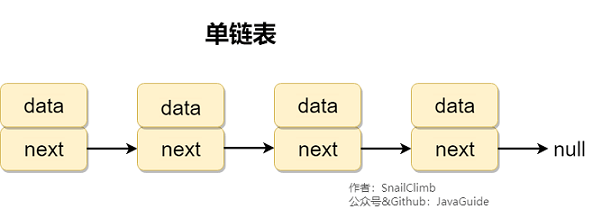

- 循环链表

  **循环链表** 其实是一种特殊的单链表，和单链表不同的是循环链表的尾结点不是指向 null，而是指向链表的头结点。

  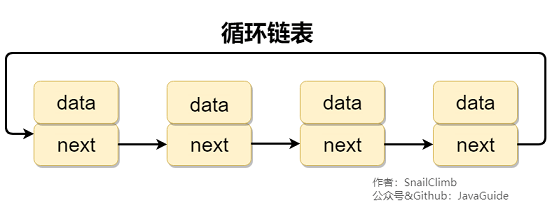

- 双向链表

  **双向链表** 包含两个指针，一个 prev 指向前一个节点，一个 next 指向后一个节点。

  

- 双向循环链表

  **双向循环链表** 最后一个节点的 next 指向 head，而 head 的 prev 指向最后一个节点，构成一个环。

  


### 数组 VS 链表

- 数组支持随机访问，而链表不支持。
- 数组使用的是连续内存空间对 CPU 的缓存机制友好，链表则相反。
- 数组的大小固定，而链表则天然支持动态扩容。如果声明的数组过小，需要另外申请一个更大的内存空间存放数组元素，然后将原数组拷贝进去，这个操作是比较耗时的！


**应用场景：**

- **数组应用场景：数据比较少；经常做的运算是按序号访问数据元素；数组更容易实现，任何高级语言都支持；构建的线性表较稳定**。
- **链表应用场景：对线性表的长度或者规模难以估计；频繁做插入删除操作；构建动态性比较强的线性表**。


> **扩展：** 遍历相同长度的数组和链表，哪个快：
>
> 首先读取速度是缓存>内存。
>
> cpu读取数据是按照缓存行读取到缓存的，简单来说就是cpu会把需要的数据加载到缓存中，查找数据时，会先从缓存找，找不到再到内存找。
>
> 而数组作为连续内存，cpu缓存会把一片连续的内存空间读入，这样连续内存的数组会更易于整块读取到缓存中，当进行遍历时，直接命中缓存。而链表是跳跃式的地址，很轻易就会跳出缓存，跑到内存中去查找数据。所以会慢很多。


## 栈

**栈** (stack)只允许在有序的线性数据集合的一端（称为栈顶 top）进行加入数据（push）和移除数据（pop）。因而按照先进后出的原理运作。**在栈中，push 和 pop 的操作都发生在栈顶。**

栈常用一维数组或链表来实现，用数组实现的栈叫作 **顺序栈** ，用链表实现的栈叫作 **链式栈** 。

```
假设堆栈中有n个元素。
访问：O（n）//最坏情况
插入删除：O（1）//顶端插入和删除元素
```

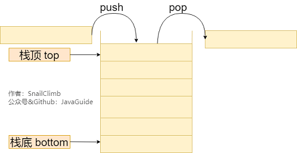

### 应用场景

- 实现浏览器的回退功能

  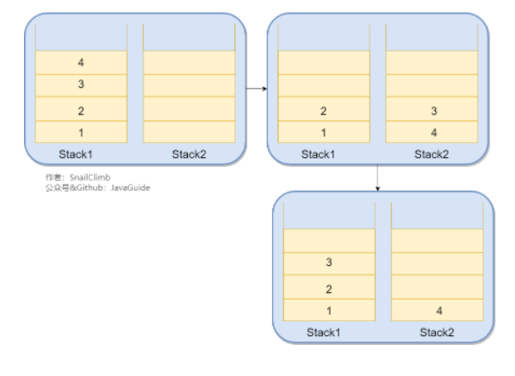

- 检查符合是否成对出现/运算式

- 反转字符串

- 维护函数调用/递归栈

### 数组实现栈

```
public class MyStack {
    private int[] storage;//存放栈中元素的数组
    private int capacity;//栈的容量
    private int count;//栈中元素数量
    private static final int GROW_FACTOR = 2;

    //不带初始容量的构造方法。默认容量为8
    public MyStack() {
        this.capacity = 8;
        this.storage=new int[8];
        this.count = 0;
    }

    //带初始容量的构造方法
    public MyStack(int initialCapacity) {
        if (initialCapacity < 1)
            throw new IllegalArgumentException("Capacity too small.");

        this.capacity = initialCapacity;
        this.storage = new int[initialCapacity];
        this.count = 0;
    }

    //入栈
    public void push(int value) {
        if (count == capacity) {
            ensureCapacity();
        }
        storage[count++] = value;
    }

    //确保容量大小
    private void ensureCapacity() {
        int newCapacity = capacity * GROW_FACTOR;
        storage = Arrays.copyOf(storage, newCapacity);
        capacity = newCapacity;
    }

    //返回栈顶元素并出栈
    private int pop() {
        if (count == 0)
            throw new IllegalArgumentException("Stack is empty.");
        count--;
        return storage[count];
    }

    //返回栈顶元素不出栈
    private int peek() {
        if (count == 0){
            throw new IllegalArgumentException("Stack is empty.");
        }else {
            return storage[count-1];
        }
    }

    //判断栈是否为空
    private boolean isEmpty() {
        return count == 0;
    }

    //返回栈中元素的个数
    private int size() {
        return count;
    }

}
```


## 队列

**队列** 是 **先进先出( FIFO，First In, First Out)** 的线性表。在具体应用中通常用链表或者数组来实现，用数组实现的队列叫作 **顺序队列** ，用链表实现的队列叫作 **链式队列** 。**队列只允许在后端（rear）进行插入操作也就是 入队 enqueue，在前端（front）进行删除操作也就是出队 dequeue**

队列的操作方式和堆栈类似，唯一的区别在于队列只允许新数据在后端进行添加。

```
假设队列中有n个元素。
访问：O（n）//最坏情况
插入删除：O（1）//后端插入前端删除元素
```

### 队列分类

顺序队列、链接队列、循环队列

- 顺序队列

  顺序队列存在**“假溢出”的问题也就是明明有位置却不能添加的情况。**

  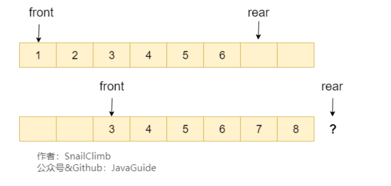


- 循环链表可以解决顺序队列的假溢出和越界问题。

  ```
  //添加算法
  rear = (rear + 1) % M;
  //删除算法
  front = (front + 1) % M;
  ```

  ​

### 应用场景

- 阻塞队列：阻塞队列可以看成在队列基础上加了阻塞操作的队列。当队列为空的时候，出队操作阻塞，当队列满的时候，入队操作阻塞。使用阻塞队列我们可以很容易实现“生产者- 消费者"模型。
- 线程池中的请求/任务队列：线程池中没有空闲线程时，新的任务请求线程资源时，线程池该如何处理呢？答案是将这些请求放在队列中，当有空闲线程的时候，会循环中反复从队列中获取任务来执行。队列分为无界队列(基于链表)和有界队列(基于数组)。无界队列的特点就是可以一直入列，除非系统资源耗尽，比如 ：`FixedThreadPool` 使用无界队列 `LinkedBlockingQueue`。但是有界队列就不一样了，当队列满的话后面再有任务/请求就会拒绝，在 Java 中的体现就是会抛出`java.util.concurrent.RejectedExecutionException` 异常。
- Linux内核进程队列（按优先级排队）
- 现实生活中的派对，播放器上的播放列表
- 消息队列
- 等等


# 图

图是由顶点的非空有限集合V与边的集合E构成的。

```
G = （ V , E )
```

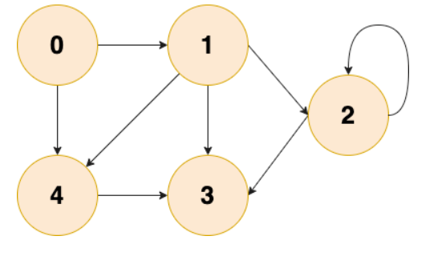

图在我们日常生活中的例子很多！比如我们在社交软件上好友关系就可以用图来表示。

## 图的基本概念

- 顶点

  图中的数据元素，我们称之为顶点，图至少有一个顶点（非空有限集合）

  对应到好友关系图，每一个用户就代表一个顶点。

- 边

  顶点之间的关系用边表示。

  对应到好友关系图，两个用户是好友的话，那两者之间就存在一条边。

- 度

  度表示一个顶点包含多少条边，在有向图中，还分为出度和入度，出度表示从顶点出去的边的条数，入度表示进入该顶点的边的条数。

  对应到好友关系图，度就代表了某个人的好友数量。

- 无向图和有向图

  边表示的是顶点之间的关系，有的关系是没有方向的，比如同学关系，A与B互为好友。有的关系是有方向的，比如父子关系，师生关系。

- 无权图和带权图

  对于一个关系，如果我们只是关心关系的有无，而不关心关系有多强，那么就可以用无权图表示二者的关系。

  对于一个关系，如果我们既然关心关系的有无，也关心关系的强度，比如描述地图上两个城市之间，要用到距离，那么我们就用带权图来表示，带权图中每一条边一个数组来表示权值。

  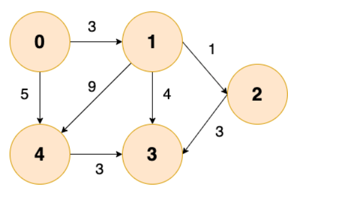

## 图的存储

### 邻接矩阵存储

邻接矩阵将图用二维矩阵存储，是一种较为直观的表示方式。

如果第i个顶点和第j个顶点之间有关系，且关系权值为n，则

`A[i][j] = n`。 在无向图中，我们只关系的有无，使用但顶点i和顶点j有关系时：` A[i][j]=1` 。

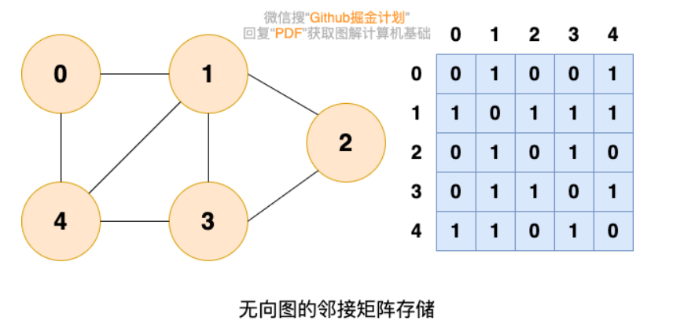

无向图的邻接矩阵是一个对称矩阵。按照压缩存储的思想，在具体存在邻接矩阵时只需存放上三角或者下三角即可。

邻接矩阵存储的方式优点是简单直接（直接使用一个二维数组即可），并且，在获取两个定点之间的关系的时候也非常高效（直接获取指定位置的数组元素的值即可）。但是，这种存储方式的缺点也比较明显，因为一般来说是一个邻接矩阵，这样存储比较浪费空间。

###  邻接矩阵存储

因为存储空间代价太大，实际情况经常遇到的情况都不是稠密表。一个较好的解决办法就是采用邻接矩阵存储方法。

用数组来存放顶点的数据信息，然后再每个顶点分别建立一个线性链表，用来存放边的信息。链表头结点由两个域组成，顶点域用来存放某个顶点的数据信息，指针域指向下一条结点。边结点有三个域，adjvex域表示该边的另外一端的顶点序号，weight域只在带权图有，表示一条边的权值，next域为指针域，指出与顶点邻接的下一条边所对应的下一个边结点的位置。


# 堆

堆是一种树，堆中的每一个节点值都大于等于或小于等于子数中所有节点的值。

完全二叉树是堆的一种，为了方便存储和索引。还有斐波那契堆和二项堆。

## 堆的用途

当我们只关心所有数据中的最大值或者最小值，存在多次获取最大值或者最小值，多次插入或删除数据时，就可以使用堆。

有小伙伴可能会想到用有序数组，初始化一个有序数组时间复杂度是 `O(nlog(n))`，查找最大值或者最小值时间复杂度都是 `O(1)`，但是，涉及到更新（插入或删除）数据时，时间复杂度为 `O(n)`，即使是使用复杂度为 `O(log(n))` 的二分法找到要插入或者删除的数据，在移动数据时也需要 `O(n)` 的时间复杂度。

**相对于有序数组而言，堆的主要优势在于更新数据效率较高。** 堆的初始化时间复杂度为 `O(nlog(n))`，堆可以做到`O(1)`时间复杂度取出最大值或者最小值，`O(log(n))`时间复杂度插入或者删除数据，具体操作在后续章节详细介绍。

## 堆的存储

由于完全二叉树的优秀性质，利用数组存储二叉树即节省空间，又方便索引（若根结点的序号为1，那么对于树中任意节点i，其左子节点序号为 `2*i`，右子节点序号为 `2*i+1`）。

存储的方式如下图所示：

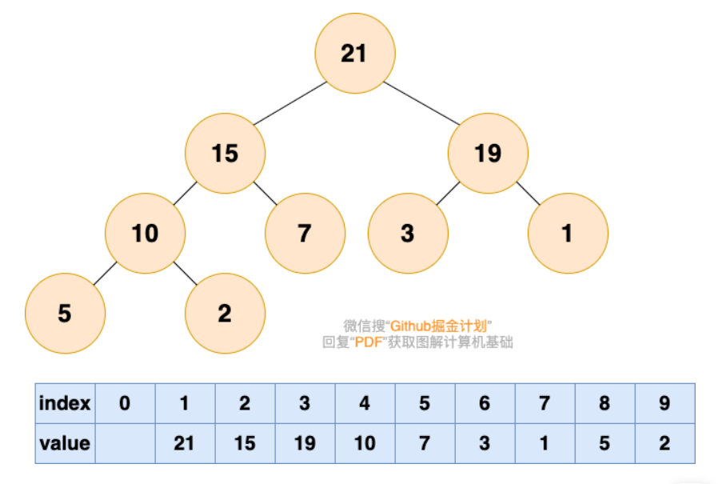

## 堆的操作

堆的更新操作主要包括两种 : **插入元素** 和 **删除堆顶元素**。

### 插入元素

1.将要插入的元素放在数据末尾

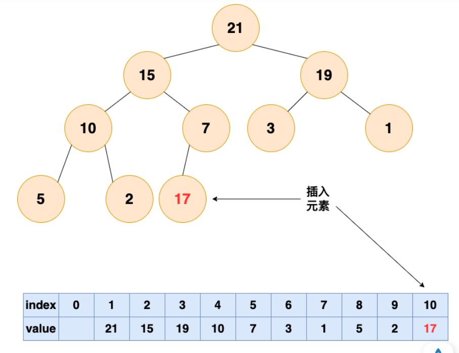

2.从底向上，如果父节点比该元素大，则该节点与父节点交换，直到无法交换

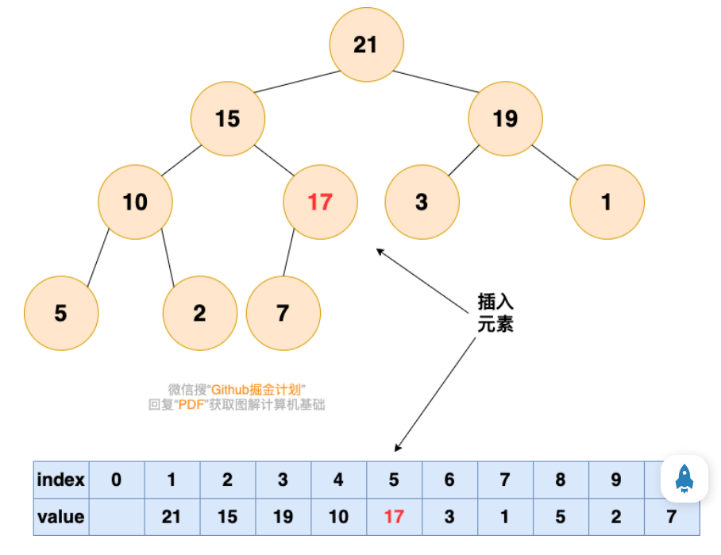

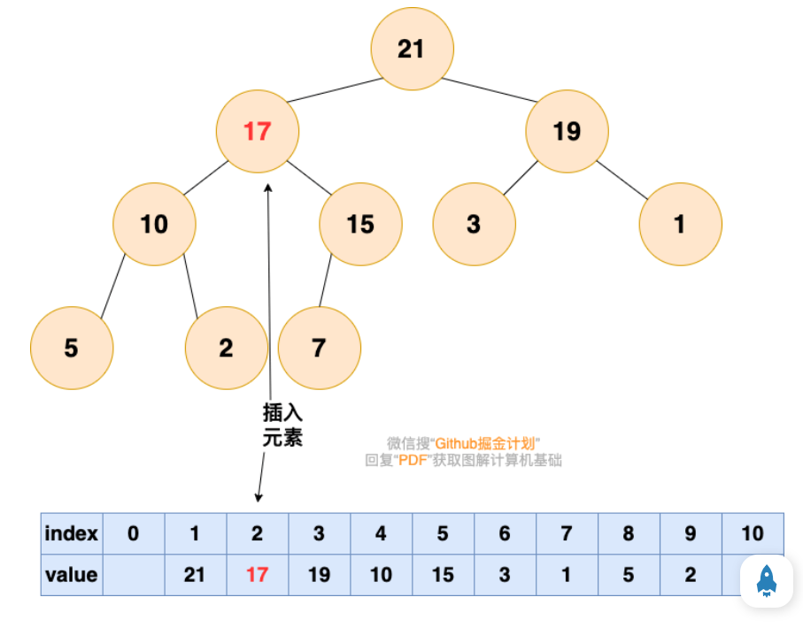

### 删除栈顶元素

删除堆顶元素后，将末尾元素放至堆顶，为了保持堆的特性，需要对堆的结构进行调整，元素由最顶部向下移动，将堆顶元素下沉。（也可以自底下上堆化，只是会产生“气泡”，浪费存储空间）。


### 堆排序

堆排序的过程分为两步：

- 第一步是建堆，将一个无序的数组建立为一个堆
- 第二步是排序，将堆顶元素取出，然后对剩下的元素进行堆化，反复迭代，直到所有元素被抽出为止。


**建堆：**

建堆的过程就是一个对所有**非叶节点**的自顶向下堆化过程。

首先要了解哪些是非叶节点，最后一个节点的父结点及它之前的元素，都是非叶节点。也就是说，如果节点个数为n，那么我们需要对n/2到1的节点进行自顶向下（沉底）堆化。

具体过程如下图：（1,2,3为非叶节点）

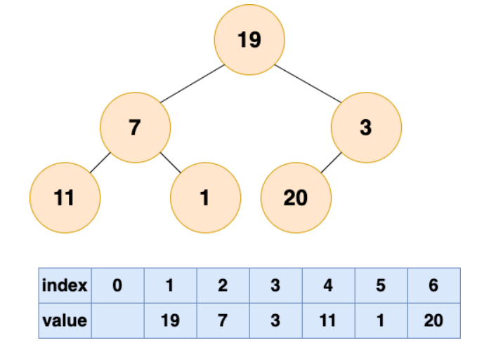

对1-3号节点进行自顶向下（沉底）堆化，注意，顺序是从后往前堆化，从3号节点开始，一直到1号节点。 3号节点堆化结果：


2号节点堆化结果：


1号节点堆化结果：


至此，数组所对应的树已经成为了一个最大堆，建堆完成！

**排序：**

由于堆顶元素是所有元素中最大的，所以我们重复取出堆顶元素，将这个最大的堆顶元素放至数组末尾，并对剩下的元素进行堆化（自顶向下堆化）即可。


# 树

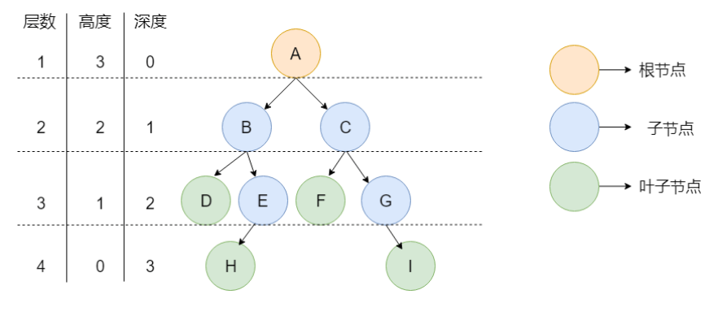

## 树的基本概念

- **节点** ：树中的每个元素都可以统称为节点。
- **根节点** ：顶层节点或者说没有父节点的节点。上图中 A 节点就是根节点。
- **父节点** ：若一个节点含有子节点，则这个节点称为其子节点的父节点。上图中的 B 节点是 D 节点、E 节点的父节点。
- **子节点** ：一个节点含有的子树的根节点称为该节点的子节点。上图中 D 节点、E 节点是 B 节点的子节点。
- **兄弟节点** ：具有相同父节点的节点互称为兄弟节点。上图中 D 节点、E 节点的共同父节点是 B 节点，故 D 和 E 为兄弟节点。
- **叶子节点** ：没有子节点的节点。上图中的 D、F、H、I 都是叶子节点。
- **节点的高度** ：该节点到叶子节点的最长路径所包含的边数。
- **节点的深度** ：根节点到该节点的路径所包含的边数
- **节点的层数** ：节点的深度+1。
- **树的高度** ：根节点的高度。


## 二叉树的分类

- 满二叉树

  一个二叉树，如果每一个层的结点数都达到最大值，则这个二叉树就是 **满二叉树**。也就是说，如果一个二叉树的层数为 K，且结点总数是(2^k) -1 ，则它就是 **满二叉树**。

  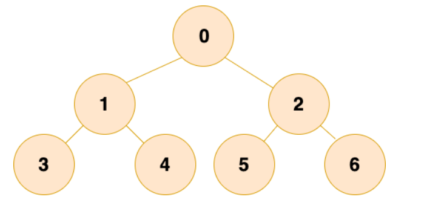

- 完全二叉树

  除最后一层外，若其余层都是满的，并且最后一层或者是满的，或者是在右边缺少连续若干节点，则这个二叉树就是 **完全二叉树** 。

  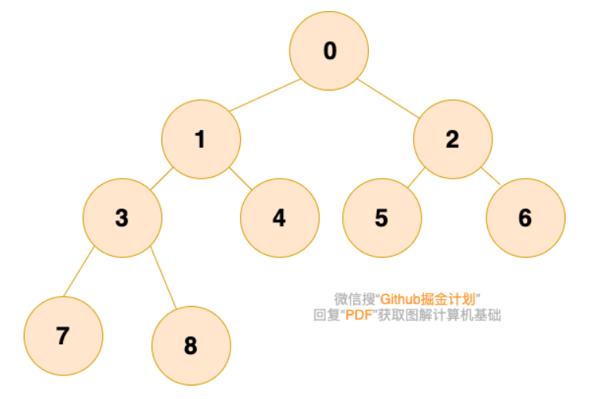

  当**根节点的值为 1 的情况**下，若父结点的序号是 i，那么左子节点的序号就是 2i，右子节点的序号是 2i+1。这个性质使得完全二叉树利用数组存储时可以极大地节省空间，以及利用序号找到某个节点的父结点和子节点。

- 平衡二叉树

  **平衡二叉树** 是一棵二叉排序树。如果不是空树，它的左右两个子树的高度差的绝对值不超过 1，并且左右两个子树都是一棵平衡二叉树。

  平衡二叉树的常用实现方法有 **红黑树**、**AVL 树**、**替罪羊树**、**加权平衡树**、**伸展树** 等。


## 二叉树的存储

### 链式存储

和链表类似，二叉树的链式存储依靠指针将各个节点串联起来，不需要连续的存储空间。

每个节点包括三个属性：

- 数据 data。data 不一定是单一的数据，根据不同情况，可以是多个具有不同类型的数据。
- 左节点指针 left（引用对象）
- 右节点指针 right。（引用对象）

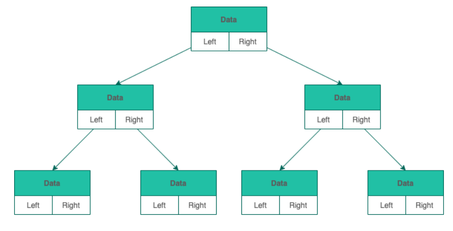

### 顺序存储

顺序存储就是利用数组进行存储，不存储左右子节点的指针，子节点的索引通过数组下标完成。根结点的序号为 1，对于每个节点 Node，假设它存储在数组中下标为 i 的位置，那么它的左子节点就存储在 2i 的位置，它的右子节点存储在下标为 2i+1 的位置。

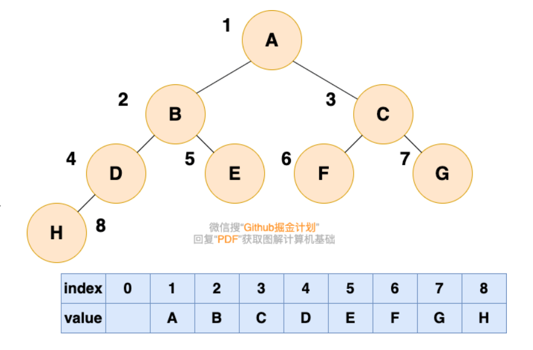

如果我们要存储的二叉树不是完全二叉树，在数组中就会出现空隙，导致内存利用率降低

## 二叉树的遍历

### 先序遍历

根->左->右

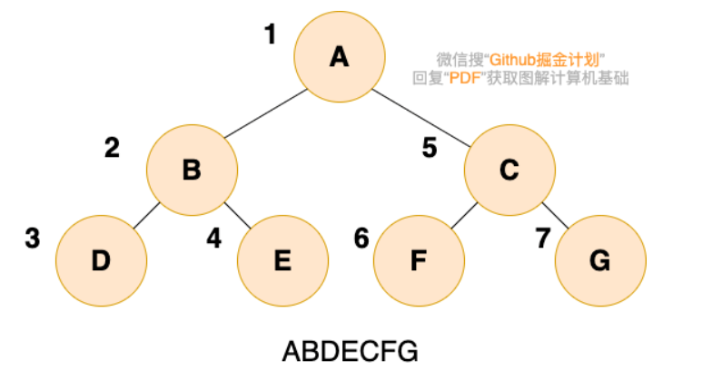

递归实现：

```
public void preOrder(TreeNode root){
	if(root == null){
		return;
	}
	system.out.println(root.data);
	preOrder(root.left);
	preOrder(root.right);
}
```

迭代实现：

```
public List<Integer> preorderTraversal(TreeNode root) {
        List<Integer> res = new ArrayList<Integer>();
        if (root == null) {
            return res;
        }

        Deque<TreeNode> stack = new LinkedList<TreeNode>();
        TreeNode node = root;
        while (!stack.isEmpty() || node != null) {
            while (node != null) {
                res.add(node.val);
                stack.push(node);
                node = node.left;
            }
            node = stack.pop();
            node = node.right;
        }
        return res;
    }
```


### 中序遍历

左->根->右（想象一巴掌把树拍扁，父节点拍到左右子节点中间）


递归实现：

```
public void inOrder(TreeNode root){
	if(root == null){
		return;
	}
	inOrder(root.left);
	system.out.println(root.data);
	inOrder(root.right);
}
```

迭代实现：

```
public List<Integer> inorderTraversal(TreeNode root) {
        List<Integer> ans = new ArrayList<Integer>();
        Stack<TreeNode> stack = new Stack<>();
        // root为空且stack为空，遍历结束
        while (root != null || !stack.isEmpty()) {
            // 先根后左入栈
            while (root != null) {
                stack.push(root);
                root = root.left;
            }
            // 此时root==null，说明上一步的root没有左子树
            root = stack.pop();
            ans.add(root.val);
            root = root.right;
        }
        return ans;
    }
```

### 后序遍历

左->右->根

递归实现：

```
public void postOrder(TreeNode root){
	if(root == null){
		return;
	}
	postOrder(root.left);
	postOrder(root.right);
	system.out.println(root.data);
}
```

迭代实现：

> [leecode](https://leetcode-cn.com/problems/binary-tree-postorder-traversal/solution/er-cha-shu-de-hou-xu-bian-li-by-leetcode-solution/)

```
public List<Integer> method1(TreeNode root) {
        List<Integer> ans=new LinkedList<>();
        Stack<TreeNode> stack=new Stack<>();
        TreeNode prev=null;
        //主要思想：
        //由于在某颗子树访问完成以后，接着就要回溯到其父节点去
        //因此可以用prev来记录访问历史，在回溯到父节点时，可以由此来判断，上一个访问的节点是否为右子树
        while(root!=null||!stack.isEmpty()){
            while(root!=null){
                stack.push(root);
                root=root.left;
            }
            //从栈中弹出的元素，左子树一定是访问完了的
            root=stack.pop();
            //现在需要确定的是是否有右子树，或者右子树是否访问过
            //如果没有右子树，或者右子树访问完了，也就是上一个访问的节点是右子节点时
            //说明可以访问当前节点
            if(root.right==null||prev==root.right){
                ans.add(root.val);
                //更新历史访问记录，这样回溯的时候父节点可以由此判断右子树是否访问完成
                prev=root;
                root=null;
            }else{
            //如果右子树没有被访问，那么将当前节点压栈，访问右子树
                stack.push(root);
                root=root.right;
            }
        }
        return ans;
    }
```


## 还原二叉树

### 前+中

对于任意一颗树而言，前序遍历的形式总是

```
[ 根节点, [左子树的前序遍历结果], [右子树的前序遍历结果] ]
```

即根节点总是前序遍历中的第一个节点。而中序遍历的形式总是

```
[ [左子树的中序遍历结果], 根节点, [右子树的中序遍历结果] ]
```

只要我们在中序遍历中定位到根节点，那么我们就可以分别知道左子树和右子树中的节点数目。由于同一颗子树的前序遍历和中序遍历的长度显然是相同的，因此我们就可以对应到前序遍历的结果中，对上述形式中的所有左右括号进行定位。

这样以来，我们就知道了左子树的前序遍历和中序遍历结果，以及右子树的前序遍历和中序遍历结果，我们就可以递归地对构造出左子树和右子树，再将这两颗子树接到根节点的左右位置。

**细节**

在中序遍历中对根节点进行定位时，一种简单的方法是直接扫描整个中序遍历的结果并找出根节点，但这样做的时间复杂度较高。我们可以考虑使用哈希表来帮助我们快速地定位根节点。对于哈希映射中的每个键值对，键表示一个元素（节点的值），值表示其在中序遍历中的出现位置。在构造二叉树的过程之前，我们可以对中序遍历的列表进行一遍扫描，就可以构造出这个哈希映射。在此后构造二叉树的过程中，我们就只需要 O(1) 的时间对根节点进行定位了。

```
    private Map<Integer, Integer> indexMap;

    public TreeNode myBuildTree(int[] preorder, int[] inorder, int preorder_left, int preorder_right, int inorder_left, int inorder_right) {
        if (preorder_left > preorder_right) {
            return null;
        }

        // 前序遍历中的第一个节点就是根节点
        int preorder_root = preorder_left;
        // 在中序遍历中定位根节点
        int inorder_root = indexMap.get(preorder[preorder_root]);
        
        // 先把根节点建立出来
        TreeNode root = new TreeNode(preorder[preorder_root]);
        // 得到左子树中的节点数目
        int size_left_subtree = inorder_root - inorder_left;
        // 递归地构造左子树，并连接到根节点
        // 先序遍历中从 左边界+1 开始的 size_left_subtree个元素就对应了中序遍历中从 左边界 开始到 根节点定位-1的元素
        root.left = myBuildTree(preorder, inorder, preorder_left + 1, preorder_left + size_left_subtree, inorder_left, inorder_root - 1);
        // 递归地构造右子树，并连接到根节点
        // 先序遍历中「从 左边界+1+左子树节点数目 开始到 右边界」的元素就对应了中序遍历中「从 根节点定位+1 到 右边界」的元素
        root.right = myBuildTree(preorder, inorder, preorder_left + size_left_subtree + 1, preorder_right, inorder_root + 1, inorder_right);
        return root;
    }

    public TreeNode buildTree(int[] preorder, int[] inorder) {
        int n = preorder.length;
        // 构造哈希映射，帮助我们快速定位根节点
        indexMap = new HashMap<Integer, Integer>();
        for (int i = 0; i < n; i++) {
            indexMap.put(inorder[i], i);
        }
        return myBuildTree(preorder, inorder, 0, n - 1, 0, n - 1);
    }

```

复杂度分析

时间复杂度：O(n)，其中 nn 是树中的节点个数。

空间复杂度：O(n)，除去返回的答案需要的 O(n) 空间之外，我们还需要使用 O(n) 的空间存储哈希映射，以及 O(h)（其中 hh 是树的高度）的空间表示递归时栈空间。这里 h < nh<n，所以总空间复杂度为 O(n)。


## 红黑树

### 红黑树的基本概念

红黑树本质上是一种二叉查找树（平衡树），但它在二叉查找树的基础上额外添加了一个标记（颜色），同时具有一定的规则。这些规则使红黑树保证了一种平衡，插入、删除、查找的最坏时间复杂度都为 O(logn)。

它的统计性能要好于平衡二叉树（AVL树），因此，红黑树在很多地方都有应用。比如在 Java 集合框架中，很多部分(HashMap, TreeMap, TreeSet 等)都有红黑树的应用，这些集合均提供了很好的性能。

由于 TreeMap 就是由红黑树实现的，因此本文将使用 TreeMap 的相关操作的代码进行分析、论证。


**有了二叉查找树（平衡树）为什么还需要红黑树？**

### 二叉查找树的缺点

二叉查找树（搜索树）的特点就是 左子树的节点值比父亲节点小，而右子树的节点值比父亲节点大 ，如图：

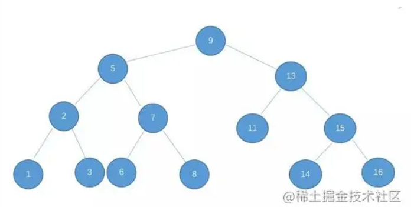

基于二叉查找树的这种特点，我们在查找某个节点的时候，可以采取类似于 二分查找的思想，快速找到某个节点。n 个节点的二叉查找树，正常的情况下，查找的时间复杂度为 O（logn）。但可能会出现一种极端的情况，二叉查找树会近似的退化为一条链表，这样的二叉查找树的查找时间复杂度顿时变成了O（n)，例如：

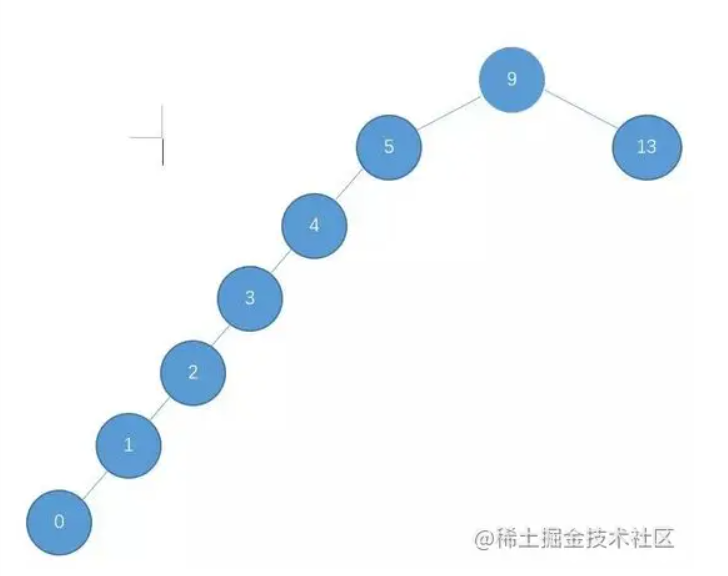

为了解决这个问题，于是我们引申出了平衡二叉树。

### 平衡二叉树

平衡二叉树就是为了解决二叉查找树退化成一颗链表而诞生了，平衡树具有如下特点

1、具有二叉查找树的全部特性。

2、每个节点的左子树和右子树的高度差至多等于1。

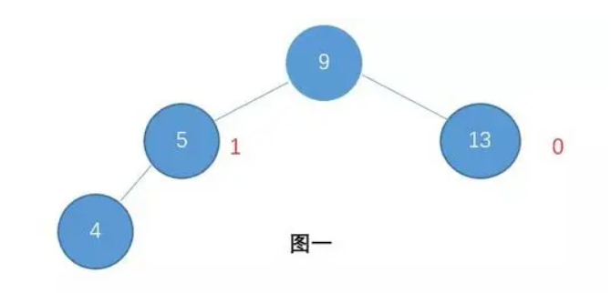

虽然平衡树解决了二叉查找树退化为近似链表的缺点，能够把查找时间控制在 O(logn)，不过却不是最佳的，因为平衡树要求 **每个节点的左子树和右子树的高度差至多等于1** ，这个要求实在是太严了，导致每次进行插入/删除节点的时候，几乎都会破坏平衡树的第二个规则，进而我们都需要通过 **左旋** 和 **右旋** 来进行调整，使之再次成为一颗符合要求的平衡树。

显然，如果在那种插入、删除很频繁的场景中，平衡树需要频繁着进行调整，这会使平衡树的性能大打折扣，为了解决这个问题，于是有了 **红黑树** 。

### 红黑树的特点

> [ 原理](https://www.cnblogs.com/LiaHon/p/11203229.html)

红黑树具有如下特点：

1、具有二叉查找树的特点。

2、根节点是黑色的；

3、每个叶子节点都是黑色的空节点（NIL），也就是说，叶子节点不存数据。

4、任何相邻的节点都不能同时为红色，也就是说，红色节点是被黑色节点隔开的。

5、每个节点，从该节点到达其可达的叶子节点是所有路径，都包含相同数目的**黑色**节点。

例如下面的图片（图片中黑色的、空的叶子节点没有画出）：

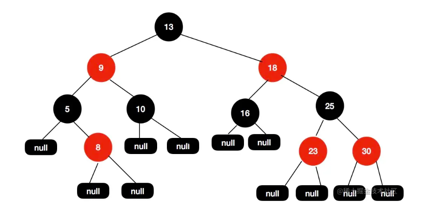

正是由于红黑树的这种特点，使得它能够在最坏情况下，也能在 O(logn) 的时间复杂度查找到某个节点。（？）

不过，与平衡树不同的是，红黑树在插入、删除等操作， 不会像平衡树那样，频繁着破坏红黑树的规则，所以不需要频繁着调整 ，这也是我们为什么大多数情况下使用红黑树的原因。

不过，如果你要说，单单在查找方面的效率的话，平衡树比红黑树快。

所以，我们也可以说， **红黑树是一种不大严格的平衡树** 。也可以说是一个折中发方案。


## B树

B Tree 指的是 Balance Tree，是一种多路平衡搜索树。平衡树是一颗查找树，并且所有叶子节点位于同一层。

- 它跟普通的平衡二叉树的不同是，B树的每个节点可以存储多个数据，而且每个节点不止有两个子节点，最多可以有上千个子节点。
- B树中每个节点都存放着索引和数据，数据遍布整个树结构，搜索可能在非叶子节点结束，最好的情况是O(1)。
- 一般一棵 B 树的高度在 **3** 层左右，**3** 层就可满足 **百万**级别的数据量

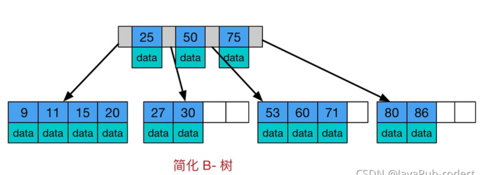

（一）**B+ 树有更低的树高**

平衡树的树高 O(h)=O(logdN)，其中 d 为每个节点的出度。红黑树的出度为 2，而 B+ Tree 的出度一般都非常大，所以红黑树的树高 h 很明显比 B+ Tree 大非常多。

（二）**磁盘访问原理**

操作系统一般将内存和磁盘分割成固定大小的块，每一块称为一页，内存与磁盘以页为单位交换数据。数据库系统将索引的一个节点的大小设置为页的大小，使得一次 I/O 就能完全载入一个节点。

如果数据不在同一个磁盘块上，那么通常需要移动制动手臂进行寻道，而制动手臂因为其物理结构导致了移动效率低下，从而增加磁盘数据读取时间。B+ 树相对于红黑树有更低的树高，进行寻道的次数与树高成正比，在同一个磁盘块上进行访问只需要很短的磁盘旋转时间，所以 B+ 树更适合磁盘数据的读取。

（三）磁盘预读特性

为了减少磁盘 I/O 操作，磁盘往往不是严格按需读取，而是每次都会预读。预读过程中，磁盘进行顺序读取，顺序读取不需要进行磁盘寻道，并且只需要很短的磁盘旋转时间，速度会非常快。并且可以利用预读特性，相邻的节点也能够被预先载入。


# 布隆过滤器

## 什么是布隆过滤器

一个名叫 Bloom 的人提出了一种来检索元素是否在给定大集合中的数据结构，可以把它看作由二进制向量（或者说位数组）和一系列随机映射函数（哈希函数）两部分组成。这种数据结构是高效且性能很好的，但缺点是具有一定的错误识别率和删除难度。并且，理论情况下，添加到集合中的元素越多，误报的可能性就越大。


## 原理介绍

**当一个元素加入布隆过滤器中的时候，会进行如下操作：**

1. 使用布隆过滤器中的哈希函数对元素值进行计算，得到哈希值（有几个哈希函数得到几个哈希值）。
2. 根据得到的哈希值，在位数组中把对应下标的值置为 1。

**当我们需要判断一个元素是否存在于布隆过滤器的时候，会进行如下操作：**

1. 对给定元素再次进行相同的哈希计算；
2. 得到值之后判断位数组中的每个元素是否都为 1，如果值都为 1，那么说明这个值在布隆过滤器中，如果存在一个值不为 1，说明该元素不在布隆过滤器中。

举个例子：


当字符串存储要加入到布隆过滤器中时，该字符串首先由多个哈希函数生成不同的哈希值，然后将对应的位数组的下标设置为 1（当位数组初始化时，所有位置均为 0）。当第二次存储相同字符串时，因为先前的对应位置已设置为 1，所以很容易知道此值已经存在（去重非常方便）。

如果我们需要判断某个字符串是否在布隆过滤器中时，只需要对给定字符串再次进行相同的哈希计算，得到值之后判断位数组中的每个元素是否都为 1，如果值都为 1，那么说明这个值在布隆过滤器中，如果存在一个值不为 1，说明该元素不在布隆过滤器中。

**不同的字符串可能哈希出来的位置相同，这种情况我们可以适当增加位数组大小或者调整我们的哈希函数。**

综上，我们可以得出：**布隆过滤器说某个元素存在，小概率会误判。布隆过滤器说某个元素不在，那么这个元素一定不在。**


## 使用场景

1. 判断给定数据是否存在：比如判断一个数字是否存在于包含大量数字的数字集中（数字集很大，5 亿以上！）、 防止缓存穿透（判断请求的数据是否有效避免直接绕过缓存请求数据库）等等、邮箱的垃圾邮件过滤、黑名单功能等等。
2. 去重：比如爬给定网址的时候对已经爬取过的 URL 去重。


## 手动实现

如果你想要手动实现一个的话，你需要：

1. 一个合适大小的位数组保存数据
2. 几个不同的哈希函数
3. 添加元素到位数组（布隆过滤器）的方法实现
4. 判断给定元素是否存在于位数组（布隆过滤器）的方法实现。

```
import java.util.BitSet;

public class MyBloomFilter {

    /**
     * 位数组的大小
     */
    private static final int DEFAULT_SIZE = 2 << 24;
    /**
     * 通过这个数组可以创建 6 个不同的哈希函数
     */
    private static final int[] SEEDS = new int[]{3, 13, 46, 71, 91, 134};

    /**
     * 位数组。数组中的元素只能是 0 或者 1
     */
    private BitSet bits = new BitSet(DEFAULT_SIZE);

    /**
     * 存放包含 hash 函数的类的数组
     */
    private SimpleHash[] func = new SimpleHash[SEEDS.length];

    /**
     * 初始化多个包含 hash 函数的类的数组，每个类中的 hash 函数都不一样
     */
    public MyBloomFilter() {
        // 初始化多个不同的 Hash 函数
        for (int i = 0; i < SEEDS.length; i++) {
            func[i] = new SimpleHash(DEFAULT_SIZE, SEEDS[i]);
        }
    }

    /**
     * 添加元素到位数组
     */
    public void add(Object value) {
        for (SimpleHash f : func) {
            bits.set(f.hash(value), true);
        }
    }

    /**
     * 判断指定元素是否存在于位数组
     */
    public boolean contains(Object value) {
        boolean ret = true;
        for (SimpleHash f : func) {
            ret = ret && bits.get(f.hash(value));
        }
        return ret;
    }

    /**
     * 静态内部类。用于 hash 操作！
     */
    public static class SimpleHash {

        private int cap;
        private int seed;

        public SimpleHash(int cap, int seed) {
            this.cap = cap;
            this.seed = seed;
        }

        /**
         * 计算 hash 值
         */
        public int hash(Object value) {
            int h;
            return (value == null) ? 0 : Math.abs(seed * (cap - 1) & ((h = value.hashCode()) ^ (h >>> 16)));
        }

    }
}
```

测试：

```
String value1 = "https://javaguide.cn/";
String value2 = "https://github.com/Snailclimb";
MyBloomFilter filter = new MyBloomFilter();
System.out.println(filter.contains(value1));
System.out.println(filter.contains(value2));
filter.add(value1);
filter.add(value2);
System.out.println(filter.contains(value1));
System.out.println(filter.contains(value2));
```

output:

```
false
false
true
true
```

测试：

```
Integer value1 = 13423;
Integer value2 = 22131;
MyBloomFilter filter = new MyBloomFilter();
System.out.println(filter.contains(value1));
System.out.println(filter.contains(value2));
filter.add(value1);
filter.add(value2);
System.out.println(filter.contains(value1));
System.out.println(filter.contains(value2));
```

output：

```
false
false
true
true
```


## Redis中的布隆过滤器

安装后即可使用

常用命令：

1. **BF.ADD**：将元素添加到布隆过滤器中，如果该过滤器尚不存在，则创建该过滤器。格式：`BF.ADD {key} {item}`。
2. **BF.MADD** : 将一个或多个元素添加到“布隆过滤器”中，并创建一个尚不存在的过滤器。该命令的操作方式`BF.ADD`与之相同，只不过它允许多个输入并返回多个值。格式：`BF.MADD {key} {item} [item ...]` 。
3. **BF.EXISTS** : 确定元素是否在布隆过滤器中存在。格式：`BF.EXISTS {key} {item}`。
4. **BF.MEXISTS** ： 确定一个或者多个元素是否在布隆过滤器中存在格式：`BF.MEXISTS {key} {item} [item ...]`。

另外， `BF. RESERVE` 命令需要单独介绍一下：

这个命令的格式如下：

`BF. RESERVE {key} {error_rate} {capacity} [EXPANSION expansion]` 。

下面简单介绍一下每个参数的具体含义：

1. key：布隆过滤器的名称
2. error_rate : 期望的误报率。该值必须介于 0 到 1 之间。例如，对于期望的误报率 0.1％（1000 中为 1），error_rate 应该设置为 0.001。该数字越接近零，则每个项目的内存消耗越大，并且每个操作的 CPU 使用率越高。
3. capacity: 过滤器的容量。当实际存储的元素个数超过这个值之后，性能将开始下降。实际的降级将取决于超出限制的程度。随着过滤器元素数量呈指数增长，性能将线性下降。

可选参数：

- expansion：如果创建了一个新的子过滤器，则其大小将是当前过滤器的大小乘以`expansion`。默认扩展值为 2。这意味着每个后续子过滤器将是前一个子过滤器的两倍。


实际使用：

```
127.0.0.1:6379> BF.ADD myFilter java
(integer) 1
127.0.0.1:6379> BF.ADD myFilter javaguide
(integer) 1
127.0.0.1:6379> BF.EXISTS myFilter java
(integer) 1
127.0.0.1:6379> BF.EXISTS myFilter javaguide
(integer) 1
127.0.0.1:6379> BF.EXISTS myFilter github
(integer) 0
```


### 最短路径算法

### 最小生成树算法

