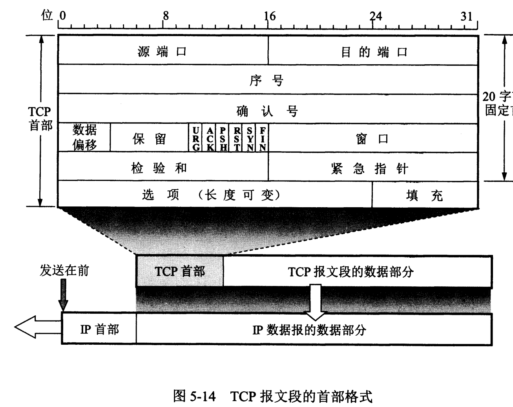

# 思维导图


# 一、OSI 七层体系结构

## 应用层：

应用层负责为操作系统或网络应用程序提供访问网络服务的端口，定义了信息交换的格式，消息会交给下一层传输层来传输。常见的应用层协议有支持 Web 应用的 HTTP 协议，支持电子邮件的 SMTP 协议等。


## 表示层：

表示层是确保一个系统的应用层发送的消息可以被另外一个系统的应用层读取，并处理用户信息的表示问题，如编码、数据格式转换和加密解密等。

## 会话层：

会话层则通过传输层建立数据传输的通道，在系统之间发起会话或者接受会话请求，并组织和协调两个会话进程之间的通信，对数据交换进行管理。

## 传输层：

传输层则在网络层的基础上，为应用进程之间的通信提供通用的数据传输服务。根据用户需求，传输层有两种不同的传输协议，分别是面向连接的TCP协议和面向无连接的UDP协议。

## 网络层：

网络层主要向其上层只提供简单灵活的，无连接的，尽最大努力交付的数据报服务， 在发送数据时，网络层把传输层产生的报文段或用户数据报封装成分组和包进行传送。网络层的还有一个任务就是选择合适的路由，使源主机运输层所传下来的分组，能通过网络层中的路由器找到目的主机。

> 我们可以把网络接口层看作是数据链路层和物理层的合体

## 数据链路层：

数据链路层则进行封装成帧，透明传输和差错检验，封装成帧是在网络层传递下来的IP数据报加上头部和尾部，透明传输是不管从键盘上输入什么字符都可以放在帧的数据部分然后传输过去。这其中使用了字节填充来解决数据中可能会出现控制字符的问题。差错检验是采用CRC循环冗余码来检测传输差错。

## 物理层：

物理层考虑的是怎样才能在连接各种计算机的传输媒体上传输数据比特流，尽可能屏蔽掉传输介质和物理设备的差异。


## 为什么要对网络协议分层

1首先是为了保证各层之间的独立性，某一层可以使用下一层提供的服务而不需要知道其具体组成。

2.然后是灵活性好。当其中一层的技术发生变化时，只要层间接口关系保持不变，则其余各层均不受影响。也就是说某一层出现技术革新或者出现问题时不会连累到其它层的工作，排除问题时也只需要考虑这一层单独的问题即可。

3.还有易于实现和维护。进行调试和维护时，可以对每一层进行单独的调试。

4.最后是能促进标准化工作。标准化的好处就是可以随意替换其中的某一层，对于使用和科研来说十分方便。


# 二、网络层

网络层功能：负责为数据包选择转发路径以及IP数据包的分片和转发，不负责可靠传输，也不负责按顺序到达

## IP地址和MAC地址

37.IP地址和MAC地址的区别和作用？

**答：**MAC地址是一个硬件地址，也叫物理地址，使用其来定义网络设备的位置；MAC地址是数据链路层和物理层使用的地址，主要由数据链路层负责；

而 IP 地址是 IP 协议提供的一种统一的地址格式，为互联网上的每一个网络和每一台主机分配一个逻辑地址，**以此来屏蔽物理地址的差异**；IP地址是网络层及其以上层使用的地址

也就是在物理层和数据链路层IP地址是不可见的,这时候就需要按照物理地址来进行数据转发，使用的是ARP地址解析协议


附：1.交换机基于数据帧的MAC地址转发数据帧，路由器基于数据包的IP地址转发数据包

2.数据包在传输过程中不变，经过网络设备时数据帧就要用新的物理地址重新封装

3.MAC地址决定了数据帧的下一跳由哪个设备来接收，而IP地址决定了数据包的起点和终点


问：为什么不直接用MAC地址进行通讯？

**答：**由于全世界存在着各式各样的网络，它们使用不同的硬件地址。要使这些异构网络能够互相通信就必须进行非常复杂的硬件地址转换工作，因此几乎是不可能的事

而连接到 Internet 的主机都拥有统一的IP地址，它们之间的通信就像连接在同一个网络上那样简单方便，因为使用ARP协议来寻找某个路由器或主机的硬件地址都是由计算机软件自动进行的，对用户来说看不见这种调用过程


5.最大传输单元 ( MTU ) 和最大报文段长度 ( MSS )

**答：**

MTU（Maximum Transmit Unit）：即物理接口（数据链路层）提供给其上层（通常是IP层）最大一次传输数据的大小。以太网的数据链路层的最大传输单元是1500字节，当 IP 数据包大于1500字节时，IP数据包就会被分片，经过分片后的IP数据包在重组的时候只能由目标主机进行，路由器是不会进行重组的，在分片传输过程中，一旦某个分片丢失，则会造成整个IP数据报作废，所以TCP引入了MSS也就是在TCP层进行分片而不由IP层进行，而对于UDP我们尽量不要传输一个大于MTU的数据报文。MSS是TCP用来限制应用层最大的发送字节数。如果底层物理接口MTU= 1500 byte，则 MSS = 1500- 20(IP Header) -20 (TCP Header) = 1460 byte，如果应用层有2000 byte发送，需要两个segment才可以完成发送，第一个TCP segment = 1460，第二个TCP segment = 540


22.IPv4和IPv6差别

**答：**1.更大的地址空间：IPv4是32位的，IPv6是128位的，扩大了4倍。IPv4以每8位作为一个一组，采用点分十进制的方式表示；IPv6每16位作为一组，采用16进制表示，每组用冒号 ":" 隔开

2.IPV6支持即插即用功能；即使没有DHCP服务器也能够自动分配IP地址

3.性能提升（从数据包首部字段方面看）

1). 包首部长度采用固定的40个字节来表示，**不再采用首部校验码**；简化首部结构，减轻路由负荷

2). 路由器不再做分片处理，数据包分片只能由发送端进行；取消分片后，IPV6首部**不再有数据包标识以及标志和片偏移等字段**

3). **取消选项字段**，选项字段不再是标准IP首部的一部分，但它并没有消失，取而代之的是使用扩展首部，当需要对数据报分片时，可以使用扩展首部；IPV4的选项长度最大只能为40字节，但是IPV6的扩展首部长度可以是任意长度 ，没有具体的大小限制  （图解TCP/IP P154）

附：IPv4和IPv6不能互相兼容，所以不但要我们电脑，手机之类的设备支持，还需要网络运营商对现有的设备进行升级，这可能是IPv6普及比较慢的原因


30.IP地址的编码分为哪两部分？ 

**答：**网络部分和主机部分；依据子网掩码来区分哪些是网络位哪些是主机位

子网掩码常用的有三种，分为A，B，C 三类地址

子网掩码为255.0.0.0  则是A类IP地址，第一段８位为网络位，后三段为主机位

子网掩码为255.255.0.0  则是B类IP地址，网络位和主机位各为两段

子网掩码为255.255.255.0  则是C类IP地址，网络位为三段，主机位为一段

附：A类地址的网络最高位必须是0，范围从1.0.0.1到127.255.255.254 ；数字0和数字127不能作为A类地址，数字127代表本地回环地址，而数字0代表该地址是本地宿主机；主机位全为0代表的是本网段，主机位全为1代表的是广播地址

B类地址的网络最高位必须是10，范围从 128.0.0.1 到 191.255.255.254

C类地址的网络最高位必须是110，范围从 192.0.0.1 到 223.255.255.254


**关于NAT:**

内网IP想要与外网通信需要使用NAT地址转换技术，把私有IP转换成公有IP地址.

路由器利用 NAT(Network Address Translation)，将你的主机IP（局域网IP）转换为外网IP，还会修改端口号，对外完全隐藏你的主机，再根据路由表选择一条合适的路径进行转发

NAT是一种网络隐蔽技术，它通过建立IP地址映射来隐藏内部的网络
它的主要功能有：

- 提高内部网络的安全性
- 共享网络地址，减少地址消耗

NAT主要有三种实现方式：

- 静态NAT（Basic NAT）：最基本的网络转换实现，只转换IP地址，建立IP地址的一对一映射，不支持端口转换
- 网络地址端口转换（NAPT）：这种方式支持端口的映射，并允许多台主机共享一个公网IP地址
- 端口多路复用（Port address Translation,PAT)：是指改变外出数据包的源端口并进行端口转换，即端口地址转换.采用端口多路复用方式。


## 各层协议

### ARP地址解析协议

物理层和数据链路层IP地址是不可见的,这时候就需要按照物理地址来进行数据转发，使用的正是ARP地址解析协议。

ARP协议解决的是**同一个局域网**上的主机或路由器的IP地址和MAC地址的映射问题。

每一台主机都设有一个ARP高速缓存，里面存有本局域网上的各个主机和路由器的IP地址到MAC地址的映射表。

ARP协议借助ARP请求和ARP响应两种类型的包来确定MAC地址的，然后缓存在这个映射表中。

1.主机会通过广播发送ARP请求，这个包中包含了想要知道的MAC地址的IP地址

2.当同个链路中的所有设备收到ARP请求时，会去拆开ARP请求包中的内容，如果ARP请求包的目标IP地址和自己的IP地址一致，那么这个设备就将自己的MAC地址塞入到ARP响应包返回给主机

操作系统通常会把第一次ARP获取的MAC地址缓存起来，以便下次直接从缓存中找到对应IP地址的MAC地址


> 如果要找的主机在不同局域网上怎么办？
>
> 主机不需要知道远程主机的MAC地址。因为主机知道和它连接在同一个局域网上的路由器IP，然后使用ARP把路由器的IP地址转换为MAC地址，把IP数据包传送到路由器之后通过路由器的转发表继续转发，然后使用同样方法每一跳之间把数据包传送下去。


### ICMP

**答：**ICMP ( 网际报文控制协议 ) 的功能主要包括：确认IP包是否成功送达目标地址，以及报告发送过程中的IP包被废弃的原因和改善网络设置等，有了这些功能以后，就可以获得网络是否正常，设置是否有误以及设备有何异常等信息，从而便于进行网络上的问题诊断；在IP通信中如果某个IP包因为某种原因未能到达目标地址，那么这个具体的原因将由 ICMP 负责通知。	

ICMP大致可分为两种类型： 一类用于诊断查询报文类型；另一类是通知出错原因的差错报文类型。

比如：0 代表回送应答 (Echo Replay) 	 8 代表回送请求(Echo Request)  	 3 代表目标不可到达  	 11 代表超时     5 代表重定向或改变路由


**Ping工作流程：**

ping命令主要利用的是 ICMP 里面的类型为8的回送请求和类型为0回送回答的两种消息。

主机A ping 主机B时，主机A会发送一个ICMP回送请求的数据包，大小为32位。

主机 B 如果正常收到请求报文后，会构建一个ICMP回送回答消息数据包，该数据包的类型字段为0，序号为接收到的请求数据包中的序号，然后再发送给主机A。

如果不能正常接收，由中途的路由器返回数据包不能到达的原因


附：有一款利用ICMP差错报文类型的应用叫做 traceroute

作用一：故意设置特殊的TTL，来追踪去往目的地时沿途经过的路由器数，它的原理就是利用IP包的生存周期从1开始按照顺序递增的同时发送UDP包，强制接受ICMP超时消息的一种方法，TTL数值从１逐渐增大的发包，直到返回正确的响应报文就可以知道目标主机离我们有多少个路由器了

作用二：故意设置不分片，用来确定路径的MTU，因为有的时候我们并不知道路由器的MTU大小，以太网的数据链路层的MTU通常是1500字节，但是非以太网的MTU就不一样了， 所以我们要知道MTU的大小，从而控制包的大小


### 3.当路由器接收到的IP报文的TTL的值为1时，采取的策略为？

**答：**经过该路由器TTL的值就变成0了，所以路由器会丢掉该数据包

附：不同系统的TTL值

Linux和Unix是64     Windows是128     Solaris是254


### 路由选择协议

**答：**动态路由协议可分为内部网关协议和外部网关协议，内部网关协议有RIP, OSPF协议，外部网关协议有BGP

RIP(Routing Infomation Protocol) 路由信息协议    OSPF(Open Shortest Path First) 开放最短路径优先协议     这两个协议都是选路协议

#### **RIP**

RIP协议每隔 30s 就与相邻的路由器交换信息，交换的信息是路由器现在的路由表。**RIP协议选择最佳路径的标准是跳数**，认为到达目标网络经过的路由器最少的路径就是最佳路径，默认其所允许的最大跳数为15跳，也就是说16跳的距离会被认为是不可到达的，所以RIP协议只适用于小型网络。因为只有相邻路由器交换信息，所以RIP网络的收敛速度非常的慢，而且会占用大量带宽。

距离向量算法：

- 对地址为X的相邻路由器发来的RIP报文，先将该报文的“下一跳”字段中的地址都改为X，并把跳数加1。
- 对RIP报文的每一行数据进行：
  - 若原来路由表没有，则添加该行数据
  - 否则，查看下一跳地址
    - 如果地址是x则替换
    - 地址不是x则进行更新，取跳数小的

#### OSPF

OSPF克服了RIP的缺点。OSPF向本自治系统中的所有路由器发送信息，这种方法是洪泛法。发送的信息就是与相邻路由器的链路状态，链路状态包括与哪些路由器相连以及链路的度量，度量用费用、距离、时延、带宽等来表示。只有当链路状态发生变化时，路由器才会发送信息。所有路由器都具有全网的拓扑结构图，并且是一致的。相比于 RIP，OSPF 的更新过程收敛的很快。

工作过程：

- 寻找邻居
- 建立邻接关系
- 链路状态信息传递
- 计算路由

#### BGP

BGP (Border Gateway Protocol) 边界网关协议。用于处理各ISP之间的路由传递。主要用于互联网AS（自治系统）之间的互联。

边界路由器之间建立完TCP连接后互相发送可达信息，然后边界路由器再将信息转发给AS内部的路由器。


## 网络设备

### 集线器

集线器是**物理层**扩展以太网的设备，对接收到的信号进行放大、转发，集线器所起的作用相当于多端口的中继器 ，将主机互联形成局域网。使用集线器作为互连设备的以太网仍然属于共享总线式以太网。集线器互连起来的所有主机共享总线带宽，**属于同一个碰撞域和广播域。** 在扩大了广播域的同时也扩大了碰撞域。


注：交换机扩大了广播域的同时隔离了碰撞域


### 交换机

> 网桥可以理解为**两个网线口的交换机**，正好可以把两台电脑给连起来，也叫**桥接**。而交换机，则是**多网线口的网桥**，可以把多台电脑给连（桥接）起来，可以使多对主机同时通信，无碰撞的传输数据。问网桥答交换机功能。

交换机是基于以太网设计的，位于数据链路层，俗称⼆层网络设备，交换机的端口不具有 MAC 地址，通常用于同一网段内的主机之间通信。

交换机是依靠MAC地址过滤，转发。交换机内有一张**MAC表**，里面存放着和它相连的所有设备的MAC地址和端口号的映射，它会根据收到的**数据帧**的首部信息内的目的MAC地址在自己的表中查找，如果有就转发，没有就把它丢弃（即过滤）。在接受到包的时候，会将相应的端口号和发送MAC地址写入表中，因为从这个端口发的大概率也是从这个端口接受的。


### **虚拟局域网**

因为以太网交换机的问世，一个以太网交换机可以非常方便地连接十几台计算机，构成一个星型以太网。

但是一个以太网包含的计算机太多，会带来一些问题。

- 一个以太网是一个广播域，这时候传播广播帧的时候必然会消耗更多的网络资源，如果配置出错了还可能发生广播帧在网络无限制兜圈子，使网络瘫痪。
- 安全性问题，比如一个单位的以太网中，有些部门的信息是想要保密的

这时候就需要用交换机来建立虚拟局域网VLAN（virtual LAN），把大的局域网分割一些较小的局域网，每一个局域网是一个较小的广播帧，划分虚拟局域网可以使用交换机的端口划分，也可以按照主机MAC地址划分。

虚拟局域网是给用户提供的一种服务，并不是一种新型局域网，实现方式是使用栈格式中的VLAN标签，也就是一个4字节的标识符来指明该帧的计算机属于哪一个局域网。

VLAN的作用有以下几点：

1.限制广播域：广播域限制在一个 VLAN 中，节省了带宽，提高了网路的处理能力

2.增强局域网的安全性：不同 VLAN 内的报文在传输时是相互隔离的，即一个 VLAN 内的用户不能和其他VLAN内的用户直接通信

3.提高网络的健壮性：故障被限制在一个 VLAN 中，本 VLAN 中的故障不会影响到其他 VLAN 的正常工作

4.灵活构建虚拟工作组：用 VLAN 可以划分不同的用户到不同的工作组，同一工作组的用户也不必局限于某一固定的物理范围，网络构建和维护更加方便


### 路由器

> 俗称为三层交换机


路由器是基于 IP 设计的，位于网络层，俗称三层网络设备。**路由器的各个端⼝都具有 MAC 地址和 IP 地址** 。 通常作为以太网中的发送方和接受方。路由器支持各种局域网和广域网的接口，主要用于互联局域网和广域网，实现不同网络间的通信。

路由器是依靠IP地址寻址转发，路由器内有一份路由表，里面有它的寻址信息，它收到网络层的**数据报**后，会根据路由表和选路算法将数据报转发到下一站（可能是路由器、交换机、目的主机）


虽然路由器内集成了交换机的功能，主机与路由器相连也可以实现数据转发，但是不足之处是：可扩展的接口不路交换机多，而且交换机通常由硬件加速转发，路由器主要靠软件寻址，速度慢。


# 三、传输层

 TCP(传输控制协议)、UDP(用户数据报协议 )

##  TCP 协议与 UDP 协议的特点(区别)

- 最大的区别就在于UDP是不可靠传输而TCP是可靠传输，TCP的可靠传输涉及到超时重传、滑动窗口、以及流量控制和拥塞控制机制等

  还有一些其他的区别比如：


- UDP支持一对一，一对多，多对一的交互通信，因而支持单播、广播，多播；而TCP只能是点到点通信

- TCP是面向字节流的，发送数据时以字节为单位，一个数据包可以拆分为若干组进行发送，而UDP是面向报文的，一个报文只能一次发完。

- TCP的首部开销比UDP的首部开销要大，TCP首部在没有使用「选项」字段时是 20 个字节，而UDP首部只有8个字节

- TCP 的数据大小如果大于 MSS 大小，则会在传输层进行分片，目标主机收到后，也同样在传输层组装 TCP数据包，如果中途丢失了⼀个分片，只需要传输丢失的这个分片

  UDP 的数据大小如果大于 MTU 大小，则会在 IP 层进行分片，目标主机收到后，在 IP 层组装完数据，接着再传给传输层，但是如果中途丢了⼀个分片，在实现可靠传输的 UDP 时则就需要重传所有的数据包，这样传输效率非常差，所以通常 UDP 的报文应该小于 MTU

  **附：单播，多播(组播)，广播的区别**

  单播：主机给每个目标主机一个广播包				

  多播 (组播)：主机给每一组主机发送一个广播包

  广播：主机发送一个广播包，所有主机都能收到

  ​

  ​

  ​


##  TCP和UDP的应用场景

50.TCP和UDP各自的应用，举例子

使用TCP还是UDP得看需求。

因为TCP是面向连接，并且能够保证数据的可靠交付，因此经常用于FTP文件传输，HTTP/HTTPS等。

例如，当想查看网页或查看电子邮件时，希望完整且按顺序查看网页，而不丢失任何内容。当你下载文件时，希望获得的是完整的文件，而不仅仅是文件的一部分，因为如果数据丢失或乱序，都不是你希望得到的结果，于是就用到了TCP。

而 UDP 面向无连接，它可以随时发送数据，再加上UDP本身的处理既简单又高效，所以经常用于

1.包总量较少的通信，如DNS等，发一个数据包就能把数据全部传完

2.视频、音频等多媒体通信，因为这些通信追求的是效率，数据包越快送达越好，而且即使丢失一两个数据包也不会造成太大影响。

3.广播，多播通信（因为TCP是点到点通信）


**视频和语音采用什么协议**


视频和语言应当采用UDP协议进行常规的通信。

虽然使用TCP协议和客户端保存长连接，两者之间可以随时相互通信，信息的传输是可靠的。但用户量大的情况下服务端需要维护大量的连接，要承受很大的负荷。而且TCP有延迟发送机制，除非关闭相应的延迟确认算法，否则做不到实时。

而UDP不一样，UDP协议无连接。但快速，资源消耗小。UDP数据包中包含了头信息描述了包的大小等信息，在包进行转发的过程中 如果数据不完整，是会被网络设备发现的，比如中途一个转发这个包的路由器发现了一个不完整的UDP包会直接丢弃，而这种概率一般情况下是非常低的。

实在不行可以在应用层，然后类似于TCP，实现拥塞控制，流量控制，确认机制，重传机制。有开源程序利用UDP实现了可靠的数据传输；分别有RUDP, RTP, UDT


## TCP 的端到端连接（socket)

网络上的两个程序通过一个双向的通讯连接实现数据的交换，这个双向链路的一端称为一个socket。socket通常用来实现客户方和服务方的连接。socket是TCP/IP协议的一个十分流行的编程界面，一个socket由一个IP地址和一个端口号唯一确定。

客户端和服务端的通信方式主要有2种：

- Http通信
- Socket通信

两者的**最大差异**在于：

Http**连接使用的是**“请求-响应方式**”，即在**请求时建立连接通道**，当**客户端**向服务器**发送请求**后，**服务端**才能向客户端**返回数据。

**Socket**通信则是在双方**建立连接后**，可以**直接**进行**数据的传输**，在连接时可实现信息的**主动推送**，而**不需要**每次由**客户端**向服务器**发送请求**。

send函数在本质上并不是向网络上发送数据，而是将应用层发送缓冲区的数据拷贝到内核缓冲区中，至于数据什么时候会从网卡缓冲区中真正地发到网络中，要根据TCP/IP协议栈的行为来确定。

recv函数在本质上并不是从网络上收取数据，而是将内核缓冲区中的数据拷贝到应用程序的缓冲区中。在拷贝完成后会将内核缓冲区中的该部分数据移除。


##  TCP 报文格式：



##  UDP 报文格式：


## UDP的包大小有限制吗？

**答：**在应用程序中我们用到的data的长度最大是多少，直接取决于底层的限制；	从上到下分析：

1.在数据链路层，由**以太网的物理特性**决定了数据帧的大小为 (18+46)~(18+1500)，其中18是数据帧的帧头和帧尾总大小，也就是说数据帧的内容最大为1500字节(不包括帧头和帧尾)，即MTU为1500字节

2.在网络层，因为IP包的首部要占20字节，所以这里的MTU为：1500-20=1480

3.在传输层：对于UDP包的首部占8字节，所以这里的MTU为：1480-8=1472；对于TCP，首部为20字节，所以MTU为1460

所以在应用层，data的最大长度为1472字节；当我们的UDP包中的数据多于MTU时，发送方的IP层需要分片进行传输，而在接收方的IP层需要进行数据报重组，由于UDP是不可靠的传输协议，如果分片导致重组失败，将导致UDP数据包直接被丢弃


## UDP会发生粘包吗？粘包原因是什么？粘包问题怎么解决？     

（参看CSDN博客）

**答：**TCP是传输层的协议，传输层除了有TCP协议还有UDP协议；但是UDP不会发生粘包，因为UDP是基于报文发送的，从UDP的帧结构可以看出，在UDP首部采用了16位来表示UDP报文的长度，因此应用层能很好的将不同的数据报文区分开来，从而避免粘包和拆包的问题；而TCP是基于字节流的，虽然应用层和TCP传输层之间的数据交互是大小不等的数据块，但是TCP把这些数据块都看成一连串无结构的字节流，没有边界；另外从TCP的帧结构也可以看出，在TCP的首部没有表示数据长度的字段，所以TCP在传输时才有可能发生粘包或者拆包

原因：1.要发送的数据大于TCP缓冲区剩余空间大小，将会发生拆包

2.待发送数据大于MSS(最大报文长度)，TCP在传输前进行拆包

3.要发送的数据小于TCP缓冲区的大小，TCP将多个写入缓冲区的数据一起发送出去，将会发生粘包

4.接收端的应用层程序没有及时读走缓冲区的数据，将发生粘包


解决方案：1.发送端给每个数据包添加的包首部中至少应该包含数据包的长度，这样接收端在接收到数据后，通过读取包首部的长度字段，便知道每个数据包的实际长度

2.发送端将每个数据包封装为固定长度(不够的可以通过补0填充)，这样接收端每次从缓冲区中读取固定长度的数据就自然而然的把每个数据包拆分开来

3.可以在数据包中设置边界，比如添加特殊符号，这样接收端就可以通过这个边界将不同的数据包拆分开来

简而言之：TCP粘包就是发送方发送的多个数据包，到接收方缓存区首尾相连，粘成一个包被接收


## 三次握手

### 介绍一下三次握手


- 三次握手的目的是建立可靠的通信信道，主要目的就是双方都确认自己与对方发送和接受都正常
- 刚开始客户端处于关闭状态，服务端处于监听状态
- 第一次握手，客户端将SYN置1，并随机产生一个初始序列号发送给服务端，进入SYN-send状态。这时服务端确认了对方发送正常
- 第二次握手，服务端以自己的SYN报文作为应答，将客户端的序列号加一作为ack的值，并随机产生一个自己的初始序列号发送给客户端，进入了SYN-RCVD状态，此时客户端确认了自己与对方发送与接受都正常，服务端确认了自己接受正常，对方发送正常。
- 第三次挥手，客户端收到SYN报文后，会发送一个ACK报文，也是一样把服务端的序列号加一作为ack的值，表示收到了服务端的SYN报文，进入了establish状态。此时客户端和服务端都确认了自己与对方发送和接受都正常，这三次握手都缺一不可。


###  三次握手的原因

第三次握手是为了防止失效的连接请求到达服务器，让服务器错误打开连接。设想一种情况：

如果客户端发送的连接请求在网络中滞留，那么就会隔很长一段时间才能收到服务器端发回的连接确认。客户端等待一个超时重传时间之后，就会重新请求连接。但是这个滞留的连接请求最后还是会到达服务器，如果不进行三次握手，那么服务器就会打开两个连接。如果有第三次握手，客户端会忽略服务器之后发送的对滞留连接请求的连接确认，不进行第三次握手，因此就不会再次打开连接。

四次握手理论上可以，第二次握手的ACK和SYN分两次发送给客户端；但是三次握手就足以保证通信的可靠性了，没有必要再握一次手


### 三次握手携带数据

**答：**第一次和第二次不能携带数据

假如第一次握手可以携带数据的话，那对于服务器而言太危险了，如果有人恶意攻击服务器，在第一次握手的 SYN 报文中放入大量数据，而且频繁重复发送 SYN 报文，那么服务器就会花费很多时间去处理这些报文

第二次握手是服务器回给客户端的响应报文，表示同意建立连接，没有数据携带

第三次握手可以携带数据，因为此时客户端已经处于ESTABLISHED状态了，对于客户端来说，它已经建立连接了，并且知道服务器的接收和发送能力是正常的；所以也就可以携带数据了

附：TCP三次握手前两次的序列号为主机和服务器自己选的一个值，没有说一定要使用哪个值

TCP四次挥手前两次的序列号为上一次已经传送过的数据的最后一个字节的序号加1


##  四次挥手

### 介绍一下四次挥手


- 第一次挥手，客户端发送一个FIN，用来关闭客户端到服务端的数据传送
- 第二次挥手，服务端收到这个FIN，它发回一个ACK，确认序号为收到的序号加一。一个FIN将占用一个序号。
- 此时客户端终止了数据发送，服务端还可以继续发送数据，发送完后进行第三次挥手
- 第三次挥手，服务端关闭与客户端的连接，发送一个FIN给客户端
- 客户端发回ACK报文确认，并将确认序号设置为收到的序号加一
- 任何一方都可以在数据传送结束后发出连接释放的通知，待对方确认后进入半关闭状态。当另一方也没有数据再发送的时候，则发出连接释放的通知，对方确认后就完全关闭了TCP连接


### 四次挥手的原因

- 因为TCP是双向对等传输，有两个方向的连接，需要2个FIN才能断开。

- 客户端发送了 FIN 连接释放报文之后，服务器收到了这个报文，就进入了 CLOSE- WAIT 状态。这个状态是为了让服务器端发送还未传送完毕的数据，传送完毕之后，服务器会发送 FIN 连接释放报文。

  ​

### 四次挥手中间为什么是两次 

关闭连接时，当server端收到FIN报文时，很有可能不会立即关闭SOCKET，所以只能先回复一个ACK报文，告诉Client端，"你发的报文我收到了"。只有等我Server端所有的报文都发送完了，我才能发送FIN报文，因此不能一起发送，所以中间挥了两次手


### 等待 2MSL 的原因

- 确保最后一个确认报文能够到达。如果 B 没收到 A 发送来的确认报文，那么就会重新发送连接释放请求报文，A 等待一段时间就是为了处理这种情况的发生。

- 等待一段时间是为了让本连接持续时间内所产生的所有报文都从网络中消失，使得下一个新的连接不会出现旧的连接请求报文。

  ​

### 为什么是2MSL

比如现在A发送出去了最后一个ACK报文，但中途丢失了；B等待了MSL时间没有收到，就会再发送一次FIN报文，到达A的时间为MSL，而这个等待加上重新发送的时间刚好为2MSL，所以设定的时间为2MSL。

具体时间的话，Windows下一个MSL时间为2分钟，所以为4分钟(Ubuntu 和 Centos)一个MSL时间为1分钟，Unix一个MSL时间为半分钟


### 说一说close_wait半关闭状态

**答：**TCP关闭连接过程中当客户端发出请求关闭连接的FIN报文后，服务端收到该报文回复给客户端一个ACK确认报文后就进入了半关闭状态 (也就是colse_wait状态，等待关闭状态)


### 出现大量的 close_wait 状态原因和解决方案

**原因**：大量close_wait状态出现只有一种原因：对方在关闭连接后服务器程序没有进一步发出ACK信号；也就说对方关闭连接之后，程序里没有检测到，或者程序根本就忘记了这个时候需要关闭连接，于是这个资源就一直被程序占用着

**解决方案**：检查服务器程序代码，因为这种情况问题是出现在服务器程序里面

附：如果服务端一直处于close_wait状态，也就是迟迟不给客户端发送第三次挥手的FIN报文，这时客户端是不能监测到的，这种情况客户端会一直等待，也就是只能把服务端这边程序杀掉或者重启才行


### time wait 状态过多是什么原因，有什么问题以及怎么解决？

**答：**time wait 状态是主动断开TCP连接的一方产生的，客户端处于time wait状态的话问题不大，但是如果服务器产生大量的time wait状态的连接，就会大大降低服务器的响应速度和性能；其**根本原因**是一些端口号和socket地址被占用而得不到释放

危害：第一是占用内存资源；第二是对端口资源的占用，一个TCP连接至少占用一个TCP端口

由于一个四元组 {源IP，目标IP，源端口，目的端口} 表示一个TCP连接，理论上服务端可以建⽴很多连接，服务端确实只监听⼀个端口，但是会把连接扔给处理线程，所以理论上监听的端⼝可以继续监听；但是线程池处理不了那么多⼀直不断的连接了。所以当服务端出现大量 TIME_WAIT 时，系统资源被占满时，会导致处理不过来新的连接

解决方案：

方案一：让每个 time_wait 早点过期，修改MSL时间即可

方案二：端口复用，有一个 tcp_tw_resuse 功能，如果开启了此功能，在调用 connect 时内核会随机找一个 time_wait 超过1秒的连接给新到来的连接复用，有一个 setsocketopt 系统调用可以设置端口复用


附：一般情况下服务器不会进入time wait状态，因为大多数情况都是客户端主动发起连接并关闭；但是某些服务如 pop/smtp, ftp服务确实服务端收到客户端的 quit 命令后主动关闭连接，这就造成服务器上很容易出现大量的 time wait 状态，而且并发量越大此种状态的连接越多


##  TCP 可靠传输的工作原理

- 首先是应用数据被分割成TCP最适合发送的数据块，TCP给发送的每一个包进行排序，把有序的数据传送到应用层。

- 然后是检验和，TCP将保持它首部与数据的检验和。这是一个端到端的检验和，目的是检测数据在传输过程中的任何变化，收到的段的检验和有差错将会丢弃该报文。

- 最后是TCP的流量控制、拥塞控制、ARQ协议和超时重传机制等。

  ​

  ​


## ARQ协议

####    停止等待ARQ协议

- 每发送完一个分组就停止发送，等待对方确认，在收到确认之后再发送下一个分组。发送方只要在设定的时钟时间段内没有收到确认，就会认为发送的分组丢失，重传刚才发送的分组。**注意：** 发送方在发送完一个分组后需要暂时保存分组；分组和确认分组都必须编号；超时重传时间应比数据在分组传输的平均往返时间更长一些。
- **确认丢失和确认迟到两种情况：** 如果确认丢失发送方在超时计时器过期后会认为刚刚发送的分组错误，重传分组，而接受方在收到第二次相同分组时，会直接丢弃该分组并重新发起该分组的确认；如果确认迟到，发送方同样重传分组，接送方丢弃后重传确认，发送方会接受最先到达的确认，并丢弃后面到达的无用确认。
- 停止等待协议固然是简单、可靠的协议；但是信道利用率太低，改进方法是采用流水线传输。

####     连续 ARQ 协议

- 发送方维持一个发送窗口，凡位于发送窗口内的分组可以连续发送出去，而不需要等待对方确认。接收方一般采用累积确认，对按序到达的**最后一个分组** 发送确认，**表明到这个分组为止的所有分组都已经正确收到了** 。

- 具有停止等待协议可靠、易实现的优点，且信道利用率高；但通信线路质量不好时，连续ARQ协议会带来负面的影响。比如：发送方发送了 5 条 消息，中间第三条丢失（3 号），这时接收方只能对前两个发送确认。发送方无法知道后三个分组的下落，而只好把后三个全部重传一次。这也叫 Go-Back-N（回退 N），表示需要退回来重传已经发送过的 N 个消息。

  ​

## 滑动窗口(这部分即是连续 ARQ 的实现)

- 窗口是缓存的一部分，用来暂时存放字节流。发送方和接收方各有一个窗口，接受方通过TCP报文段中的窗口字段告诉发送方自己的窗口大小，发送方根据这个值和其他信息来设置窗口大小
- 发送窗口内的字节都允许被发送，接收窗口内的字节都允许被接收。如果发送窗口左部的字节已经发送并且收到确认，那么发送窗口就会向右滑动一定的距离，直到左部第一个字节不是已发送并且收到了确认的状态。接收窗口类似，接收窗口左部字节已经确认并交付主机，就向右滑动一定距离，接收窗口只会对窗口内最后一个按序到达的字节进行确认。
- 发送缓存暂时存放发送应用程序传送给发送方 TCP 准备发送的数据；TCP 已发送出但尚未收到确认的数据。
- 接收缓存暂时存放按序到达的、但尚未被接收应用程序读取的数据；未按序到达的数据。

##  流量控制

1. 流量控制是为了控制发送方的发送速率，保证接收方来得及接受，接受方发送的确认报文中的窗口字段rwnd可以用来控制发送方窗口的大小，从而影响发送方的发送速率。将窗口字段设置为0，则发送方不能发送数据。
2. 在双方停止发送数据包时，为了避免互相等待的死锁局面一直延续，在接收到报文窗口值为 0 的一端，会设置一个持续计时器，每当持续计时器到期，会发送一个 0 窗口探测报文段吗，如果对方会对这个报文确认给出窗口值，如果为 0 重新启动持续计时器，如果不为 0 变可以重新发送数据。

##  拥塞控制

- 拥塞控制是为了降低网络的拥塞控制，防止过多的数据注入到网络中，这样就可以使网络中的路由器或链路不至于过载。拥塞控制所要做的都有一个前提，就是网络能够承受现有的网络负荷。为了进行拥塞控制，TCP的发送方要维持一个拥塞窗口的状态变量cwnd。拥塞控制窗口的大小取决于网络的拥塞程度，并且动态改变。
- TCP 的拥塞控制采用了四种算法，即 慢开始 、 拥塞避免 、快重传 和 快恢复。

##  拥塞控制算法

- 慢开始： 慢开始算法的思路是当主机开始发送数据时，如果立即把大量数据字节注入到网络，那么可能会引起网络阻塞，因为现在还不知道网络的符合情况。所以慢开始是由小到大逐渐增大发送窗口，也就是由小到大逐渐增大拥塞窗口数值。cwnd 初始值为 1，只发送一个报文段，每经过一个传播轮次，cwnd 加倍增加。

- 拥塞避免： 在拥塞窗口 >= 慢开始门限后，就采用拥塞避免算法，具体的思路是让拥塞窗口 cwnd 按线性规律缓慢增大，即每经过一个往返时间 RTT 就把发送方的 cwnd 加 1，如果出现了超时，则令 慢开始门限为拥塞窗口cwnd的一半，然后重新执行慢开始。

- 快重传与快恢复：
  快重传和快恢复能快速恢复丢失的数据包。如果接收机接收到一个不按顺序的数据段，它会立即给发送机发送一个重复确认。如果发送机接收到三个重复确认，它会假定确认件指出的数据段丢失了，并立即重传这些丢失的数据段，提高了网络的吞吐量。当有单独的数据包丢失时，快重传能最有效地工作。当有多个数据信息包在某一段很短的时间内丢失时，它则不能很有效地工作。如果只是少量数据包丢失，发送方会执行快恢复算法，调整门限值和拥塞窗口执行拥塞避免算法 

**补充：** 慢开始和快恢复的快慢指的是 cwnd 的设定值，而不是 cwnd 的增长速率。慢开始 cwnd 设定为 1，而快恢复 cwnd 设定为 ssthresh(慢开始门限)，这时候直接进入拥塞避免。发送方窗口的上限值应该是接收方窗口 rwnd 和拥塞窗口 cwnd 中较小一个即 上限值 = min(rwnd, cwnd)

附：门限值单位是字节，只不过书上为了讲清原理用数据包个数来代替这样方便理解


## 超时重传时间怎么确定 

> 计网P225

RRT为报文段的往返时间，RRT(s)为报文段的加权平均往返时间，RTO为超时重传时间，RTT(D)是RTT偏差的加权平均值      (s代表smoothed，RTO : RetransmissionTime-Out )

**答：**发送方发出报文到收到确认报文的这段往返时间称为RRT时间，超时重传的时间应略大于RRT的平均值

具体算法是Karn提出，为：报文段每重传一次，就把超时重传的时间RTO增大一些，新的超时重传时间取为旧的重传时间的2倍；

当不再发生报文段的重传时，取超时重传时间为 RTO = RTT(s) + 4*RTT(D)

超时时间 RTO 设置较大时，重发就慢，丢了包之后老半天才重发，效率低；设置较小时，会导致可能并没有丢就重发，于是重发的就快，会增加网络拥塞，导致更多的超时，更多的超时又导致更多的重发


## TCP延迟确认和Nagle算法

**答：**当我们TCP报文承载的数据非常小的时候，例如只有几个字节，那么整个网络的效率是很低的，因为每个TCP报文都有20字节的TCP头部，也会有20字节的IP头部，而数据却只有几个字节，所以整个报文中有效数据占有的比重就会非常低

于是就出现了两种策略来减少小报文的传输，分别是：Nagle算法和TCP延迟确认

Nagle算法做了一些策略来避免过多的小报文发送，这可提高传输效率

1.当没有已经发送但还未收到确认的报文时，立即发送数据

2.存在未确认报文时，直到没有发送确认报文或者数据长度达到MSS大小，再发送数据

只有没满足上面的一条，发送方就会一直囤积数据直到满足上面的发送条件


事实上没有携带数据的ACK，它的网络效率也是很低的，因为它有40个字节的IP头和TCP头，但没有携带任何数据报文

TCP延迟确认的策略：

1.当有响应数据要发送时，ACK会随着响应数据一起发送给对方

2.当没有响应数据要发送时，ACK会延迟一段时间，以等待发送端是否有响应数据可以一起发送

3.如果在延迟等待发送ACK期间，对方的第二个数据报文又到达了，这时就会立刻发送ACK


## TCP异常断开机制：

### 1.client 端与 server 端建立长连接 ( 即开启了keep-alive)，第一种情况服务器直接挂了，第二种情况服务器进程挂了，两种情况下client端会做出什么反应？

**答：**

1）服务器进程挂掉了，则无论有没有开启长连接，且也无论双方有没有数据交互，这个过程操作系统是可以感知到的，于是就会发送FIN报文给对方，然后与对方进行TCP四次挥手断开连接

附：如果是正常关机，系统会向各个进程发送 SIGTERM 和 SIGKILL 信号，server进程会退出，然后关闭相应的文件描述符，给对应的 client 端发送 FIN 消息

2）服务器直接挂掉了

1.开启了TCP的 keep-alive 且有数据交互

**答：**此时 client 端发出数据后，会一直阻塞在套接字的读取响应，但是由于服务器主机已经崩溃，TCP客户端会持续重传数据分组，试图从服务器接受一个ACK(一般重传15次) 后，客户端TCP最终选择放弃，返回给客户端应用进程一个ETIMEDOUT错误；或者是因为中间路由器判定服务器主机不可到达，则返回一个目标主机不可到达的ICMP消息响应

2.开启了TCP的 keep-alive 但是没有数据交互

**答：**TCP还设有一个保活计时器(keepalive timer)；当客户端和服务器建立连接之后如果客户端的主机突然出现故障 (或者服务端的主机出现故障)，服务器就不能再白白浪费时间等待客户端主机；这时就需要使用保活计时器，服务器每收到一次客户的数据，就重新设置保活计时器，时间的设置通常是两个小时；若两个小时没有收到客户端发来的数据，服务器就发送一个探测报文段，以后每隔固定时间就发送一次；若一连发送好几个探测报文段后客户端仍没有反应，则服务器就认为客户端出现了差错，就主动关闭该连接     （计网P241）

在Linux内核中可以有对应的参数来设置保活时间，保活探测的次数，保活探测的时间间隔

保活时间默认为两小时，保活探测次数默认为9次，保活探测的间隔时间默认为75秒；也就是Linux系统中最少需要2小时11分15秒才可以发现一个死亡的连接；TCP的保活机制可以在双方没有数据交互的情况下，通过探测报文来检测对方的TCP连接是否还存活

保活探测报文的发送会有以下几种情况：

1、对端程序正常工作；当TCP保活的探测报文发送给对端，对端能够正常响应，这样TCP的保活时间会被重置，等待下一个保活时间的到来

2、对端程序程序崩溃并重启；当TCP保活的探测报文发送给对端后，对端是可以响应的，但是由于没有该连接的有效信息，会产生一个RST报文，这样很快就会发现TCP连接已被重置

3、对端程序崩溃；达到保活探测次数后就主动关闭连接


### 3.在没有开启TCP的 keep-alive 的情况下，且**双方存在数据交互**，如果客户端的主机崩溃(宕机)了，会发生什么？

**答：**客户端主机崩溃了，服务端是无法感知到的，在加上服务端没有开启 TCP keepalive，又没有数据交互的情况下，服务端的 TCP 连接将会一直处于 ESTABLISHED 连接状态，直到服务端重启进程；所以，我们可以得知在没有使用 TCP 保活机制且双方不传输数据的情况下，一方的 TCP 连接处在 ESTABLISHED 状态，并不代表另一方的连接还一定正常


### 4.在没有开启TCP的keep-alive的情况下，且**双方存在数据交互**，如果客户端的主机崩溃(宕机)了，会发生什么？

**答：**这种情况，服务端超时重传报文的次数达到阈值后，内核就会判定出该 TCP 有问题，然后通过 Socket 接口告诉应用程序该 TCP 连接出问题了，一般就是 ETIMEOUT 状态码

具体重传几次？

在 Linux 系统中，提供一个叫 tcp_retries2 配置项，默认值是 15，这个内核参数是控制在 TCP 连接建立的情况下，超时重传的最大次数

不过 tcp_retries2 设置了 15 次，并不代表 TCP 超时重传了 15 次才会通知应用程序终止该 TCP 连接，内核还会基于「最大超时时间」来判定；每一轮的超时时间都是倍数增长的，比如第一次触发超时重传是在 2s 后，第二次则是在 4s 后，第三次则是 8s 后，以此类推。

内核会根据 tcp_retries2 设置的值，计算出一个最大超时时间，在重传报文且一直没有收到对方响应的情况下，先达到「最大重传次数」或者「最大超时时间」这两个的其中一个条件后，就会停止重传


附：如果客户端主机宕机又迅速重启呢？

**答：**在客户端主机宕机后，服务端向客户端发送的报文会得不到任何的响应，在一定时长后，服务端就会触发超时重传机制，重传未得到响应的报文；服务端重传报文的过程中，客户端主机重启完成后，客户端的内核就会接收重传的报文，然后根据报文的信息传递给对应的进程

1).如果客户端主机上没有进程监听该 TCP 报文的目标端口号，那么客户端内核就会回复一个 RST 报文，重置该 TCP 连接；

2).如果客户端主机上有进程监听该 TCP 报文的目标端口号，由于客户端主机重启后，之前的 TCP 连接的数据结构已经丢失了，客户端内核里协议栈会发现找不到该 TCP 连接的 socket 结构体，于是就会回复 RST 报文，重置该 TCP 连接

所以，只要有一方重启完成后，收到之前 TCP 连接的报文，都会回复 RST 报文，以断开之前的连接


总结：各种异常下的数据报重传次数总结

TCP建立连接过程中的数据包的重传次数默认为5次

TCP建立连接后的数据包传输的默认重传次数为15次

若没有数据交互，达到TCP的保活时间后保活探测报文段的默认重传次数为9次，每次间隔75秒


### 70.TCP的 keep-alive 和HTTP的 keep-alive

Http的 keep-alive 称为长连接，TCP的 keep-alive 称为保活计时器

**答：**我们知道 Http 协议采用“请求-应答”模式，当使用普通模式，即非 Keep-Alive 模式时，每个请求/应答，客户端和服务器都要新建一个连接，完成之后立即断开连接；当使用 Keep-Alive 模式时，Keep-Alive 功能使客户端到服务器端的连接持续有效，当出现对服务器的后继请求时，Keep-Alive 功能避免了建立或者重新建立连接

开启 Keep-Alive 的优缺点：

优点：Keep-Alive 模式更加高效，因为避免了连接建立和释放的开销

缺点：长时间的 TCP 连接容易导致系统资源无效占用，浪费系统资源


附：当 HTTP 保持长连接时，如何判断一次请求已经完成？

**答：**使用 Content-Length 字段

Content-Length 表示实体内容的长度；浏览器通过这个字段来判断当前请求的数据是否已经被全部接收

所以，当浏览器请求的是一个静态资源时，即服务器能明确知道返回内容的长度时，可以设置Content-Length来控制请求的结束。但当服务器并不知道请求结果的长度时，如一个动态的页面或者数据，Content-Length就无法解决上面的问题，这个时候就需要用到 Transfer-Encoding 字段

Transfer-Encoding 是指传输编码，在上面的问题中，当服务端无法知道实体内容的长度时，就可以通过指定 Transfer-Encoding: chunked 来告知浏览器当前的编码是将数据分成一块一块传递的。当然, 还可以指定Transfer-Encoding: gzip, chunked表明实体内容不仅是 gzip 压缩的，还是分块传递的。最后，当浏览器接收到一个长度为 0 的chunked时，就知道当前请求内容已全部接收


Keep-Alive timeout：

Httpd 守护进程，一般都提供了 keep-alive timeout **时间设置参数**；比如 nginx 的 keepAlive_timeout，和Apache的KeepAliveTimeout；这个 keepalive_timout 时间值意味着：一个http产生的 tcp 连接在传送完最后一个响应后，还需要 hold 住 keepalive_timeout 秒后，才能真正关闭这个连接

当 httpd 守护进程发送完一个响应后，理应马上主动关闭相应的 tcp 连接，设置 keepalive_timeout 后，httpd守护进程会想说：”再等等吧，看看浏览器还有没有请求过来“，这一等，便是keepalive_timeout 时间。如果守护进程在这个等待的时间里，一直没有收到浏览器发过来的 http 请求，则关闭这个http连接


### 71.TCP的半连接，半打开，半关闭

半连接：未成功建立三次握手的连接都叫半连接

半关闭：TCP四次挥手过程中当服务端发出第二次挥手的报文时便进入半关闭状态，也就是 close_wait 状态

半打开：如果TCP连接中一方已经关闭或者异常终止连接，但是另外一方却不知道，则称这样的TCP连接为半打开


# 应用层

## 1 HTTP

**本质：** 一种浏览器与服务器之间约定好的通信格式。

###  HTTP 请求报文

HTTP 请求报文结构主要由 `请求行+请求头+空行+请求体`   组成，一般来说 get 请求没有请求体

- 请求行：格式为请求方法 、请求URL、HTTP 协议及版本版本

- 请求头：是客户端发送给服务端的一些附加信息，比如客户端信息(浏览器版本，所使用的操作系统等)
  和响应内容相关优先级等信息。

  格式为属性名：属性值，如Connection:keep-alive

- 空行

  用于区分头部和实体，如果头部中添加了一个空行，那么空行内容后面会全部视为请求体。

- 请求体

  将页面表单中的组件值通过键值对形式编码成一个格式化串。


### HTTP 响应报文


 HTTP响应报文结构主要由响应行、响应头和响应体组成

- 响应行：报文协议及版本，响应状态码及状态描述

- 响应头：属性名：属性值

- 响应体

  ​

### HTTP首部

HTTP 首部用于给服务器和客户端提供报文主体大小、使用的语言及认证消息等内容。首部字段由字段名和字段值构成，中间用冒号「:」隔开。有些首部是某些报文专用的，如请求首部只适用于请求报文中，有些通用些。按类型用途不同可以分为 5 类：

- 通用首部：服务器和客户端都可以使用的首部。

  ```
  Date: Sat, 19 Sep 2020 06:13:42 GMT  #报文创建日期时间
  Connection: keep-alive/Uprade    #	浏览器优先使用的连接类型
  Transfer-Encoding: chunked   #报文的传输编码方式
  (有如下编码方式：)
  chunked：数据分块形式发送。
  compress：采用 LZW (Lempel-Ziv-Welch)压缩算法。
  deflate：采用 zlib 结构和 deflate 压缩算法。
  gzip：采用 LZ77（Lempel-Ziv coding）压缩算法和 32 位 CRC 检验的编码方式。
  identity：不压缩处理或修改
  ```

  ​

- 请求首部：客户端想服务端发送请求报文，补充请求的附加内容、客户端信息、响应内容相关优先级等信息。

  ```
  Accept-Charset: utf-8    #告知服务器能发送哪些字符集
  Accept-Encoding: gzip, deflate    #告知服务器能发送哪些编码方式
  Host: test.test.com:8080  #提供接受请求的服务器主机号和端口号(如果是标准端口即可忽略)
  Referer: https://www.baidu.com/   #当前文档的 URL
  ```

  ​

- 响应首部：服务端向客户端返回响应报文中所使用的字段。补充响应的附加内容，也要求客户端提供额外的内容信息。

  ```
  Age: 20   #资源在代理缓存中存在的时间，单位为秒
  Location: http://www.baidu.com/test.html  #引导客户端访问另一个URL,通常配合3xx响应,提供重定向URL
  Server: Apache/2.4.38   #告知客户端当前服务器安装的应用程序信息
  Retry-After: 120   #告知客户端多久（具体日期或秒数）后再发送请求，主要配合状态码 503服务器正忙或                       3xx Redirect 响应
  ```

  ​

- 实体首部：补充实体主体的更多信息，如主体长度或 MIME 类型。

  ```
  Content-Encoding: gzip   #用于对特定媒体类型的数据进行压缩。告知客户端要用的解压方式：gzip,                                 compress, deflate, identity, br
  Content-Length: 15000    #响应消息体长度，单位为字节
  Expires: Mon, 21 Sep 2020 02:16:21 GMT     #指定日期/时间，超过即表示已过期。如果 Cache-Control                                            设置了 max-age 和 s-max-age，那么 Expires 会被忽略
  Last-Modified: Mon, 21 Sep 2020 02:16:21 GMT  #该实体最后修改时间
  ```

  ​


- 常见非标准字段（自定义）：HTTP 首部字段可以自定义。

  ```
  响应首部：
  X-XSS-Protection: 1   #控制浏览器 XXS 防护机制开关：0（关闭 XSS 过滤）或（开启 XSS 过滤）
  请求首部：
  DNT: 1      #拒绝被精准广告跟踪：0 （同意被跟踪） 或 1 （不同意被跟踪）
  ```

  ​


###  HTTP 特点

1. 灵活可扩展。

   语义上自由，只规定基本格式，其他部分没有严格的语法限制。传输媒体多样，支持文本、图片、视频等任意数据。

2. 可靠传输。

   HTTP 协议基于可靠的传输层协议 TCP。(可以扩展 TCP 为何可靠)

3. 请求响应模式。

   HTTP 采用一方发送一方接收，并且有发送就会有响应的模式。

4. 无状态。

   每次 HTTP 请求都是独立的、无关的，并且默认不需要保留状态信息。

   ​

###  HTTP 缺点

- HTTP 的整个传输过程都是明文传输，传输的信息直接暴露给了外界，很容易被截取。

- 不验证通信方的身份，因此可能遭遇伪装。

- .无法验证报文的完整性，所以有可能已遭篡改

  ​

  **中间人攻击**：请求或响应在传输途中，遭到攻击者拦截并篡改内容的攻击称为中间人攻击

  ​

  ​

###  常见的请求方法有哪几种

- GET：常用于获取资源
- POST：提交数据，上传数据
- PUT：修改数据
- DELETE：删除资源
- HEAD：获取资源的元信息，如用于确认资源更新的日期时间
- PATCH：常用于对资源进行部分修改
- OPTIONS：查询指定的 URL 能够支持的请求方法，如 CORS 跨域时的预检请求。
- CONNECT：建立连接隧道，用于代理服务器。
- TRACE：常用于追踪请求到响应这个过程的传输路径。

###  GET 与 POST 区别

GET 和 POST 请求的本质是相同的

**前提：** 基于 RFC 规范

- 作用不同，GET 多用于从服务端获取资源、POST 一般用来向服务端提交资源
- 参数传递方式不同，GET 的参数一般是通过 ? 跟在 URL 后面的，多个参数通过 & 连接；POST 的参数一般是包含在 请求体 中
- 安全性不同，GET 请求参数直接暴露在 URL 上，所以 GET 不能用来传递敏感信息
- 编码方式不同，GET 请求只能进行 URL 编码,只能接受 ASCLL 字符；POST 支持多种编码方式,application/x-www-form-urlencoded、multipart/form-data。
- 缓存机制不同，GET 请求会被浏览器主动缓存，而 POST 需要手动设置；GET 请求参数会被完整保留在浏览器历史记录里，而 POST 的参数不会保留；GET 在浏览器回退时是无害的，而 POST 会再次提交请求。
- 从 TCP 角度来讲，GET 请求会把请求报文一次性发出，而大部分浏览器 POST 请求会分为两个 TCP 数据包，首先发送 header 部分，如果服务器响应 100 (表明继续操作)，然后发送 body 部分。(firefox 的 post 只发送一个 TCP 包)


> Http get方法提交的数据大小长度并没有限制，Http协议规范没有对URL长度进行限制。目前说的get长度有限制，是特定的浏览器及服务器对它的限制。

附：Get 和 Post 方法都是安全和幂等的吗？

**答：**在HTTP协议里，安全是指请求方法不会破坏服务器上的资源；幂等就是多次执行相同的操作结果都是相同的

Get 方法是安全且幂等的，因为它是只读操作，不会对服务器上的资源进行更改

Post 方法是新增或者提交数据，会修改服务器上的资源，自然也就不是安全和幂等的


### POST和PUT的区别

1、POST
用于提交请求，可以更新或者创建资源，是非幂等的
举例：
在用户注册功能上，每次提交都是创建一个用户账户，此时则用POST

2、PUT
用于向指定URL传送更新资源，是幂等的
举例：
比如用户修改密码，虽然提交的还是账户名跟用户密码这两个必填参数，但是每次提交都只是更新该用户密码，每次请求都只是覆盖原先的值，此时该用PUT

3、场景
当需要以更新的形式来修改某一具体资源时，

若该更新对应的URL多次调用结果一致，则用PUT
若每次提交相同的内容，最终结果不一致的时候，用POST


###  HTTP 响应状态码

**状态码**都是３位数字，分为５大类

- 1xx：信息性状态码，表示目前是协议处理的中间状态，还需要后续操作。

  - 100 Continue：常用于 POST 请求的第一个请求报文的响应，当服务器返回此代码表示已收到请求的第一部分，正在等待剩余部分。

  - 101 Switching Protocols：常用于在 HTTP 协议切换到 WebSocket 的时候，如果服务器同意变更，就会发生切换协议的状态码。

- 2xx：成功状态码，表示请求正常处理完毕。

  - 200 OK：服务器已成功处理了请求。

  - 204 No Content：请求已经成功处理，但是返回的响应报文不包含实体部分。

  - 206 Partial Content：常用在 HTTP**分块下载**和**断点续传**，会带上响应头字段 Content-Range

- 3xx：重定向状态码，表示需要进行附加操作以完成请求。

  - 301 Moved Permanently：永久性重定向。请求的网页已永久移动到新位置，服务器返回此响应时，会自动跳转到新的位置。例如网站从 HTTP 协议升级到 HTTPS 协议，这时候服务器就会返回 301 状态码，并且浏览器默认会作缓存优化，在第二次访问时自动访问重定向的 URL。

  - 302 Found：临时性重定向，服务器目前从不同位置的网页响应请求，但请求者应继续使用原有位置来进行以后的请求。

  - 304 Not Modified：常用于协商缓存中服务器通知客户端资源未修改，可以继续使用缓存中的资源。

- 4xx：客户端错误状态码，说明客户端请求报文有误。

  - 400 Bad Request：请求报文中存在语法错误，但并没有具体出错原因。

  - 401 Unauthorized：请求要求身份验证。

  - 403 Forbidden：请求的资源服务器禁止访问。

  - 404 Not Found：服务器无法找到对应资源(未找到)

- 5xx：服务端错误状态码，服务器处理请求出错。

  - 500 Internal Server Error：服务器在执行请求时发生错误，具体原因未知。

  - 502 Bad Gateway：作为网关或代理角色的服务器，从上游服务器（如 tomcat、php-fpm）中接收到的响应是无效的。

  - 503 Service Unavailable：服务器暂时处于过载或进行停机维护，暂时无法响应服务。

  - 504(GateWay Time-out) : 作为网关或者代理工作的服务器尝试请求时，由于等待响应超时，未能及时从上游服务器收到响应

    ​

  **HTTP断点续传**：断点续传返回的状态码是206

  断点续传就是从文件上次中断的地方开始重新下载或上传，当下载或上传文件的时候，如果没有实现断点续传功能，那么每次出现异常或者用户主动的暂停，都会去重头下载，这样很浪费时间；所以断点续传的功能就应运而生了

  想要实现断点续传的功能，就需要客户端记录下当前的下载或上传进度，并在需要续传的时候通知服务端本次需要下载或上传的内容片段

  附：如果续传的过程中文件变化了，怎么判断呢？

  **答：**会有一个字段记录文件的最后修改时间，服务器会检查这个字段，如果不符合则会重新从头发送 (返回状态码200)

  ​


###  HTTP 传输定长和不定长(分块传输)的包体

- 定长的包体涉及到 Content-Length 字段，如果手动将该字段的值设置的比传输的内容小，那么多余的字段会直接截取。如果设置的比传输内容大，响应的内容会出现错误。

- HTTP 通过分块传输不定长包体

  需要在响应头设置 Transfer-Encoding: chunked，开启这个字段后默认会采用长链接，并且 Content-Length 字段会被忽略。

  可以通过手动设置 Connection 字段为 keep-alive 开启长连接。

###  HTTP 的大文件传输(范围请求)

HTTP 通过服务器的**范围请求**来支持大文件传输，服务器端需要设置响应头的字段为 `Accpet-Ranges: bytes` 表明服务器支持范围请求。

而对于客户端需要指定要请求哪一部分的内容，通过设置请求头的 `Range` 字段，格式为`bytes=x-y` 例如 0-499、500- 分别表示开始到第 499 个字节、从第 500 个字节到文件终点。

服务器收到请求后，会验证客户端请求的范围是否违法，如果越界返回 416 状态码；否则会读取相应的片段，并返回 206 状态码。同时服务器需要添加 `Content-Range` 字段。

单段请求返回的响应：

```js
HTTP/1.1 206 Partial Content
Content-Length: 10
Accept-Ranges: bytes
Content-Range: bytes 0-9/100  // 0-9表示请求的范围，100表示总资源大小

i am xxxxx
```

多段请求返回的响应：

```js
HTTP/1.1 206 Partial Content
Content-Type: multipart/byteranges; boundary=00000010101
Content-Length: 189
Connection: keep-alive
Accept-Ranges: bytes


--00000010101
Content-Type: text/plain
Content-Range: bytes 0-9/96

i am xxxxx
--00000010101
Content-Type: text/plain
Content-Range: bytes 20-29/96

eex jspy e
--00000010101--

```

在 Content-Type 字段中指定了两个值，multipart/byteranges 表示请求是多段请求，而 boundary=00000010101 是响应体中的分隔符，并且在最后的分隔末尾添加上--。

###  HTTP 中表单数据的处理

表单的提交方式，一般使用 POST 将提交的数据放在请求体中，并且有两种不同的 Content-Type 取值：

- application/x-www-form-urlencoded
  - 数据会被编码成以 & 分隔的键值对
  - 字符以 URL 编码方式编码
- multipart/form-data
  - Content-Type 还会包含 boundary，由浏览器指定
  - 数据会分为多个部分，每个部分间通过 boundary 指定的分隔符分隔，最后的分隔符会加上--
  - 各部分均有 HTTP 头部描述子包体

一般表单的提交采用 multipart/form-data 而不是 application/x-www-form-urlencoded ，因为没有必要做 URL 编码，会增加耗时和空间的占用。

###  HTTP 缓存

（属于 Web 性能优化，也称为浏览器缓存）

**概念：** 通过复用缓存资源，减少了客户端等待时间和网络流量，同时也能缓解服务器端的压力。

- 涉及的参数

  - Expires，响应头，资源的过期时间
  - Cache-Control，请求/响应头，控制强缓存的逻辑。
  - If-Modified-Since，请求头，资源最近修改时间
  - Last-Modified，响应头，资源最近修改时间(配合 If-Modified-Since 使用)
  - Etag，响应头，资源标识，资源变化会导致 ETag 变化
  - If-None-Match，请求头，缓存资源标识(配合 Etag 使用)

- 强缓存，强制直接使用缓存  当缓存数据库中有客户端需要的数据，客户端直接将数据从其中拿出来使用（如果数据未失效），当缓存服务器没有需要的数据时，客户端才会向服务端请求。在浏览器控制台的 network 选项中可以看到该请求返回 200 的状态码，并且 size 显示 from disk cache 或 from memory cache；

  

  - 约定过期时间 (Expires)

    - 浏览器第一次请求 a.js
    - 服务器发送 a.js 资源并设置的 Expires(资源过期时间)
    - 浏览器接收并缓存的 a.js ,记下该资源过期时间
    - 浏览器第二次请求 a.js 发现缓存中的 a.js 还未过期,直接使用
    - 浏览器第三次请求 a.js 发现 a.js 过期了，重新向服务器发请求获取资源

    **缺点：**缓存过期以后，服务器不管 a.js 有没有变化，都会重新读取磁盘上的 a.js 文件发送给浏览器。

  总结：服务器在每次浏览器请求资源时，在响应头中设定资源的过期时间，只要过期时间未达浏览器就直接使用缓存中资源

  - 增加相对时间控制(Cache-Control)
    - max-age: 缓存最大过期时间
    - no-cache: 可以在客户端存储资源，每次都必须去服务端做新鲜度校验，来决定从服务端获取新的资源（200）还是使用客户端缓存（304）。
    - no-store: 永远不缓存

  总结：除了第一次请求，其他每次请求浏览器会先检查 Cache-Control，以 Cache-Control 为准，没有 Cache-Control 再用 Expires。

  **强缓存缺点：** 如果服务器上更新了资源浏览器并不会拿到最新的资源

- 协商缓存，和服务器协商确认缓存能否使用

  客户端会先从缓存数据库拿到一个缓存的标识，然后向服务端验证标识是否失效，如果没有失效服务端会返回304，这样客户端可以直接去缓存数据库拿出数据，如果失效，服务端会返回新的数据

  

  - 服务器告诉浏览器资源上次修改时间(Last-Modified/If-Modified-Since)

    - 浏览器第一次请求 a.js

    - 服务器发送 a.js 资源,并设置的 Last-Modified (最近修改时间)及过期时间

    - 当 a.js 过期时,浏览器带上 If-Modified-Since（等于上一次请求的 Last-Modified）请求服务器

    - 服务器比较请求头里的 If-Modified-Since 时间和服务器上 a.js 的最近修改时间

      - 一致，告诉浏览器：你可以继续用本地缓存(304),并不再返回 a.js
      - 不一致，读取磁盘上的 a.js 文件返给浏览器，同时告诉浏览器 a.js 的最近的修改时间以及过期时间

    **缺点：**浏览器端可以随意 Exipres，导致缓存使用不精准；最近修改时间只能精确到秒(可能 a.js 在 1 秒内经常变动,并且 a.js 设置了无缓存)

  - 增加文件内容对比(Etag)

    - 浏览器第一次请求 a.js
    - 服务器发送 a.js 资源,同时告诉浏览器资源过期时间以及相对时间（Cache-Control：max-age=10），以及 a.js 上次修改时间，以及 a.js 的 Etag。
    - 10 秒内浏览器再次请求 a.js，不再请求服务器，直接使用本地缓存。
    - 10 秒后，浏览器再请求 a.js，带上最近修改时间和设置在 If-None-Match 的的上次 Etag 值 。
    - 服务器收到浏览器的 If-Modified-Since 和 Etag，发现有 If-None-Match，则比较 If-None-Match 和 a.js 的 Etag 值，忽略 If-Modified-Since 的比较。
    - Etag 和 If-None-Match 一致，则 a.js 文件内容没变化，服务器告诉浏览器继续使用本地缓存（304）。

###  如何让 HTTP 有状态

#### Cookie

HTTP 是一种无状态协议。也就是说 HTTP 协议自身不对请求和响应之间的通信状态进行保存。

HTTP 为了实现有状态引入了 Cookie，本质上是浏览器中存储的一个很小的文本文件，内容以键值对的方式存储。

向**同一个域名**下发送请求，都会携带相同的 Cookie ，服务器便能通过 Cookie 拿到客户端的状态。在服务器中可以设置响应头的 Set-Cookie 字段对客户端写入 Cookie。在 Cookie 设置时便绑定了域名和路径，在发送请求前会对比请求的域名和路径是否匹配，不匹配请求头就不携带 Cookie。对于路径来说，如果使用 / 就表示绑定的域名下任意路径都允许使用 Cookie。

Cookie 的有效期可以通过 Expires(过期时间) 和 Max-Age(存活时间) 两个字段设置。

如果设置请求头带上了 Secure 就说嘛只能通过 HTTPS 传输 Cookie，如果 Cookie 字段添加了 HttpOnly ，则说明 Cookie 不能通过 js 访问(document.cookie)，只能通过 HTTP 协议传输（防止攻击）。

Cookie 存储容量小，上限为 4kb、安全缺陷，会有 xss、csrf 攻击。

#### Session

那么我们保存用户状态呢？Session 机制的存在就是为了解决这个问题，Session 的主要作用就是通过服务端记录用户的状态。典型的场景是购物车，当你要添加商品到购物车的时候，系统不知道是哪个用户操作的，因为 HTTP 协议是无状态的。服务端给特定的用户创建特定的 Session 之后就可以标识这个用户并且跟踪这个用户了（一般情况下，服务器会在一定时间内保存这个 Session，过了时间限制，就会销毁这个 Session）。 在服务端保存 Session 的方法很多，最常用的就是内存和数据库(比如是使用内存数据库 redis 保存)。大部分情况下，通过在 Cookie 中附加一个 Session ID 来方式来实现 Session 跟踪(Cookie 禁用使用 URL 重写)。

###  长连接和短连接

- 长链接：客户端向服务端发起连接，服务端接受客户端连接，双方建立连接，客户端与服务端完成一次请求后，它们之间的连接并不会主动关闭，后续的读写操作会继续使用这个连接。长连接可以省去较多的 TCP 建立和关闭的操作，减少浪费，节约时间。服务端有保活功能(防止长链接无数据交互长期不关闭)。客户端与服务端之间的连接如果一直不关闭的话，会随着客户端连接越来越多，迟早服务端会崩溃。

- 短连接：客户端和服务器每进行一次 HTTP 操作，就建立一次连接，任务结束就中断连接。管理起来比较简单，存在的连接都是有用的连接，不需要额外的控制手段。信道利用率低。

  ​

###  URI 和 URL 的区别是什么

- URI(Uniform Resource Identifier) 是统一资源标志符，定位web上的每一种资源如：图片，文档，视频等，这里所谓的定位指的是web上的资源相对于主机server来说，存放在server上的详细路径
- URL是全球资源定位符的英文缩写，平时上网时在浏览器中输入的那个地址就是URL
- 虽然URI和URL都定义了资源是什么，但URL还定义了该如何访问资源。URL是一种具体的URI，它是URI的一个子集，它不仅唯一标识资源，而且还提供了定位该资源的信息。我个人理解的话，只要能唯一标识资源的就是URI，在URI的基础上给出其资源的访问方式的就是URL
- **补充：** URI 包括 URL 和 URN，URN 是统一资源名称，用来定义一个资源的名称
  


### URL详细内容

​     `http://www.aspx.com:8080/news/index.jsp?boardId=5&id=1#name`

- 协议部分：代表网页使用的协议，比如HTTP，HTTPS，FTP等
- 域名部分：也可以使用IP地址作为域名部分
- 端口部分：非必须，如果省略的话http则默认80端口，https则默认443端口
- 虚拟目录部分：非必须，看服务器项目有没有添加虚拟目录
- 文件名部分：访问项目文件的名称
- 参数部分：get请求携带的参数
- 锚部分：非必须，用于定位网页上的位置


### HTTP的发展

HTTP 有多个版本：目前主流的协议是HTTP1.1

http1.1 以下使用短连接，TCP发送端发送完信息等待接收到信息后就断开

http1.1 使用长连接，是**半双工通信**：按顺序一个一个发送和回复

http2.0 是**全双工通信**，第一个消息发送后不用等待接收就可立即发送第二个消息


附：单工通信，半双工通信，全双工通信区别

单工通信：数据只能在一个方向上传输，同一时刻只能有一方接收或者发送消息，不能实现双向通信；如 电视，广播

半双工通信：允许数据在两个方向上传输，但是同一时刻只允许数据在一个方向上传输；如 对讲机

全双工通信：允许同一时刻数据在两个方向上同时传输；如 电话


**队头阻塞**：如果 HTTP 开启长链接，共用一个 TCP 连接，同一时刻就只能处理一个请求，如果一个请求耗时过长，其他请求就只能处于阻塞状态。

#### HTTP1队头阻塞解决方法

1. 采用并发连接，对一个域名允许分配多个长链接，等同于增加了任务队列，也就不至于一个队伍的任务阻塞其他所有任务。例如 Chrome 浏览器支持并发 6 个长链接。

2. 域名分片，在一个域名下分出多个二级域名，并且它们指向同样的一台服务器，这样在多个域名下有多个长链接，能够并发的长链接数就更多了。

   ​

####  HTTP 1.0 和 HTTP 1.1 的主要区别

- HTTP1.0 中默认采用短连接、HTTP1.1 中默认采用长链接，即默认开启 Connection:keep-alive

- 新增了错误状态码，如 409（Conflict）表示请求的资源与资源的当前状态发生冲突；410（Gone）表示服务器上的某个资源被永久性的删除。

- HTTP1.1 支持滑动窗口，所以可以使用管道网络传输，即在同一个TCP连接里，客户端可以发起多个请求，不必等待其回来就可以发送第二个请求，这样可以减少整体的响应时间。

- 还是会导致队头阻塞

  ​

####  HTTP2 的改进

   **与 HTTP1.1 区别：**

- 头部压缩

  支持 HTTP2 的浏览器和服务器会维护一份相同的静态表和动态表，以及内置一个哈夫曼编码表。

  静态表存储一些常见的头部，和一些常见的头部键值对。动态表初始时是空的，如果请求头头部字段命中静态表中的名称，那么就会将这份键值对加入到动态表中。这样下次请求或响应只需要用一个字节就可以表示，这个字节就是一个指向表中数据的地址。

  另外像 Cookie 字段的值就可以用哈夫曼编码，将所有出现的字符串加入到哈夫曼编码表，让多次出现的字符串的索引值尽可能短，传输时传输索引值，这样可以达到很高的压缩效率。

- 二进制分帧

  HTTP2 将原来 Headers + Body 的报文格式拆分成了一个个二进制的帧，一个 HTTP2 连接上可以同时发送多个帧，用 Headers 帧存放头部字段，Data 帧存放请求体数据，并且每个二进制帧可以设置优先级，让服务器优先处理重要的资源请求。

  二进制分帧层是处于应用层和传输层之间的中间层，所有信息都会从中经过转换。

  双方都可以给对方发送二进制帧，这种二进制帧的**双向传输的序列**，也叫做`流(Stream)`。HTTP2 用`流`在一个 TCP 连接上进行多个数据帧的通信。

  二进制分帧实现了乱序发送，在每个帧上都有一个流标记，在接收方接收完毕，会按照标记位的拼接成一整条信息。因此发送方可以并行发送数据，接收方可以并行返回确定，无需按照顺序返回。

  乱序指的是`不同 ID 的流`是乱序的，但`同一个 ID 的流`的帧一定是按顺序传输的，二进制帧到达后对方会将`Stream ID`相同的二进制帧组装成完整的请求报文或响应报文。

- 多路复用

  HTTP 会存在`队头阻塞`的问题，通过**并发连接**和**域名分配**并没有从 HTTP 本身解决问题，只是增加了 TCP 连接。也会带来额外的问题，多条 TCP 连接竞争有限的带宽，优先级高的请求不能优先处理。

  HTTP2 的多路复用基于二进制分帧，二进制分帧后，服务器收到的将不是一个完整的 HTTP 请求包文，而是一堆乱序的二进制帧。这些二进制帧不存在先后关系，因此也就不会排队等待，也就没有 HTTP 队头阻塞的问题。并且多路复用也可以并行发送请求，无需等待前面的请求的响应。

- 服务器推送

  HTTP2 中服务器不再是被动的接收请求，响应请求，它也能通过新建 `Stream` 向客户端发送消息。当 TCP 连接建立之后，如果浏览器请求一个 HTML 资源，服务器就可以在返回相应 HTML 资源的基础上将 HTML 中引用到的其他资源一起返回给客户端，减少客户端发送请求的次数。

  如果浏览器有缓存服务器就可能发送不必要的数据浪费带宽，因此一般只有在对某资源第一次请求时实现服务器推送。

  遵循同源策略。

- HTTP2.0的一个主要缺点就是多个 HTTP 请求在复用⼀个 TCP 连接，下层的 TCP 协议是不知道有多少个 HTTP 请求的；所以⼀旦发生了丢包现象，就会触发 TCP 的重传机制，这样在⼀个 TCP 连接中的所有的 HTTP 请求都必须等待这个丢了的包被重传回来；所以HTTP3.0就直接把HTTP底层的协议换成了UDP

####  TCP 队头阻塞

HTTP2 虽然解决了 HTTP 的队头阻塞问题，但并没有解决 TCP 的队头阻塞问题。

HTTP2 中将每个请求拆分成多个二进制帧，不同请求的二进制帧组合成 Stream，Stream 是 TCP 上的逻辑传输单元，这样 HTTP2 就达到了一条连接同时发送多个请求。

TCP 队头阻塞：在一条 TCP 连接上同时发送多个 Stream，假如此时第二个 Stream 的第三个二进制帧丢失，因为 TCP 的数据有严格的前后顺序，如果前面的数据没到达，就算后面的数据到达了也需要等待，这就造成了 TCP 阻塞。

####  基于 UDP 的 HTTP3

队头阻塞：因为 UDP 的数据包在接收端没有处理顺序，即使中间丢失一个包，也不会阻塞整条链接。

HTTP3 是基于 QUIC 层的应用层协议，只要是运行在 QUIC 是至上的 HTTP 协议就被称为 HTTP3。

HTTP3 对 TCP 的拥塞控制、流量控制做了改进将其应用在 UDP 上

拥塞控制

- 热拔插

  TCP 的拥塞控制策略需要在系统层面进行操作，HTTP 的拥塞控制在应用层操作，动态选择拥塞控制策略。

- 前向纠错

  一段数据被切分为 10 个包后，一次对每个包异或运算，异或运算结果作为前向纠错包与数据包一起传输，如果传输过程中有一个数据包丢失，那么可以根据剩余 9 个包以及前向纠错包推算出丢失的包的数据，也能用于校验数据正确性。

- 单调递增的 Packet Number

  使用 Packet Number 解决原始请求与超时重传请求 ACK 的歧义，例如一个包丢失了，那么它重传的包的 Packet 标识将是比原来的标识大的数。

- ACK Delay

  TCP 计算 RTT 没有考虑接收发收到数据和发送数据间的延迟，HTTP3 考虑了这段延迟。

- 更多的 ACK

  一般接收后回复都是发送一个 ACK，但每接收一个就返回一个 ACK 太麻烦了，所以采用了接收多个后再回复多个也就是 ACK BLOCK，TCP 采用了这样的机制，但是最多只能有 3 个 ACK BLOCK，HTTP3 最多可以有 256 个 ACK BLOCK。在丢包严重的网络下，更多 ACK BLOCK 可以减少重传次数。


###  HTTP 和 HTTPS 的区别

   1.https需要拿到ca证书，用来解决非对称加密中公钥来源的不安全性。

   2.端口不一样，HTTP 默认 80端口、HTTPS 默认 443端口

   3.http是超文本传输协议，信息明文传输，https则是具有安全性的ssl加密传输协议

   4.HTTP 连接建立相对简单， TCP 三次握手之后便可进行 HTTP 的报文传输。而 HTTPS 在 TCP 三次握⼿之后，  还需进行 SSL/TLS（4次） 的握手过程，才可进⼊加密报文传输


###  HTTPS

HTTP 即 HTTP + SSL/TLS，HTTPS 协议需要在建立 TCP 连接后，进行 SSL 握手，客户端和服务端交换随机数确定会话密钥，在之后的数据通信中采用会话密钥进行加密(表示层)。

#### SSL 握手的流程

1. 客户端生成一个随机数(client random)、以及能使用的加密方法发送给服务端
2. 服务端接收该随机数和加密方法，并生成一个随机数(server random)，并携带加密方法和自己的数字证书一起发给客户端
3. 客户端首先使用该证书的认证机构CA公开发布的公钥对该证书进行验证，然后接收该随机数(到此为止加密方法确定，因为如果能使用的加密方法不同在服务端接收到的时候就已经断开连接)，客户端再生成一个随机数并从数字证书中取出公钥，用公钥加密该随机数并发送给服务端
4. 服务端接收该随机数并用自己的私钥解密，到此三个随机数生成完毕，客户端和服务端用这三个随机数生成会话秘钥，**注意：**前面两个随机数都是明文传输，只有第三个随机数采用非对称加密后再传输，因此 SSL 握手的安全性体现在**第三个随机数**。

在 `2` 这个步骤中，公钥的存放如果不采用数字证书，可能会出现**中间人攻击**

#### 中间人攻击

中间人拿到服务端的公钥，保留在自己身上并替换为自己的公钥，重新发送给客户端。  
而客户端在收到请求拿到公钥后，便会用这个公钥加密自己要发送的东西发送给服务端。  
中间人截取了客户端的发送的加密数据，并用自己的私钥去解密，中间人修改客户端要发送  
的信息为有害的信息，并用一开始截取的公钥加密发送给服务端。服务端用自己的私钥去解密，  
并执行了中间人修改后的有害操作。


解决这个问题的办法就是借助第三方公证机构，服务端将自己的公钥和自己的个人信息包装成一个证书，凡是收到这个证书的客户就能确定是服务端的公钥，再进行安全地传输。

不过这个证书仍然可能被篡改，这时候就需要使用 `数字签名`，服务端将个人信息及其他必要信息用`hash算法`生成一个 `数字摘要`，只要`数字摘要`的内容被修改，使用该算法生成的`数字摘要`就会发生巨大改变(所以数字签名中的信息是不肯被篡改的)。

然后公证处用自己的 `私钥` 对 `数字摘要` 进行加密，生成`数字签名`，最后将服务端的`原始信息`与`数字签名`合并为`数字证书`，之后每次服务器要给客户端发送公钥时，就发送自己的数字证书。

客户端收到数字证书后，从证书中拿到 `hash算法` 将数字证书上的服务端原始信息转化为 `数字摘要` ，再用公证处的公钥对数字签名进行解密，也生成一个 `数字摘要`，所以如果此时服务端的信息被篡改了 `数字摘要` 就会出现很大的变动，所以就解决了中间人攻击的问题。


注意：上面第二步服务器鉴别过程中，证书里面的内容其实就是**服务器的公钥**和**证书认证机构对该公钥的数字签名** (数字签名就是用私钥加密的数据，这个数据就是公钥；私钥加密公钥也可以解开)

浏览器得到证书后，用CA的公钥对其中的数字签名进行校验，看结果和公钥符不符合，符合就表明通信的对方确实是真实的

附：公钥存放在哪里？

**答：**公钥存放在服务器上，公钥可随意传播；

而证书理论上应该存放在CA服务器上，但是现在一般都是存放在服务端上，直接由服务端发送给客户端进行校验，因为如果存放在CA服务器上，那么客户端除了要与服务端建立连接外，还需要和CA服务器端建立连接，这样太麻烦


#### 对称加密和非对称加密

**对称加密：**

对称加密是指用来加密和解密的是同一个秘钥。其特点是加密速度快，但是秘钥容易被黑客截获，所以安全性不高。常见的有AES、DES算法。

**非对称加密：**

非对称加密是指用来加密和解密的是不同的秘钥，它们是成对出现的，称为公钥和私钥，知道其中一个秘钥是无法推导出另外一个秘钥的。用公钥加密的内容需要用私钥才能解密，用私钥加密的内容需要用公钥才能解密。非对称加密的特点是安全性高，缺点是加密速度慢。常见的有RSA算法。

**加密算法的性能取决于加密算法所进行的加解密运算**

对于对称加密，因为对称加密主要的运算是位运算，速度非常快，如果使用硬件来计算，速度会更快，拿AES对称加密算法为例，其运算本质上是移位和替换

非对称加密算法的计算一般都比较复杂，如RSA，它里面涉及到大数乘法，大数取模等运算，效率相比于位运算很低。

如果发送消息非常频繁，使用非对称加密的话就会对性能造成很大影响。所以在实际开发过程中通常是对称加密和非对称加密结合使用的。也就是对称加密的秘钥是用非对称加密后发送的，这样能保证对称加密的秘钥不被黑客截获，然后在发送业务数据时就用对称加密。这样既保证了安全性也保证了加密速度。

**案例场景讲解：**

张三要找人装修一个房子，原则是谁的出价便宜就给谁装修

采用对称加密的话，李四发给张三一个报价文件报价50万，然后用对称秘钥加密，如果在传输过程中被王五截取了，王五就能用私钥解密获取文件内容，然后就报价49万获得了张三这个活，这显然是不安全的。

而采用非对称加密的话，张三会生成一对秘钥，私钥自己保管，公钥公布出去，李四用这个公钥加密后发送途中，被王五获得，但王五解密不了因为没有私钥，私钥只有张三有，使用这提高了安全性。

**数字签名有什么用**

但非对称加密也不是绝对安全的，还需要使用数字签名。

王五截货了李四的报价文件，虽然不能解密获得里面文件的内容，但可以伪造一份李四的报价文件，然后加密后替换原来的报价文件。

采用数字签名的话，李四会生成一对非对称加密的秘钥，私钥自己保持，公钥发给张三。然后李四就将自己的报价文件通过摘要算法得到一个摘要(假设摘要是`aaa`)，再用自己的私钥`lisi1`加密这个摘要就得到了报价文件的数字签名，最后将加密的报价文件和数字签名一起发给张三，张三收到后先用李四发过来的公钥`lisi2`解密数字签名得到摘要`aaa`，然后用自己的私钥`zhangsan1`解密加密的文件得到报价源文件，然后对报价源文件进行摘要算法，看计算得到的结果是不是`aaa`，如果不是`aaa`的话就说明报价文件被篡改了。


#### 常见的几种加密算法

**答：**

1、非对称加密算法 RSA

`RSA` 加密算法是目前最有影响力的 **公钥加密算法** 。

非对称加密算法有两个密钥，这两个密钥完全不同但又完全匹配。只有使用匹配的一对公钥和私钥，才能完成对明文的加密和解密过程。

是一个支持变长密钥的公共密钥算法，需要加密的文件块的长度也是可变的，RSA加密算法是目前最具影响力的公钥加密算法，它是第一个能同时用于加密和数字签名的算法

RSA加密算法基于一个十分简单的数论事实：将两个大 素数 相乘十分容易，但想要对其乘积进行 因式分解 却极其困难，因此可以将 乘积 公开作为 加密密钥

2、对称加密算法 DES/3DES/AES

对称的快加密算法，加解密的过程是可逆的

**DES**（Data Encryption Standard）：对称加密算法，数据加密标准，速度较快，适用于加密大量数据的场合

DES 加密算法是一种 分组密码，以 64 位为分组对数据加密，它的 密钥长度 是 56 位，加密解密用同一算法

DES 加密算法是对 密钥 进行保密，而 公开算法，包括加密和解密算法。这样，只有掌握了和发送方 相同密钥 的人才能解读由 DES加密算法加密的密文数据。因此，破译 DES 加密算法实际上就是 搜索密钥的编码。对于 56 位长度的 密钥 来说，如果用 穷举法 来进行搜索的话，其运算次数为 2 ^ 56 次

**3DES**算法是基于 DES 的 对称算法，对 一块数据 用 三个不同的密钥 进行 三次加密，强度更高

**AES** 加密算法是密码学中的 高级加密标准，该加密算法采用 对称分组密码体制，密钥长度最少支持为 128 位、 192 位、256 位，分组长度 128 位，算法应易于各种硬件和软件实现；这种加密算法是美国联邦政府采用的 区块加密标准

AES 本身就是为了取代 DES 的，AES 具有更好的 安全性、效率 和 灵活性

3、消息摘要算法 MD5

MD5：严格来说不算加密算法，只能说是摘要算法，属Hash算法一类。MD5算法对输入任意长度的消息进行哈希运算，产生一个128位的消息摘要 (16进制表示为32个字符)；

- 不可逆：相同数据的MD5值肯定一样，不同数据的MD5值不一样
- 压缩性：任意长度的数据，算出的MD5值长度都是固定的 (相当于超损压缩)
- 容易计算：从原数据计算出MD5值很容易
- 抗修改性：对原数据进行任何改动，哪怕只修改1个字节，所得到的MD5值都有很大区别。

**注：**MD5明文加密不安全，因为可以使用穷举法对密文进行穷举，最终得到一个和密文一样的字符串，从而得到明文的密码。可通过引进干扰项(salt，也称之为加盐)，就是先对密码加入一串字符串作为干扰项，然后进行MD5加密得到一个32位的字符串，这样即使别人暴力破解了，由于存在干扰项也不会知道原文密码


> 消息摘要算法通常是用来判断文件是否被篡改过。
>
> 数字签名：数字签名就是一个文件的摘要加密后的信息。数字签名是和源文件一起发送给接收方的，接收方收到后对文件的摘要用摘要算法加密，然后和数字签名中的摘要进行比对，两者不一致的话说明文件被篡改了。
>
> 数字证书：数字证书是一个经证书授权中心生成的文件，数字证书里一般会包含公钥、公钥拥有者名称、CA的数字签名、有效期、授权中心名称、证书序列号等信息。其中CA的数字签名是验证证书是否被篡改的关键，它其实就是对证书里面除了CA的数字签名以外的内容进行摘要算法得到一个摘要，然后CA机构用他自己的私钥对这个摘要进行加密就生成了CA的数字签名，CA机构会公开它的公钥，验证证书时就是用这个公钥解密CA的数字签名，然后用来验证证书是否被篡改。


#### https缺点

1.https握手阶段延时较高：由于在进行http会话之前还要进行SSL握手(就是SSL会话的建立)，因此https协议握手阶段延时增加

2.https部署成本高：一方面 https 协议需要使用证书来验证自身的安全性，所以需要购买CA证书；另一方面由于采用https协议需要进行加解密的计算，占用CPU资源较多，间接加重了服务器的负担，降低了用户的访问速度，所以对服务器配置数目要求高


#### 端口号表

| 名称    | 端口号  | 协议   |
| ----- | ---- | ---- |
| SMTP  | 25   | TCP  |
| DNS   | 53   | UDP  |
| HTTP  | 80   | TCP  |
| HTTPS | 443  | TCP  |
| MySQL | 3306 | TCP  |
|       |      |      |


## 2 **应用层**

### 主要协议

- HTTP：端口 80,TCP

- DNS：端口 53,UDP/TCP

- DHCP：端口 67/68,UDP

- FTP：端口 20/21,TCP

- TFTP(Trivial FTP,简单文件传输协议)：端口 53,TCP

- SMTP：端口 25,TCP

- TELNET：端口 23,TCP

- POP3(邮件读取协议)：端口 110,TCP

- IMAP(网际报文存取协议)：端口 143,TCP

  ​

### 输入 url 到显示主页的过程

- 首先是进行url解析，然后浏览器查询DNS，获取域名对应的IP地址：具体过程包括浏览器搜索自身的DNS缓存，搜索操作系统的DNS缓存、读取本地Host文件和向本地DNS服务器进行查询等。对于向本地DNS服务器进行查询，如果要查询的域名包含在本地配置区域资源中，则返回解析结果给客户机，完成域名解析（此解析具有权威性）。如果要查询的域名不由本地DNS服务器区域解析，但该服务器已缓存了此网址映射关系，则调用这个IP地址映射，完成域名解析（此解析不具有权威性）。如果本地DNS服务器并未缓存该网址映射关系，那么将根据其设置发起递归查询或者迭代查询。
- 浏览器获得域名对应的IP地址之后，浏览器向服务器请求建立连接，发起三次握手。
- TCP/IP链接建立起来后，浏览器向服务器发起HTTP请求。
- 服务器接收到这个请求，并根据路径参数映射到特定的请求处理器进行处理，并将处理结果及相应的视图返回给浏览器。
- 浏览器解析并渲染视图，若遇到对js文件，css文件以及图片等静态资源的应用，则重复上述步骤完并向服务器请求这些资源。
- 浏览器根据其请求到的资源，数据渲染页面，最终向用户呈现一个完整的页面。


**为什么会进行url解析？**

因为网络标准规定了URL只能是字母和数字，还有一些其它特殊符号。如果不转义会出现歧义，比如url后面的参数是key=value,假如value的值本身就含有=或者&，服务端就会解析成2个键值对，出现了歧义。


还有一种原因是URL只能使用ASCLL字符集来通过因特网进行发送，由于URL常常会包含 ASCII 集合之外的字符，URL 必须转换为有效的 ASCII 格式。编码后会使用%其后跟随两位的十六进制数来替换非Ascll字符。相当于使用没有特殊用途或者特殊意义的可打印字符去表示那些不安全的字符。


### 这其中用到了哪些协议

**答：**在浏览器搜索baidu,会用到计算机网络中的哪些层？每层是干什么的？输入一个URL发生了什么？都是下面这个回答

浏览器要将URL解析为IP地址，解析域名就要用到DNS协议，首先主机会查询DNS的缓存，如果没有就给本地DNS服务器发送查询请求；得到IP地址后，浏览器就要与服务器建立一个http连接；http生成一个get请求报文，将该报文传给TCP层处理 (如果需要加密则使用https协议)， TCP的数据包发送给IP层，IP层通过路由选路，一跳一跳发送到目的地址；当然在同一个网段内的寻址是通过以太网协议来实现的，以太网协议需要知道目标IP地址的物理地址，所以又需要ARP协议

其中：

1.DNS协议，HTTP协议，HTTPS协议属于应用层       

应用层是体系结构中的最高层；应用层确定进程之间通信的性质以满足用户的需要；这里的进程指的是正在运行的程序；应用层不仅要提供应用程序所需要的信息交换和远地操作，而且还要作为互相作用的应用进程的用户代理，来完成一些进行语义上有意义的信息交换所必须的功能；应用层直接为用户的的应用进程提供服务

2.TCP/UDP属于传输层    （负责可靠传输或者不可靠传输）

传输层的任务就是负责主机中两个进程之间的通信；因特网的传输层可使用两种不同的协议：即面向连接的传输控制协议TCP和无连接的用户数据报协议UDP；面向连接的服务能够提供可靠的交付，但无连接的服务则不能提供可靠的交付，它只是 "尽最大努力的交付"

3.IP协议，ARP协议属于网络层     （网络层负责选择最佳路径，规划IP地址）

网络层负责为分组交换网的不同主机提供通信；在发送数据时，网络层将传输层产生的报文段或用户数据报封装成分组或包进行传送；在TCP/IP体系中，分组也叫做IP数据报，或简称为数据报；网络层的另一个任务是要选择合适的路由，使源主机运输层所传下来的分组能够交付到目的主机

4.数据链路层     （数据链路层定义了数据帧的开始和结束，实现透明传输并且有差错校验功能）

当发送数据时，数据链路层的任务是将在网络层交付下来的IP数据报组装成帧，在两个相邻节点间的链路上传送以帧为单位的数据；每一帧包括数据和必要的控制信息 (如同步信息、地址信息、差错信息、以及流量控制信息等)；控制信息使接收端能够知道一个帧是从哪个比特开始到哪个比特结束；控制信息还使接收端能够检测到所接收的帧中有无差错

5.物理层     （定义一些物理标准如电器电压网线标准等）

物理层的任务是透明的传输比特流；在物理层上所传数据的基本单位是比特；传递信息所使用的一些物理媒介，如双绞线、同轴电缆、光纤等并不在物理层之内而是在物理层的下面；因此也有人把物理媒介当作第0层

###  DNS 解析域名获取 IP 地址


#### 递归查询和迭代查询：

- 本地DNS服务器以客户机的身份向其他域名服务器查询的过程属于递归查询。其他域名服务器再向网域内的域名服务器查询直到得到最终的IP地址告诉本机，而不是让主机自己进行下一步查询。
- 迭代查询是本地域名服务器向那13个根域名服务器查询，不在的话就告诉顶级域名服务器的ip地址让本地dns服务器去查询、又不在的话就告诉二级域名服务器的ip地址让本地dns服务器去查询。这个查询的过程就是迭代查询，最后找到了需要解析的 ip 地址就把这个结果返回给查询该域名的主机。


（注：由于DNS报文总大小为512字节限制，所以只有13个根域名服务器）


#### 本地域名服务器向根服务器查询的是什么？

**答：**根服务器不负责具体的域名解析，但是根服务器知道每个具体的域名解析的服务器的地址，即知道.com域名是由哪个服务器来进行解析，.org，.edu又是由哪些服务器进行解析

所以本地域名服务器向根服务器查询的是其他DNS服务器的地址

比方说现在我输入的是 www.dlut.edu ，但是本地服务器解析的是.com的域名，这时就会向根服务器请求查询解析.edu域名的服务器，根服务器将查询结果返回给本地服务器后，本地服务器再根据结果访问目标服务器


#### 什么命令可以通过域名查IP呢？

**答：**两种方法

1.ping命令用来测试网络是否畅通；可以 ping [www.baidu.com](http://www.baidu.com/)会先显示域名对应的IP地址

2.nslookup命令用来查询目标域名和其对应的主机IP地址；它通常需要一个域名解析服务器来提供域名服务；

如 nslookup [www.baicu.com](http://www.baicu.com/) 显示的结果第一条为使用的域名解析服务器的地址；第二条为目标域名对应的IP地址


###  DNS 缓存

浏览器缓存，系统缓存，路由器缓存，ISP 服务器缓存，根域名服务器缓存，顶级域名服务器缓存，二级域名服务器缓存...


###  DNS 负载均衡

DNS 负载均衡，又叫做 DNS 重定向。CDN(Content Delivery Network)就是利用 DNS 的重定向技术，DNS 服务器会返回一个跟用户最接近的点的 IP 地址给用户，CDN 节点的服务器负责响应用户的请求，提供所需的内容。


# Web问题解决与防范

## 浏览器的同源政策

两个网页"同源"。所谓"同源"指的是"三个相同"：

- 协议相同
- 域名相同
- 端口相同

同源政策的目的，是为了保证用户信息的安全，防止恶意的网站窃取数据。

设想这样一种情况：A网站是一家银行，用户登录以后，又去浏览其他网站。如果其他网站可以读取A网站的 Cookie，会发生什么？

很显然，如果 Cookie 包含隐私（比如存款总额），这些信息就会泄漏。更可怕的是，Cookie 往往用来保存用户的登录状态，如果用户没有退出登录，其他网站就可以冒充用户，为所欲为。因为浏览器同时还规定，提交表单不受同源政策的限制。

限制范围：

（1） Cookie、LocalStorage 和 IndexDB 无法读取。

（2） DOM 无法获得。

（3） AJAX 请求不能发送。

**LocalStorage 详解：**

生命周期：除非被手动清除，否则将会永久保存

存放数据大小：可以保存5MB的信息

http请求：仅在客户端（即浏览器）中保存，不参与和服务器的通信

localStorage只要在相同的协议、相同的主机名、相同的端口下，就能读取/修改到同一份localStorage数据。


## 如果浏览器打开某个网站比较慢(但是打开其他网站没有问题)，怎么分析问题？怎么优化？

**答：**可能是三个原因

1.网站服务器速度或者租用服务商服务器速度

服务器速度是网站打开的速度快的硬件基础，也是先决条件；否则即使你网站页面设计的非常"苗条"，网站打开速度也会大打折扣；

解决方法：需要找服务商解决或者更换服务商

2.电信和联通机房互访瓶颈问题

如果网站打开速度时快时慢，甚至有时打不开，那就是空间服务商不稳定的问题；需要找服务商解决；如果在有的地方打开速度快，有的地方打开速度慢，则应该是网络线路的问题；电信线路用户访问在联通服务器的网站，联通线路访问在电信服务器的网站，相对而来打开速度肯定是比较慢

解决方法：如果购买空间的话，建议购买双线空间或者多线空间 ( 通俗点就是电信和联通的服务机房都布置网站的服务器 )

3.网站本身的问题

网站的问题包括网站程序设计，网页结构设计，网页内容三个部分

解决方法：找前端人员排查


## 网络中常见的攻击有哪些？

**答：**网络攻击主要分为被动攻击和主动攻击（计网P324）

被动攻击是指攻击者从网络上窃取他人的通信内容；通常把这类攻击叫做截获；在被动攻击中，攻击者通常只是观察和分析某一个协议数据单元 (PDU) 而不干扰信息流

主动攻击有以下三种方式

1.篡改：攻击者故意修改网络上的报文再发送给接收方

2.恶意程序：包括病毒，木马，流氓软件等

3.拒绝服务攻击 (Dos攻击)：指攻击者向互联网上的某个服务器不停的发送大量数据分组，使得该服务器无法正常提供服务，甚至完全瘫痪；若是从互联网的成百上千的网站集中攻击一个网站，则称为分布式拒绝服务攻击 (DDos攻击)

总结：被动攻击一般检测不出来，主动攻击可采取适当措施防范


**附：避免SYN攻击的几种方式 （小林266）**

**答：**服务端的 Socket 会在内核中维护两个队列，一个称为半连接队列 (也叫SYN队列)，这里面的连接都是还没有完成三次握手的连接，另外还有一个全连接队列 (Accept 队列)，这里面的连接都是已经完成三次握手的连接

**方法一：**其中⼀种解决方式是通过修改 Linux 内核参数，控制半连接队列大小和当队列满时应做什么处理，比如队列满时直接对新到来的连接发送 RST 包，不允许建立连接；但是这种方式实现比较困难，因为修改内核参数想再使其生效需要重新编译 Linux 内核

**方法二：**如果不断受到 SYN 攻击，则很容易导致半连接队列被占满，当半连接队列满时，后续的数据包不再进入半连接队列

TCP 有一个 syncookie 功能，当开启了 syncookie 就可以在不使用半连接队列的情况下成功建立连接

syncookie 服务器根据当前状态计算出⼀个值，放在己方发出的 SYN+ACK 报文中发出，当客户端返回 ACK 报⽂时，取出该值验证，如果合法，就认为连接建⽴成功，将连接放入accept 队列中

syncookie 参数主要有以下三个值：

0值：表示关闭该功能；	1值：表示仅当SYN半连接队列满时，再启动 syncookie，所以防御 SYN 攻击可以将该参数设置为1

2值：表示无条件开启该功能

**方法三：**减少 SYN+ACK 重传次数

当服务端受到 SYN 攻击时，就会有大量处于 SYN_REVC 状态的 TCP 连接，处于这个状态的 TCP 会重传 SYN+ACK ，当重传超过次数达到上限后，就会断开连接；那么针对 SYN 攻击的场景，我们可以减少 SYN+ACK 的重传次数，以加快处于 SYN_REVC 状态的 TCP 连接断开


**附：常见的几种web攻击**

简单的 HTTP 协议本身并不存在安全问题，因此协议本身几乎不会成为攻击的目标；而应用 HTTP 协议的服务器和客户端，以及运行在服务器上的Web应用等资源才是攻击的目标。

目前来自互联网的攻击大多都是冲着Web站点来的，它们把 Web 应用作为攻击目标

### XSS

> （Cross-Site Scripting）跨站脚本攻击

XSS，是一种代码注入攻击。攻击者通过在目标网站上注入恶意脚本，使之在用户的浏览器上运行。利用这些恶意脚本，攻击者可获取用户的敏感信息如 Cookie、SessionID 等，进而危害数据安全。

XSS 的本质是：恶意代码未经过滤，与网站正常的代码混在一起；浏览器无法分辨哪些脚本是可信的，导致恶意脚本被执行。

而由于直接在用户的终端执行，恶意代码能够直接获取用户的信息，或者利用这些信息冒充用户向网站发起攻击者定义的请求。

在部分情况下，由于输入的限制，注入的恶意脚本比较短。但可以通过引入外部的脚本，并由浏览器执行，来完成比较复杂的攻击策略。

**预防**：

- 服务端转义字符

- HEAD 设置 X-XSS-Protection

- 设置HttpOnly Cookie 防止被客户端窃取cookie

  ​

### CSRF

> （Cross-site request forgery）跨站请求伪造
>
> 07年Gmail一个用户点开了一个黑客的链接，所有邮件都被窃取，就是靠的CSRF攻击

攻击者诱导受害者在进入第三方网站，在第三方网站中，向被攻击网站发送跨站请求。利用受害者在被攻击网站已经获取的注册凭证，绕过后台的用户验证，达到冒充用户对被攻击的网站执行某项操作的目的。

一个典型的CSRF攻击有着如下的流程：

- 受害者登录a.com，并保留了登录凭证（Cookie）。
- 攻击者引诱受害者访问了b.com。
- b.com 向 a.com发送了一个请求：a.com/act=xx
- a.com接收到请求后，对请求进行验证，并确认是受害者的凭证，误以为是受害者自己发送的请求。
- a.com以受害者的名义执行了act=xx。
- 攻击完成，攻击者在受害者不知情的情况下，冒充受害者，让a.com执行了自己定义的操作。

几种常见的攻击类型：

- get类型

  GET类型的CSRF利用非常简单，只需要一个HTTP请求，一般会这样利用：

  ```
    
  复制代码
  ```

  在受害者访问含有这个img的页面后，浏览器会自动向

  ```
  http://bank.example/withdraw?account=xiaoming&amount=10000&for=hacker
  ```

  发出一次HTTP请求。bank.example就会收到包含受害者登录信息的一次跨域请求。

- post类型

  这种类型的CSRF利用起来通常使用的是一个自动提交的表单，如：

  ```
   <form action="http://bank.example/withdraw" method=POST>
      <input type="hidden" name="account" value="xiaoming" />
      <input type="hidden" name="amount" value="10000" />
      <input type="hidden" name="for" value="hacker" />
  </form>
  <script> document.forms[0].submit(); </script> 
  复制代码
  ```

  访问该页面后，表单会自动提交，相当于模拟用户完成了一次POST操作。

  POST类型的攻击通常比GET要求更加严格一点，但仍并不复杂。任何个人网站、博客，被黑客上传页面的网站都有可能是发起攻击的来源，后端接口不能将安全寄托在仅允许POST上面。

- 链接类型的CSRF

  链接类型的CSRF并不常见，比起其他两种用户打开页面就中招的情况，这种需要用户点击链接才会触发。这种类型通常是在论坛中发布的图片中嵌入恶意链接，或者以广告的形式诱导用户中招，攻击者通常会以比较夸张的词语诱骗用户点击，例如：

  ```
    <a href="http://test.com/csrf/withdraw.php?amount=1000&for=hacker" taget="_blank">
    重磅消息！！
    <a/>
  ```

  由于之前用户登录了信任的网站A，并且保存登录状态，只要用户主动访问上面的这个PHP页面，则表示攻击成功。

**防护策略：**

- 由于CSRF通常是从第三方网站发起，所以我们可以进行同源检测，使用HTTP头中的Referer字段，但这种方法并非万无一失，因为Referer的值是由浏览器提供的，把安全性都依赖于第三方浏览器来保障并不是很安全，在部分情况下，攻击者可以隐藏，甚至修改自己请求的Referer。所以遇到referer不存在的情况应该直接阻止，特别是没用使用第二层防护措施的情况下。

- 第二层防护措施是使用CSRF Token，因为在CSRF攻击中，攻击者无法直接窃取到用户的信息，仅仅是冒用Cookie中的信息。所以我们可以要求所有用户请求都携带一个CSRF攻击者无法获取到的Token。服务器通过校验请求是否携带正确的Token，来把正常的请求和攻击的请求区分开，也可以防范CSRF的攻击。

  原理：

  - get请求时给用户生成一个Token并加密后存放在Session，Token包括随机字符串和时间戳的组合，

  - 页面提交的请求携带这个Token

    ```
    get:
     http://url?csrftoken=tokenvalue
    post
     form 的最后加上:
      <input type=”hidden” name=”csrftoken” value=”tokenvalue”/>
    ```

  - 服务端验证Token是否正确

    判断有效性然后对比正确性

    ​


### SQL注入

SQL注入攻击是指针对 web 应用使用的数据库，通过运行非法的 SQL语句 而产生的攻击；web 应用通常都会用到数据库，当需要对数据库中的表进行增删改查操作时，会使用 SQL 语句连接数据库进行特定的操作；如果在调用 SQL 语句的方式上存在疏漏，就有可能执行被恶意注入的非法 SQL 语句

**实例：**

```
' "+userName+" ' and password=' "+password+" '";
```

当输入了上面的用户名和密码，上面的SQL语句变成：

```
SELECT * FROM user_table WHERE username=
'’or 1 = 1 -- and password='’
```

or 1=1表示一定成功，而且后面用--把后面语句注释

```
SELECT * FROM user_table WHERE
username='' ;DROP DATABASE (DB Name) --' and password=''
```

这种情况后果可想而知！

**解决策略：**

1、像账号、密码、邮箱、日期这种有固定格式的变量在sql执行前应该按照固定格式检查。

2、像文章发布、评论系统等这种无法确定固定格式的变量，一定要进行特殊符号过滤或转义处理。

3、绑定变量使用预编译语句是预防SQL注入的最佳方式，使用预编译的SQL语句语义不会发生改变，在SQL语句中，变量用问号?表示，黑客即使本事再大，也无法改变SQL语句的结构


### DDos攻击

> (Distributed Denial of Service)即分布式拒绝服务攻击

目前最为强大、最难以防御的攻击方式之一

两个常见的DDos手段：

- SYN Flood（syn泛洪攻击）

  TCP协议为实现可靠传输，在三次握手的过程中设置了 一 些异常处理机制。第三步中如果服务器没有收到客户端的ACK报文，服务端一般会进行重试，也就是再次发送 SYN +ACK 报文给客户端，并且一 直处于 SYN_RECV 状态，将客户端加入等待列表。重发一 般会进行 3-5次，大约每隔30秒左右会轮询一 遍等待队列，重试所有客户端；另一 方面，服务器在发出SYN+ACK报文后，会预分配 一 部分资源给即将建立的TCP 连接，这个资源在等待重试期间－直保留，更为重要的是，服务器资源有限，可以维护的等待列表超过极限后就不再接收新的SYN报文，也就是拒绝建立新的TCP连接。

  SYN Flood正是利用了TCP协议三次握手的过程来达成攻击的目的。攻击者伪造大量的IP地址给服务器发送SYN报文，但是由于伪造的IP地址几乎不可能存在，也就不可能从客户端得到任何回应，服务端将维护一 个非常大的半连接等待列表，并且不断对这个列表中的IP 地址进行遍历和重试，占用了大量的系统资源。更为严重的是，由于服务器资源有限，大量的恶意客户端信息占满了服务器的等待队列，导致服务器不再接收新的SYN请求，正常用户无法完成三次握手与服务器进行通信，这便是SYN Flood攻击。

- DNS Query Flood（dns解析泛洪攻击）

  向被攻击的服务器发送海量的域名解析请求，解析的域名通过伪造端口和客户端IP，防止被过滤。被攻击的DNS服务器在接收到域名解析请求后，首先会在服务器上查找是否有对应的缓存，由于域名是随机生成的，几乎不可能有相应的缓存信息，当没有缓存。 该域名无法直接由该DNS服务器进行解析时，DNS服务器会向其上层DNS服务器递归查询域名信息，直到全球互联网的13台根DNS服务器。大量不存在的域名解析请求给服务器带来很大的负载，当解析请求超过一定量时，就会造成 DNS 服务器解析域名超时，这样攻击者便达成了攻击目的。


3.OS 注入攻击是指通过 web 应用，执行非法的操作系统命令达到攻击的目的；只要是在能调用 shell 的函数的地方就存在被攻击的风险；可以从 web 应用中通过shell 调用操作系统命令，倘若调用 shell 时存在疏漏，就可以执行插入的非法 OS 命令

4.HTTP 首部注入攻击是指攻击者通过在响应首部字段插入换行，添加任意响应首部或主体的一种攻击


# 应用程序访问量过大

应用程序访问量过大崩溃可能原因：

- 服务器内存不足，每次应用线程都会占用一定的内存空间，请求越多内存用量越大，而且还有日志文件也会占用内存很大的一份空间。
- 服务器超载，可能达到了线程池的最大连接数量。或者是因为设计上的局限性，高并发量造成了缓存穿透，缓存雪崩，造成了服务器宕机。


解决办法：

- 采用Nginx进行限流

  Nginx的”流量限制”使用漏桶算法(leaky bucket algorithm)，该算法在通讯和分组交换计算机网络中广泛使用，用以处理带宽有限时的突发情况。就好比，一个桶口在倒水，桶底在漏水的水桶。如果桶口倒水的速率大于桶底的漏水速率，桶里面的水将会溢出；同样，在请求处理方面，水代表来自客户端的请求，水桶代表根据”先进先出调度算法”(FIFO)等待被处理的请求队列，桶底漏出的水代表离开缓冲区被服务器处理的请求，桶口溢出的水代表被丢弃和不被处理的请求。

- 降级

  降级也就是服务降级，当我们的服务器压力剧增为了**保证核心功能的可用性** ，而**选择性的降低一些功能的可用性，或者直接关闭该功能**。这就是典型的**丢车保帅**了。就比如贴吧类型的网站，当服务器吃不消的时候，可以选择把发帖功能关闭，注册功能关闭，改密码，改头像这些都关了，为了确保登录和浏览帖子这种核心的功能。

  一般而言都会建立一个独立的降级系统，可以灵活且批量的配置服务器的降级功能。当然也有用代码自动降级的，例如接口超时降级、失败重试多次降级等。具体失败几次，超时设置多久，由你们的业务等其他因素决定。开个小会，定个值，扔线上去看看情况。根据情况再调优。


- 熔断

  **降级一般而言指的是我们自身的系统出现了故障而降级。而熔断一般是指依赖的外部接口出现故障的情况断绝和外部接口的关系。**

  例如你的A服务里面的一个功能依赖B服务，这时候B服务出问题了，返回的很慢。这种情况可能会因为这么一个功能而拖慢了A服务里面的所有功能，因此我们这时候就需要熔断！即当发现A要调用这B时就直接返回错误(或者返回其他默认值啊啥的)，就不去请求B了。我这还是举了两个服务的调用，有些那真的是一环扣一环，出问题不熔断，那真的是会雪崩。

- 限流

  一般限制的指标有：**请求总量或某段时间内请求总量**。

  请求总量：比如秒杀的，秒杀100份产品，我就放5000名进来，超过的直接拒绝请求了。

  某段时间内请求总量：比如规定了每秒请求的峰值是1W，这一秒内多的请求直接拒绝了。咱们下一秒再见。